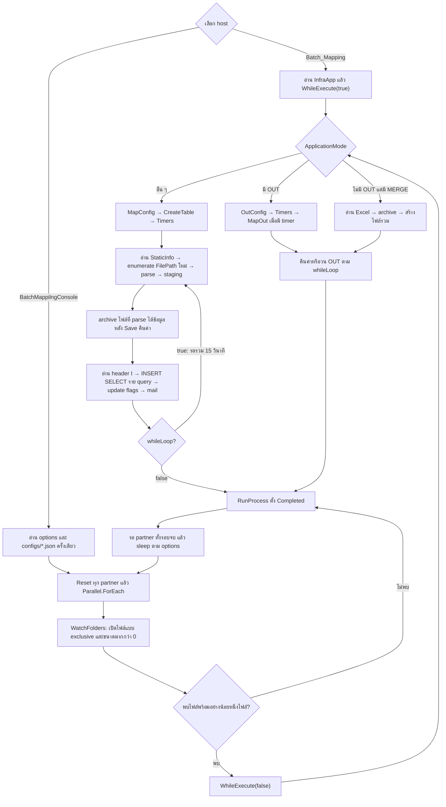
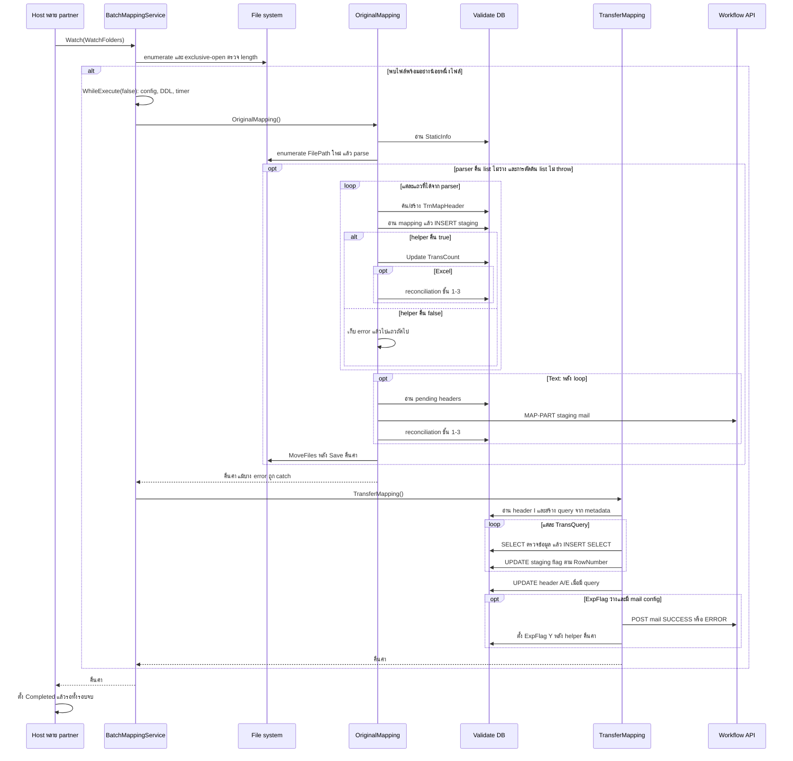
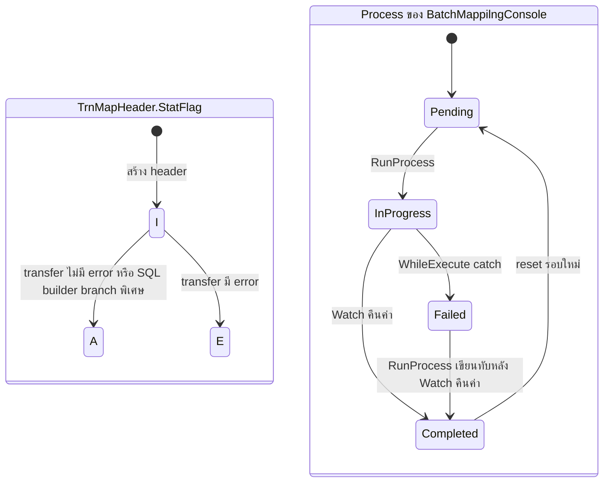

# การทำงานปัจจุบันของระบบ Batch Mapping — As-Is

## 1. ขอบเขตและวิธีอ่านหลักฐาน

เอกสารภาษาไทยฉบับนี้ถอดพฤติกรรมจาก working tree ที่มีฐาน commit `8cb9721` ตรวจเมื่อ 15 กันยายน 2026 ด้วย skill `spec-miner` ครอบคลุม `BatchMappilngConsole`, `Batch_Mapping`, `Application`, `Infrastructure` และ `DataAccess` ที่เชื่อมกับเส้นทางทำงาน โดยติดตามเส้นทางจาก console host สองตัวคือ `Batch_Mapping` และ `BatchMappilngConsole` คำว่า “BatchMa” ในคำขอใช้เรียกรวมระบบนี้ ไม่ได้ถือเป็นชื่อ project เพิ่มเติม

- **Observed (พบจากโค้ด):** มีคำสั่ง เงื่อนไข หรือการเรียกเมธอดรองรับโดยตรง เป็นผลของ static inspection ไม่ใช่หลักฐานว่ารันสำเร็จในระบบจริง
- **Inferred (อนุมาน):** ผลที่เป็นไปได้จากการประกอบหลายเส้นทาง ระบุแยกในหัวข้อ 15 ไม่ถือว่าเคยเกิดจริง
- **Unknown (ยังยืนยันไม่ได้):** ต้องอาศัยข้อมูลฐานข้อมูล ไฟล์จริง สภาพแวดล้อม หรือ implementation ภายนอก ระบุในหัวข้อ 16
- **Business context (ข้อมูลจากผู้ดูแลระบบ):** ขั้นตอนเตรียม partner ใหม่และความหมายของประเภทงานในหัวข้อ 1.1–1.3 เพิ่มจากคำอธิบายผู้ดูแลระบบเมื่อ 16 กันยายน 2026; รายละเอียด workbook ที่ตรวจโดยตรงระบุแหล่งเป็นไฟล์ตัวอย่าง ไม่ถือเป็นหลักฐานผล runtime หรือการออกกรมธรรม์สำเร็จ
- หัวข้อ 2–14 เป็น **Observed** ทั้งหมด ใช้รูปแบบ “เมื่อ…ระบบ…” เพื่อบรรยายพฤติกรรมที่มีอยู่ ไม่ใช่ข้อกำหนดสำหรับพัฒนาในอนาคต ลิงก์หลักฐานท้ายข้อความชี้ไปยังไฟล์และบรรทัดต้นทาง รายการหลักฐานอยู่ท้ายเอกสาร
- คำว่า “สำเร็จ” ต้องอ่านตามระดับ: host `Completed`, SQL helper คืน `true`, header `A`, และหัวข้ออีเมล `SUCCESS` มีเงื่อนไขต่างกัน ไม่ใช่สถานะเดียวกัน [H-CONSOLE-RUN], [S-RUN], [D-EXEC], [T-ROW], [T-MAIL]

### 1.1 ก่อนเริ่ม mapping: เตรียม partner และประเภทงาน

เมื่อมี partner ใหม่ ผู้ดูแลต้องกำหนด field จากไฟล์ของ partner ให้ตรงกับ **ตารางต้นทางในฐานข้อมูล (staging)** เพื่อให้ระบบ insert ข้อมูลจากไฟล์ลงตารางได้ จากนั้นกำหนดว่า field ใดของตารางต้นทางจะ map ไปยัง field ใดของ **ตารางปลายทาง** เช่น `mti_original` หาก field ต้องแปลงค่า หรือมีเงื่อนไขตรวจสอบข้อมูลจากตารางอื่น ต้องกำหนดเงื่อนไขประกอบด้วย

ตามแนวทางตั้งชื่อที่ผู้ดูแลระบุ ตารางต้นทางใช้ `trn` ตามด้วยชื่อ partner และประเภทงาน ตัวอย่าง partner `KK` มีงาน 3 ประเภทดังนี้

| ประเภทไฟล์ | ความหมายทางธุรกิจ | ตัวอย่างตารางต้นทาง |
|---|---|---|
| แจ้งงานเข้า | แจ้งงานเพื่อขอสร้างกรมธรรม์ | `trnkkjob` |
| ยืนยัน | บาง partner นำข้อมูลเข้าก่อนโดยยังไม่ออกกรมธรรม์ แล้ววางไฟล์ยืนยันข้อมูลก่อนออกกรมธรรม์ | `trnkkos` |
| ยกเลิก | partner วางไฟล์เพื่อขอยกเลิกงานที่เคยแจ้งเข้าเพื่อออกกรมธรรม์ | `trnkkcancel` |

การยืนยันเป็นขั้นตอนของบาง partner ตามกระบวนการธุรกิจ ไม่ใช่ทุกงานต้องผ่านไฟล์ทั้ง 3 ประเภทตามลำดับ ชื่อตารางข้างต้นเป็นตัวอย่างของ KK; ตารางที่ pipeline ใช้จริงกำหนดผ่าน configuration ส่วนกฎอนุญาตให้ออกกรมธรรม์หรือยกเลิกงานหลัง mapping ต้องตรวจระบบปลายทางเพิ่มเติมตามขอบเขต UNK-10

### 1.2 Excel configuration สำหรับ partner ใหม่

ผู้ดูแลจัดทำ configuration ใน Excel เพื่อบอกระบบว่าจะอ่านไฟล์ที่ใด จัด field ลงตารางต้นทางอย่างไร และ map ไปตารางปลายทางด้วยเงื่อนไขใด โครงสร้างที่อธิบายแบ่งเป็น 6 แท็บ โดย `<partner>` คือชื่อ partner และ `01` คือรหัสงานของชุดตัวอย่าง ไม่ได้ยืนยันรหัสของงานยืนยันหรือยกเลิก

| แท็บ | หน้าที่ในการเตรียม mapping |
|---|---|
| `Configuration` | กำหนด path สำหรับอ่านไฟล์ต้นทางของ partner/job รวมข้อมูลประกอบการรับไฟล์ |
| `Timer` | ระบุเวลารันงานตาม configuration; normal mode ไม่ใช้ค่ากำหนดเวลานี้ควบคุมรอบ ส่วนข้อจำกัดการใช้ timer ของ OUT อธิบายในหัวข้อ 12 [S-MODE], [S-RUN], [A-TIMER] |
| `TableName` | ระบุชื่อตารางต้นทางและตารางปลายทางที่ต้องการ map ข้อมูล |
| `Table-<partner>-01` | ระบุ field ทั้งหมดของตารางต้นทาง พร้อมรายละเอียดโครงสร้าง เช่น ชนิดข้อมูล ความยาว และการยอมรับ null |
| `Mapping-<partner>-01` | ระบุการจับคู่ field จากตารางต้นทางไปยัง field ของตารางปลายทาง รวมค่าคงที่/default ตาม configuration |
| `Condition-<partner>-01` | ระบุเงื่อนไขเพิ่มเติม การแปลงข้อมูล หรือการตรวจสอบกับตารางอื่นที่จำเป็นสำหรับ mapping |

ตรวจไฟล์ [NewMapping-NTL-Pro.xlsx](NewMapping-NTL-Pro.xlsx) พบชื่อแท็บจริงคือ `Configuration`, `Timer`, `TableName`, `Table-NTL-01`, `Mapping-NTL-01` และ `Condition-NTL-01` โดย `TableName!A2:D2` ระบุ partner `NTL`, job `01`, ตารางต้นทาง `trnNtlJob` และตารางปลายทาง `MTI_ORIGINAL` ตัวอย่างนี้จึงแสดง configuration ของ NTL/job 01 ไม่ได้แสดง configuration ของ KK หรือยืนยันว่าทุกประเภทงานใช้ตารางปลายทางเดียวกัน

ในตัวอย่าง `Mapping-NTL-01` มีทั้งการจับคู่ `TransID` → `TransID` และการกำหนด default `I` ให้ `cSTATUS`; `Condition-NTL-01` มีคอลัมน์สำหรับชนิด/วิธีของเงื่อนไข ชื่อ field, substring, replace, split, concat และรูปแบบค่า การมีคอลัมน์ใน Excel ไม่ได้หมายความว่าทุกค่าจะถูกนำไปใช้เหมือนกันทั้งหมด รายละเอียดการนำเข้า metadata และการประมวลผลจริงอยู่ในหัวข้อ 5 และหัวข้อ mapping/condition ถัดไป

### 1.3 จาก configuration ไปสู่การประมวลผลไฟล์

ลำดับเชิงธุรกิจที่ผู้ดูแลเตรียมและจุดเชื่อมกับ pipeline ปัจจุบันเป็นดังนี้

1. ระบุ partner และประเภทงาน พร้อม layout ของไฟล์ที่รับเข้า
2. กำหนดตารางต้นทางและ field สำหรับ insert ข้อมูลจากไฟล์
3. กำหนดตารางปลายทาง การจับคู่ field และเงื่อนไขแปลง/ตรวจสอบข้อมูลใน Excel ทั้ง 6 แท็บ
4. นำ Excel configuration เข้าสู่เส้นทาง `FileConfigPath` เพื่อให้ `MapConfig` นำเข้าเป็น metadata แล้ว `CreateTable` เตรียมตารางต้นทางตามพฤติกรรมในหัวข้อ 5; สำหรับ host หลาย partner ขั้นนี้เริ่มเมื่อผ่าน Watch gate ตามหัวข้อ 4 [A-CONFIG], [S-MODE], [S-WATCH]
5. เมื่อประมวลผลไฟล์งาน ระบบอ่านไฟล์ลงตารางต้นทางผ่าน OriginalMapping แล้วใช้ mapping/condition ในการโอนข้อมูลไปตารางปลายทางผ่าน TransferMapping [A-ORIGINAL], [T-START], [Q-TRANSFER]

ดังนั้น flow ข้อมูลคือ **ไฟล์งานของ partner → ตารางต้นทาง เช่น `trnkkjob` → mapping และเงื่อนไข → กระจายข้อมูลลงตารางปลายทางตามกลุ่มข้อมูล** ส่วน Excel configuration เป็นข้อมูลกำหนดวิธีทำงานของ flow นี้ แยกจากไฟล์แจ้งงาน/ยืนยัน/ยกเลิกที่นำเข้าประมวลผล

ตามข้อมูลธุรกิจที่ผู้ดูแลเพิ่มเติม เมื่อระบบอ่าน configuration การ mapping field จาก Excel และรับข้อมูลแจ้งงานแล้ว จะกระจายข้อมูลไป insert ในตารางปลายทางดังนี้:

| กลุ่มข้อมูลจากงานแจ้งเข้า | ตารางปลายทาง |
|---|---|
| ข้อมูลทั่วไปของงาน | `mti_original` |
| ข้อมูลลูกค้า/บุคคล/นิติบุคคล | `mti_original_client` |
| ข้อมูลรายละเอียดรถ | `mti_original_cardetail` |

งานแจ้งเข้าจึงมีปลายทางแยกตามกลุ่มข้อมูล ไม่ได้มีเพียงข้อมูลทั่วไปใน `mti_original` เท่านั้น ตารางนี้อธิบายหน้าที่ทางธุรกิจของแต่ละปลายทาง ส่วน field/key ที่เชื่อมทั้ง 3 ตาราง จำนวนแถวต่อรายการ ลำดับการ insert และขอบเขต transaction ต้องตรวจ metadata/SQL/schema ที่ใช้งานจริงเพิ่มเติม ไม่อนุมานจากชื่อหรือจาก workbook NTL ที่แสดง `MTI_ORIGINAL` เพียงรายการเดียว รายละเอียดกลไก transfer จากโค้ดอยู่หัวข้อ 8

## 2. โครงสร้างและเส้นทางที่ถูกเรียก

### 2.1 เทคโนโลยีและความรับผิดชอบ

| ส่วน | พฤติกรรม/ความรับผิดชอบที่พบ | หลักฐาน |
|---|---|---|
| `Batch_Mapping` | console `net6.0`; มี `BatchMappingService` ที่ทั้งสอง console host ใช้ | [P-SINGLE], [H-SINGLE], [S-WATCH] |
| `BatchMappilngConsole` | console `net6.0`; จัดรอบหลาย partner ด้วย `Parallel.ForEach` | [P-CONSOLE], [H-CONSOLE-RUN] |
| `Application` | concrete `c*` ส่งต่อไป abstract orchestration `Ab*` เช่น `Maps`, `TransMap`, `MapOut` | [A-WRAPPERS], [A-ORIGINAL], [T-START] |
| `Infrastructure` | default/static interface implementations ทำ parsing, สร้าง SQL, เขียน metadata, archive, HTTP; ใช้ ExcelDataReader, CsvHelper, EPPlus และ Excel COM ตามเส้นทาง | [P-INFRA], [F-EXCEL], [F-PASS], [F-TEXT], [Q-INSERT] |
| `DataAccess` | EF Core SQL Server 6.0.9 และ raw ADO.NET; context/เอนทิตีที่ใช้หลักคือ `ValidateDBContext` | [P-DATA], [D-CONTEXT], [D-EXEC] |

Project reference ไหลจาก `BatchMappilngConsole` → `Batch_Mapping` → `Application` → `Infrastructure` → `DataAccess`; solution รวมสอง console และสาม library [P-CONSOLE], [P-SINGLE], [P-APP], [P-INFRA], [P-SOLUTION]

### 2.2 Flow รวม

แผนภาพย่อเส้นทางปกติของทั้งสอง console host; เส้นทาง `DONE/BARRIER` เป็นของ host หลาย partner เท่านั้น ส่วน exception ที่หลุดออกจาก `Watch`/constructor ไม่มี catch ใน host และไม่จำเป็นต้องมาถึงจุดนั้น รายละเอียด error อยู่หัวข้อ 13 [H-SINGLE], [H-CONSOLE-RUN], [S-WATCH], [S-MODE], [S-RUN]

## 3. Startup, configuration และความต่างของ host

### 3.1 ตารางเปรียบเทียบ

| ประเด็น | `Batch_Mapping` | `BatchMappilngConsole`  |
|---|---|--- |
| จุดเริ่ม | `Main` → `MapAppConfig.Maps()` → service → `WhileExecute()` | top-level program → bind options → อ่าน partner JSON → `while(true)`  |
| JSON ของ partner | `appsettings.json` ใต้ `AppContext.BaseDirectory` | ทุก `*.json` ใต้ executable `configs`  |
| options ส่วนกลาง | ไม่ใช้ `BatchMappilngAppOptions` | `appsettings.json` จาก current working directory  |
| ตัวเริ่ม pipeline | เรียกตรง ไม่มี `Watch` gate | `Watch` ก่อน แล้วหนึ่งรอบผ่าน `WhileExecute(false)`  |
| concurrency | config/file/header/query วนตามลำดับ | ขนานระดับ partner; รอทั้งรอบ  |
| หน่วง normal mode | หลัง transfer 10 วินาที แล้ว 5 วินาที | หลังทั้งรอบจบ ตาม `RunProcessesSleepSeconds`  |
| การแสดงผล | console และ file logger | console, progress callback และ timer ทุก 1 วินาที  |
| เมื่อ service คืนค่า | `ReadKey` แล้วจึงพิมพ์ข้อความออก | `RunProcess` เขียน `Completed` เสมอ  |
| catch ของ host | ไม่มี catch ใน Main | ไม่มี catch รอบโหลด JSON/Parallel/Watch  |

หลักฐานราย host: [H-SINGLE], [H-CONSOLE-START], [H-CONSOLE-RUN], [H-CONSOLE-CONFIG], [S-RUN]

**OBS-HOST-01:** เมื่อเริ่ม `BatchMappilngConsole` ระบบเปิด JSON provider ด้วย `reloadOnChange: true` แต่ bind options เป็น object ครั้งเดียว และโหลด partner JSON เป็น `InfraApp` ครั้งเดียวก่อน loop ไม่มีการ rebind/reload รายการ partner ใน loop [H-CONSOLE-START], [H-CONSOLE-CONFIG]

ค่าที่พบในไฟล์ของ repository: `BatchMappilngConsole` parallelism **3**, sleep **10 วินาที** และ extension string `.xlsx|.txt|.xls`; default ใน options class คือ parallelism 5, sleep 0 และ extension null การอ่านค่านี้ไม่ยืนยันค่าที่ deploy อยู่จริง และระยะระหว่างรอบเท่ากับ **เวลาทำทั้งรอบ + sleep** ไม่ใช่เริ่มงานทุก 10 วินาทีตายตัว [C-CONSOLE], [C-OPTIONS], [H-CONSOLE-RUN]

**OBS-HOST-02:** เมื่อ property `Message` ถูกเขียน จะเรียก progress callback; `Process(name, action)` เขียน Begin → เรียก action → เขียน End โดยไม่จับ exception และไม่เปลี่ยน Status/ProcessStartTime เอง `Reset` ล้างเวลาและข้อความพร้อมตั้ง `Pending`; single host ไม่ได้ผ่าน `RunProcess` ที่ตั้ง `InProgress` [M-PROCESS], [H-SINGLE], [H-CONSOLE-RUN]

### 3.2 แหล่ง config และการเลือก mode

`BatchMappilngAppOptions` ประกาศใน namespace `BatchMappilngConsole` และ constant `BatchMappilngApp` ระบุชื่อ section JSON ที่ console ใช้ bind options ของตนเอง [C-OPTIONS], [H-CONSOLE-START]

| แหล่ง | ข้อมูลที่ใช้ | การอ่าน/ผลต่อ flow |
|---|---|---|
| `InfraApp` JSON | `ApplicationMode`, `Version`, SQL/ODBC connections, config/archive paths, API/mail settings, merge paths, `WatchFolders` | Deserialize ด้วย Newtonsoft.Json; ไม่พบ schema validation; ไฟล์อ่านไม่ได้/JSON ไม่ถูกต้อง throw กลับผู้เรียก |
| options JSON | parallelism, sleep, watch extensions | `BatchMappilngConsole` bind section ชื่อ `BatchMappilngApp` |
| Excel config | CONFIGURATION, TIMER, TABLENAME, TABLE, MAPPING, CONDITION | นำเข้าเป็น metadata ของฐานข้อมูลก่อน normal pipeline |
| ฐานข้อมูล | input paths/extensions, layout, SQL templates, conditions, mapping targets, mail recipients | อ่านระหว่างแต่ละ phase ไม่ได้ snapshot ทั้งงาน |

หลักฐาน: [C-MAP], [M-APP], [H-CONSOLE-START], [A-CONFIG], [Q-SYSCONFIG], [Q-INSERT], [Q-TRANSFER], [MAIL-CONFIG]

**OBS-MODE-01:** service ตรวจ `IsOutMode` ก่อน `IsMergeMode`; ทั้งคู่ใช้ `ApplicationMode.ToUpper().Contains(...)` ดังนั้นถ้ามีทั้ง OUT และ MERGE จะเข้า OUT ส่วนอื่นทั้งหมดเข้า normal mapping ตัว query `IGetMapSysConfig` เลือก MAPOU ด้วย `ApplicationMode.Contains("OUT")` ที่ไม่ได้ ToUpper ในตำแหน่งนี้ จึงมีเงื่อนไขเรื่องตัวพิมพ์ต่างจาก service [M-APP], [S-MODE], [Q-SYSCONFIG]

## 4. Polling, concurrency และ file readiness

**OBS-WATCH-01:** เมื่อเริ่มรอบ BatchMappilngConsole จะ reset ทุก process แล้ว `Parallel.ForEach` ด้วย parallelism จาก options แต่ละ callback สร้าง service ใหม่และเรียก `Watch` เมื่อทุก callback จบจึง sleep; timer 1 วินาทีมีหน้าที่แสดงเวลาผ่านไป/เวลารอ ไม่ได้เป็นตัว poll ไม่มีการสร้างงานแยกรายไฟล์ในเส้นทางนี้ [H-CONSOLE-RUN], [H-CONSOLE-START], [A-ORIGINAL]

**OBS-WATCH-02:** ถ้า extension string null/empty หรือไม่มี watch folder ระบบเขียน Message แล้ว return; แต่ whitespace-only string ไม่ถูกกันด้วย `IsNullOrEmpty` ถ้า folder ไม่มีอยู่จะเขียนข้อความแล้วตรวจ folder ถัดไป สุดท้ายข้อความสรุป watch เขียนทับข้อความ folder ที่หาย [S-WATCH]

**OBS-WATCH-03:** `Watch` enumerate เฉพาะไฟล์ชั้นบนด้วย `Directory.GetFiles(folder)` แล้วเปิดแต่ละไฟล์ด้วย `FileMode.Open`, `FileAccess.Read`, `FileShare.None`; ผ่านเมื่อ length > 0 เท่านั้น จับ `IOException`/`UnauthorizedAccessException` แล้วคืน false ไม่ log รายไฟล์ ไม่มีการวัดขนาดคงที่หลายครั้งหรือเก็บ handle ต่อถึง parsing [S-WATCH], [S-READY]

**OBS-WATCH-04:** extension config split ด้วย `|`/`,`; extension ของไฟล์ถูก lower-case แต่ config ไม่ trim/lower-case โค้ดคำนวณ `containFiles` ที่ตรง config แต่ไม่ได้ใช้: `fileExts.AddRange(fileExtensions)` เพิ่ม **ทุกไฟล์ที่ผ่าน readiness** และเรียก `WhileExecute(false)` ครั้งเดียวหากมีอย่างน้อยหนึ่งไฟล์ ดังนั้นค่าจำนวนในข้อความไม่ใช่จำนวนไฟล์ที่ผ่าน extension filter [S-WATCH]

**OBS-WATCH-05:** รายชื่อ ready files ไม่ถูกส่งเข้า Application; normal pipeline อ่าน `StaticInfo` และ enumerate `FilePath` ใหม่ ตัว `WatchFolders` กับ `StaticInfo.Desc2` เป็นคนละแหล่งข้อมูล Single host ข้าม readiness gate ทั้งหมด; BatchMappilngConsole gate ก็ไม่ได้ตรวจความพร้อมของแต่ละไฟล์ในรายการใหม่ซ้ำ [S-WATCH], [Q-SYSCONFIG], [F-LIST], [A-ORIGINAL]

## 5. การเตรียม metadata และตาราง

### 5.1 นำเข้า Excel configuration

**OBS-CONFIG-01:** normal mode เรียก `MapConfig → CreateTable → Timers` ก่อนเริ่ม Original/Transfer; `WhileExecute(true)` เตรียมครั้งเดียวก่อน inner loop ส่วน `WhileExecute(false)` เตรียมใหม่ทุกครั้งที่ Watch เปิด gate [S-MODE], [S-RUN]

`MapConfig` ใช้ `FileConfigPath`, ค้นกลุ่ม XLS และ archive ใต้ `ArchivedFileConfigPath/yyyyMMdd` อ่าน Excel แล้ววนสาม pass ดังนี้ [A-CONFIG], [F-LIST], [F-MOVE]

| Pass / sheet | สิ่งที่เขียนจริง | หลักฐาน |
|---|---|---|
| 1: `CONFIGURATION` | upsert `StaticInfo`, Group MAPOR/MAPOU, Code partner-job; Value1/2 → partner/job, Value3/4 → input/archive, Value5 → extension, Value7 มีค่าจะใช้ `PASS:` แทน Value6, Value8/9 → Start/FinishRecord; สถานะ A | [C-PARTNER] |
| 1: `TIMER` | upsert `StaticInfo` กลุ่ม TIMER; Value1 → CodeId, Value2 → hour/Desc1, Value3 → minute/Desc2; สถานะ A | [C-TIMER] |
| 1: `TABLENAME` | ตั้ง BatchMode/BatchType จาก Value1/2; upsert `MapTableHeader` schema dbo, table Value3, สถานะ I; เมื่อ Value4 ไม่ว่าง สร้าง/ปรับ `MapConfigHeader.SubRefNo` เป็น target table สถานะ A | [C-TABLE-H] |
| 2: `TABLE-partner-job` | upsert `MapTableDetail` ตาม TableId+ColumnName; FieldData, type, length, null flag; เริ่ม/กลับเป็น I; default ที่ orchestration ใส่คือ STRING, 255, Y แต่ `DefaultValue` ใน DTO ไม่ถูกเขียนใน helper นี้ | [A-CONFIG], [C-TABLE-D] |
| 3: `MAPPING-partner-job` | ต้องมี MapConfigHeader A ก่อน; เพิ่ม detail ตามชื่อ target column; ไม่เพิ่มแถวหัวข้อ `MTI Column Name`; กรณีมี detail เดิมจะ update เฉพาะเมื่อ MapValue1 เดิมว่าง; ไม่ได้ overwrite ทุก mapping | [C-MAPPING] |
| 3: `CONDITION-partner-job` | สร้าง FunctionHeader A ตาม partner/job เมื่อยังไม่มี แล้ว insert/update FunctionDetail A ตาม FunctionId+FunctionType+ValueName; แถวใหม่ข้ามเมื่อ Value14 = VALUEFORMAT | [C-CONDITION] |

การแยก sheet ตรวจกรณีสามส่วนด้วย `.Length.Equals(3)` แต่กรณีสองส่วนเขียน `_spSheet.Equals(2)` ซึ่งเป็นการเทียบ array กับ integer จึงไม่ทำงานเหมือน Length; metadata ที่เขียนก่อนหน้าไม่มี transaction รวมทั้ง workbook และ `MoveFiles` อยู่หลังเงื่อนไข parse result ทำให้ไฟล์ config ถูกส่ง archive ได้แม้ parser คืน null/empty หรือ helper กลืนข้อผิดพลาด [A-CONFIG], [A-OUTCONFIG], [C-PARTNER], [C-MAPPING]

### 5.2 สร้าง/เพิ่มคอลัมน์ staging

**OBS-DDL-01:** `CreateHeaderList` เลือก `MapTableHeader` I/A ของ ApplicationMode ที่มี schema/table; detail เลือก I/E เรียง FieldData ถ้าตารางไม่มีจะ CREATE ด้วย detail ที่เลือก ถ้ามีจะตรวจ/ADD เฉพาะคอลัมน์ที่ยังไม่มี ไม่พบ ALTER ชนิดของคอลัมน์เดิมใน flow นี้ [DDL-LIST-H], [DDL-LIST-D], [A-DDL], [DDL-SERVICE]

ชนิด STRING → VARCHAR(length), DECIMAL → DECIMAL(length,2), INT/DATE/DATETIME/UNIQUEIDENTIFIER ตามชื่อ; CREATE ใส่ NULL/NOT NULL จาก config แต่ ADD ไม่ใส่ null/default clause; ไม่มีคำสั่งสร้าง identity, primary key หรือ default ของ RowNumber ใน builder นี้ [DDL-SERVICE]

เมื่อ CREATE สำเร็จจะเรียกตั้ง header/detail A; เมื่อ table มีอยู่จะตั้ง detail A เมื่อคอลัมน์มีอยู่หรือ ADD สำเร็จ แล้วตั้ง header A ถึงแม้บาง ADD คืน false ตัว updater ทั้งสองปรับเฉพาะ record ที่เดิมเป็น I ดังนั้น detail E ที่ query เลือกมาไม่ได้ถูก updater นี้เปลี่ยนเป็น A [A-DDL], [DDL-UPD-H], [DDL-UPD-D]

`ExistsTable/ExistsColumn` คืน true ใน catch แต่ `finally` เรียก `_dt.Dispose()` โดยไม่เช็ค null หาก query helper คืน null จะเกิด exception ใน finally และไปหยุด `CreateTB` ผ่าน catch ชั้นนอก; DDL ใช้ raw SQL helper แยกจาก transaction ของ metadata [DDL-SERVICE], [D-EXEC], [A-DDL]

## 6. ค้นไฟล์และ parsing

### 6.1 Job configuration ที่ใช้รับไฟล์

**OBS-INPUT-01:** `IGetMapSysConfig` อ่าน StaticInfo ที่ Group MAPOR (หรือ MAPOU), StatFlag A และ Desc1 = ApplicationMode ตัวพิมพ์ใหญ่ สำหรับ AY/TQM จำกัด Desc5 เป็น `01–10, 51–55`; partner อื่นไม่จำกัดชุดนี้ ไม่มี OrderBy รายการ job ใน query [Q-SYSCONFIG]

`Desc2` เป็น input path, `Desc3 + yyyyMMdd` เป็น backup path, `Desc4` เป็น extension, `Desc5` เป็น JobStep, `SpecialCode` เป็น MapSymbol; ก่อนอ่านแต่ละ job จะเขียน BatchMode=SystemID และ BatchType=JobStep ใน InfraApp เดิม [Q-SYSCONFIG], [A-ORIGINAL]

`IGetAllFiles` ใช้ `*.{MapExtension}`; ถ้า MapExtension มี XLS จะ enumerate `*.*` แล้วกรองด้วย `FileInfo.Extension.ToUpper().Contains("XLS")` แต่ยังเพิ่ม FileInfos ว่างสำหรับไฟล์ที่ไม่ผ่าน filter ด้วย จึงทำให้ Count มากกว่าจำนวนไฟล์ที่นำเข้าได้; ข้าม folder ที่ไม่มีอยู่ และคืน null พร้อม log เมื่อเกิด exception ไม่มีการ sort หรือ recursive search [F-LIST]

### 6.2 กฎเลือก parser และแถว

**OBS-PARSE-01:** OriginalMapping ข้ามชื่อไฟล์ว่างหรือมี `~$`; เลือก Excel เมื่อ **ชื่อไฟล์** ตัวพิมพ์ใหญ่มี XLS หรือ CSV ไม่ได้เทียบ extension อย่างเดียว ถ้า MapSymbol มี `PASS:` ใช้ ExcelPassword มิฉะนั้น IMapExcel; ชื่ออื่นใช้ IMapText [A-ORIGINAL]

| Parser | สิ่งที่ทำจริง | ผลเมื่อผิดพลาด/ขอบเขต |
|---|---|---|
| Excel ปกติ | `File.Open` → ExcelReaderFactory → AsDataSet → ทุก sheet/ทุก row; รับ row เมื่อช่อง 0–4 อย่างน้อยหนึ่งช่องมีข้อความ; ชื่อ sheet ลบ `$` และ apostrophe; map คอลัมน์ที่ชื่อมี COLUMN ตามลำดับเป็น Value1–230 และ Trim | อ้าง index 0–4 โดยไม่ตรวจจำนวนคอลัมน์; จับ exception แล้ว log/console และ **คืน list ที่สะสมไว้** จึงอาจได้ข้อมูลเพียงบางส่วน |
| CSV ผ่าน IMapExcel | full path มี `.csv` → CsvHelper + StreamReader + invariant culture; อ่านแถวแรกเป็น header สร้างชื่อ ColumnN_header แล้วอ่านข้อมูลเข้า DataTable จากนั้นใช้ตัวกรอง row เดียวกับ Excel | ReadFileCSV จับ error แล้วพิมพ์และคืน DataSet ที่สร้างได้; ไม่กำหนด code page 874 ในเส้นทางนี้ |
| ExcelPassword | สร้าง Excel COM ก่อน try; เมื่อ password argument ไม่ว่างจะใช้ password **ค่าคงที่ใน implementation** แทน argument; เปิด workbook read-only, ใช้ sheet แรกและ UsedRange, อ่าน Value2 เป็น Value1–200 | พิมพ์ password ที่ใช้ลง console; catch คืน null; finally เรียก Quit; error ตอนสร้าง COM หรือ Quit อาจหลุดออกไป |
| Text แบบ delimiter | TIB ใช้ encoding 65001; อื่นใช้ 874; อ่านทีละบรรทัด split `|`, รับเมื่อมีมากกว่า 1 ช่อง; ลบ double quote และ Trim, map Value1–220 | เงื่อนไขข้าม header คือ `!Contains("application date|") || !Contains("application")`; จับ error ภายนอกแล้วคืน null |
| Text แบบ fixed width | ทำเฉพาะเมื่อรอบ delimiter ไม่ได้สักแถว; อ่าน index จาก FunctionHeader/Detail ตาม BatchMode/Type, ไม่กรอง active/ไม่ sort ใน query; อ่านไฟล์ใหม่ ข้ามบรรทัดแรก, เติมช่องว่างเมื่อสั้นกว่า 6000 แล้วใช้ `Substring(StartIndex-1, FinishIndex)` | FinishIndex เป็น **ความยาว** ที่ส่งให้ Substring; จับ error ราย field แบบเงียบ; รับแถวเมื่อ Value1 ไม่ว่าง; switch ถึง Value110 |
| CSV ภายใน IMapText | หาก path มี CSV จะ split comma แบบธรรมดาด้วย encoding 874, ข้ามบรรทัดมี LOTNO, ลบ double quote | เป็น branch ที่มีอยู่ แต่ไฟล์ชื่อ CSV ตาม normal dispatcher จะเข้า IMapExcel ก่อน |

หลักฐานราย parser: [F-EXCEL], [F-CSV], [F-PASS], [F-TEXT], [F-FIXED]

**OBS-PARSE-02:** หลัง parser คืน list ที่มีข้อมูล หาก StartRecord > 0 และ FinishRecord > 0 จะ `RemoveAt(0)` จำนวน FinishRecord−StartRecord ครั้งเมื่อ FinishRecord มากกว่า StartRecord เป็นการตัดต้น **list รวม** ไม่ใช่เลือกช่วง inclusive ต่อ sheet และไม่มี bounds check หากตัดเกินจำนวนจะเข้า catch ระดับ Maps หยุดไฟล์/job ที่เหลือใน phase นั้น [A-ORIGINAL]

ไม่มี active layout validation ก่อน save: โค้ด `GetMapLayout`/`CheckMapLayout` ใน OriginalMapping ถูก comment ไว้ จึงไม่ใช้เป็นเงื่อนไขปฏิเสธไฟล์ใน flow ปัจจุบัน [A-ORIGINAL]

## 7. Staging save และ archive

### 7.1 Header และการระบุไฟล์เดิม

**OBS-STAGE-01:** ก่อน save **แต่ละแถว** จะเรียก SaveHeader ด้วย SystemID=`BatchMode-BatchType`, RefNo=ชื่อไฟล์, SubRefNo=ชื่อ sheet แล้วค้น TransID เดิมด้วยสามค่านี้ **ไม่กรอง StatFlag**; ไม่พบจึงเพิ่ม `TrnMapHeader` ใน transaction ของตนเอง ตั้ง StatFlag I และ ExpFlag เป็น I เมื่อ SystemID มี OUT/MTP1 มิฉะนั้นเป็น string ว่าง จากนั้น query TransID ของ header I อีกครั้ง [A-SAVE-XLS], [A-SAVE-TEXT], [DB-HEADER-SAVE]

โมเดล EF ระบุ TransID default `newsequentialid()` และ primary key เป็น TransID; SaveHeader wrapper จับ exception แล้วคืน false แต่ helper ชั้นในหลาย error ถูกกลืน จึงต้องผ่าน guard GUID ว่างอีกชั้น ไม่มีการเทียบ hash, ขนาด, วันสร้าง หรือเนื้อหาไฟล์ก่อนใช้ header เดิม [DB-HEADER-MODEL], [D-CONTEXT-HEADER], [DB-HEADER-SAVE], [A-SAVE-HEADER]

### 7.2 Mapping หนึ่งแถวเป็น SQL

**OBS-STAGE-02:** IMapTable เลือก MapTableHeader A ตาม BatchMode+BatchType แล้วอ่าน MapTableDetail ของ TableId เรียง FieldData โดยไม่กรอง StatFlag ของ detail สร้างทุกคอลัมน์เป็น string: FieldData 0 = ลำดับแถวที่ orchestration ส่งมา, 1–230 = ValueN; ค่า File/CreateDate/StatFlag ถูกแทนเป็น filename/yyyyMMdd/I ตามชื่อคอลัมน์ [F-MAPTABLE]

`rowNumber` เริ่ม 1 ใหม่ต่อการเรียก SaveExcel/SaveText และต่อเนื่องข้าม sheet ใน list เดียว ไม่ใช่หมายเลขบรรทัดกายภาพหลังตัด header/แถวว่าง ใน code builder ไม่ได้ยืนยันว่า RowNumber unique ข้ามไฟล์; การสร้าง column ซ้ำถูกหลีกเลี่ยง แต่ Dictionary.Add ของ field mapping ซ้ำยัง throw ได้; catch ของ IMapTable log แล้ว dispose DataTable และคืน object เดิม [A-SAVE-XLS], [A-SAVE-TEXT], [F-MAPTABLE]

**OBS-STAGE-03:** IFunctionQuery อ่าน FunctionHeader active `QUERY/TABLE` (ตำแหน่งนี้ไม่กรอง SystemId=MAPS) และ FunctionDetail INSERT ต่อ QueryValue1–3 เป็น template สร้าง column/value list ใส่ TransID เป็น CAST, File/Files เป็นชื่อไฟล์, กรณี TQM-07 InsertDate ใช้เวลาปัจจุบัน และใช้ function conversion ของ partner สำหรับ field ที่ตรงกัน ค่าข้อมูลทั่วไปลบ apostrophe ก่อนประกอบ SQL; filename/metadata SQL ไม่ได้ผ่าน parameterized command [Q-INSERT], [U-CONVERT], [D-EXEC]

**ข้อยกเว้นสถานะที่เกิดก่อน INSERT:** เมื่อ function-detail list null/empty และเจอ column ชื่อ StatFlag ตัว SQL builder ใส่ I ให้ staging แต่เรียก `UpdateHeaderFlag(...,"A")` **ระหว่างสร้าง SQL** ก่อน execute INSERT จริง เมธอดนี้ปรับ header I เป็น A ดังนั้นการอ่าน header สำหรับ transfer ซึ่งรับเฉพาะ I ไม่ครอบคลุม header ที่เปลี่ยนด้วย branch นี้ [Q-INSERT], [Q-INSERT-HEADER], [DB-HEADER-INITIAL]

### 7.3 ความต่าง Excel กับ Text

| ประเด็น | SaveExcel | SaveText |
|---|---|---|
| ตัวนับ input | เพิ่ม `_iTrans` ทีละแถวร่วมทั้ง list | `_iTrans = List.Count` ทุกแถว |
| การ insert | หนึ่ง raw ExecuteNonQuery ต่อ DataTable ที่มีข้อมูล | เช่นเดียวกัน |
| SQL คืน false | เพิ่ม `_iErr`, เก็บข้อความตาม `TransID_record`, ส่ง remote error log แล้วไปแถวถัดไป | เพิ่ม `_iErr`, เก็บตาม `errorIndex_TransID`, พิมพ์ console แล้วไปแถวถัดไป |
| SQL คืน true | เพิ่ม success; update TransCount ด้วย running `_iTrans`; เขียน reconciliation 1–3 ทันที; remote log เริ่ม/จบพร้อม SQL | เพิ่ม success; update TransCount ด้วย List.Count |
| หลังจบ list | โค้ดส่งอีเมล staging ถูก comment | อ่าน **ทุก pending header ของ ApplicationMode** ผ่าน HeaderInitial แล้วส่ง MAP-PART mail และ reconciliation ให้แต่ละ header |
| ข้อมูลในข้อความ error | dictionary ไม่ถูกใช้ส่ง mail staging ในเส้นทาง active | lookup ด้วย GUID อย่างเดียวไม่ตรง key `errorIndex_GUID` ที่เก็บไว้ จึงอาจส่งรายละเอียด error เป็น null |
| การนับที่ไม่ครอบคลุม | SaveHeader false/GUID ว่าง/MapTable ไม่มีแถว ไม่เพิ่ม `_iErr` | เช่นเดียวกัน; หลัง loop ตั้ง success เป็น `_iTrans - _iErr` แทนจำนวน SQL ที่สำเร็จจริง |

หลักฐาน: [A-SAVE-XLS], [A-SAVE-TEXT], [DB-HEADER-COUNT], [R-ORIGINAL]

ตัวนับ Excel ร่วมทั้งไฟล์ ไม่ได้ reset ต่อ sheet; reconciliation ถูก update เฉพาะครั้งที่ insert สำเร็จ ดังนั้น error หลัง success ครั้งสุดท้ายไม่มี call เพื่อปรับตัวนับขั้น 1–3 อีก ส่วน Text ใช้ counters ของ list ปัจจุบันกับ pending header ที่อ่านกลับมาทั้งหมดและใช้ BatchMode/Type ปัจจุบัน [A-SAVE-XLS], [A-SAVE-TEXT], [DB-HEADER-INITIAL]

### 7.4 Archive

**OBS-ARCHIVE-01:** เมื่อ parser คืน list มีข้อมูล OriginalMapping เรียก SaveExcel/SaveText แล้ว MoveFiles โดย **ไม่รับผลรวมว่าสำเร็จครบทุกแถวหรือไม่**; ถ้า save คืนค่าปกติแม้ helper กลืน error ก็ยังถึง MoveFiles ถ้า parser คืน null/empty จะไม่ย้ายไฟล์ข้อมูล; ถ้า save throw หลุดออกมา จะไป catch ของ Maps ก่อนย้ายไฟล์ปัจจุบัน [A-ORIGINAL], [A-SAVE-XLS], [A-SAVE-TEXT]

MoveFiles สร้าง directory ปลายทาง ถ้ามีชื่อไฟล์ซ้ำจะเปลี่ยน **ชื่อ directory** เป็น `<target>_yyyyMMddTHHmm` แล้ว File.Move แบบไม่ overwrite เมื่อ source directory มีอยู่ ถ้าชื่อซ้ำใน directory fallback อีกครั้ง ไม่มี retry ชื่อใหม่; catch log/console แล้วคืนแบบ void ไม่มีสถานะส่งกลับ การย้ายอยู่ก่อน phase transfer [F-MOVE], [S-RUN]

### 7.5 Sequence การนำเข้าและโอนหนึ่งรอบ

Sequence แสดงเงื่อนไข helper คืนค่า ไม่ใช่การรับรอง commit/delivery; transaction ของ header, staging, reconciliation, flag, file move และ HTTP แยกจากกัน กรณีผิดพลาดรายละเอียดอยู่หัวข้อ 13 [S-RUN], [A-ORIGINAL], [A-SAVE-XLS], [A-SAVE-TEXT], [T-ROW], [T-MAIL], [MAIL-SEND]

## 8. Transfer จาก staging ไปตารางปลายทาง

### 8.1 เลือก header และ target

**OBS-TRANSFER-01:** HeaderInitial รับ **StatFlag I เท่านั้น** แม้มี array `{I,E}` ประกอบเงื่อนไขด้วย สำหรับ AY ใช้ SystemId.Contains(`AY-0`); อื่นใช้ Contains(`ApplicationMode-`) ไม่มี OrderBy; header A/E ไม่ถูกเลือกในการโอนรอบใหม่ [DB-HEADER-INITIAL]

สำหรับแต่ละ header จะ cast TransCount เป็น int; split SystemID ที่ `-` ใช้สองส่วนแรกเป็น BatchMode/BatchType (ถ้าไม่มี `-` เปลี่ยนเฉพาะ BatchMode) แล้วอ่าน staging header ที่ StatFlag ไม่ใช่ E; อ่าน MapConfigHeader A เรียง Sequence และวนทุก target; detail A และ FunctionHeader A ที่ MapID ตรงกัน พร้อม FunctionDetail A [T-START], [Q-TABLE-H], [Q-MAP-H], [Q-MAP-D], [Q-CONDITION]

SaveConditionHeader สร้าง FunctionHeader ด้วย SystemId/FunctionName แต่ไม่กำหนด MapID ใน initializer ขณะที่ GetConditionList ของ transfer กรอง MapID ที่ส่งมา การเชื่อม condition กับ target จึงต้องอ่านค่าที่อยู่ในฐานข้อมูลจริงประกอบ ไม่สามารถสรุปว่า import CONDITION อย่างเดียวสร้างความเชื่อมโยงครบ [C-CONDITION], [Q-CONDITION]

**ชื่อ MTI_ORIGINAL:** active transfer ไม่ hard-code ชื่อนี้ แต่รับ `MapConfigHeader.SubRefNo → MapTableName` ส่งเข้า SQL template ถ้าข้อมูล config กำหนดเป็น `MTI_ORIGINAL` ก็จะ insert ที่นั่น ชื่อดังกล่าวใน ITransferQuery ที่เป็น NOT EXISTS อยู่ใน comment เท่านั้น จึงไม่ใช่ active deduplication rule และไม่ยืนยันว่าทุก partner ใช้ target เดียวกัน [Q-MAP-H], [Q-TRANSFER], [T-START]

### 8.2 สร้าง SQL ตาม metadata

**OBS-QUERY-01:** ITransferQuery สร้าง target column และ SELECT expression จาก MapConfigDetail โดย default DATETIME ใช้นิพจน์ตรง ๆ ส่วน default ชนิดอื่นใส่ quote; condition แบบ MAPPING/COLUMN เลือกตัวแรกที่ชื่อ target ตรง รองรับ IIF/CASE, CONCAT, SUBSTRING และ STRING_SPLIT/STUFF ตามค่าที่มี [Q-TRANSFER]

เมื่อไม่มี condition ของ column: DATE/DATETIME ใช้ CONVERT style 103 และคืน NULL เมื่อค่าว่าง; DECIMAL ใช้ (12,2) และลบ comma; INT ลบ comma และ `.00`; UNIQUEIDENTIFIER ใช้ CAST; NDATE ถูกนำชื่อชนิดไปสร้าง CONVERT ตามโค้ดโดยไม่มีการตรวจชื่อชนิดก่อน execute; string field ใช้ expression ตาม config [Q-TRANSFER]

**OBS-QUERY-02:** WHERE เริ่มด้วย TransID **เฉพาะเมื่อ function list มีข้อมูล** แล้วเพิ่ม MAPPING/QUERY และ FUNCTIONTYPE; query รายการ RowNumber ใช้ WHERE นี้หรือ override จาก ROWNUM/QUERY ตัวแรก; อ่าน template INSERTSELECT จาก FunctionHeader MAPS/QUERY/TABLE และ QueryValue1–4 จาก detail ที่ active แล้วสร้างหนึ่ง TransQuery ต่อ RowNumber ไม่พบ StatFlag I filter ที่ hard-code ใน query builder นี้ การกรองสถานะเพิ่มเติมขึ้นกับ metadata [Q-TRANSFER]

`GetRowNoList` คาดว่า RowNumber อ่านด้วย `GetInt32`; ถ้า SQL ผิด, connection error หรือชนิดไม่ตรง จะคืน list ว่างพร้อม OutMessage แต่ caller ไม่ใช้ข้อความนั้นเป็น error ของ header; query list จึงอาจว่างโดยไม่มีการตั้ง header E [D-ROWLIST], [Q-TRANSFER], [T-START]

**OBS-UNION-01:** ถ้ามี FunctionDetail UNION active จะเพิ่ม query ที่สองหลัง primary query สำหรับ RowNumber เดียวกัน สร้าง mapping/WHERE จาก UNION config และตั้ง `checkUnion="Y"` ให้เฉพาะ query เพิ่มเติม นี่คือสองคำสั่งแยกกัน ไม่ใช่ transaction เดียวสำหรับ PMX/CTP โดย primary query ที่อยู่ลำดับแรกไม่ได้ตั้ง flag Y [Q-TRANSFER], [Q-UNION], [T-ROW]

Branch union มีรายละเอียดต่าง: INT ลบ comma แต่ไม่ลบ `.00`, bracket ชื่อ field เฉพาะ FILE/NO ใน default branch; มี query count ที่อ่านแต่ไม่ใช้กำหนดการเพิ่ม query หาก CheckUnion error จะคืน false, UnionQuery error คืน null แล้ว SetQuery อาจ catch และคืน null ทั้ง list [Q-UNION]

### 8.3 Execute, row status และการนับ

**OBS-ROW-01:** ก่อน INSERT โปรแกรมหา SELECT แรกใน SqlQuery แล้ว query ส่วน SELECT แยกต่างหากด้วย QueryDataTable; helper นี้คืน null เมื่อ error แต่ flow ยัง execute INSERT ต่อ จึงไม่ได้ใช้ preview SELECT เป็น validation gate [T-ROW], [D-SELECT]

เมื่อ ExecuteNonQueryEx คืน true จะเพิ่ม `successCount` หนึ่งต่อ query และเรียก SaveTransDetail ตั้ง A; helper คืน true เมื่อ command ไม่ throw โดย **ไม่ตรวจ affected-row count** ดังนั้น successCount เป็นจำนวนคำสั่งที่คืน true ไม่ใช่จำนวนแถวปลายทางที่ยืนยันว่าเพิ่มจริง [T-ROW], [D-EXEC]

เมื่อ ExecuteNonQueryEx คืน false จะเพิ่ม `_iErr`, จัดหมวด error, เก็บรายละเอียด, ตั้ง staging E และส่ง remote error log จากนั้นไป query ถัดไป; SqlQuery ว่างจัดเป็น system error; exception ภายใน row catch เก็บเป็น system error, ตั้ง E และ continue ไม่มี rollback ของ query/row ที่สำเร็จก่อนหน้า [T-ROW], [T-ROW-END]

**OBS-FLAG-SCOPE-01:** การตั้ง staging A/E ส่ง `Guid.Empty` และ condition `AND RowNumber = '...'`; IUpdateTransDetailFlag ใช้ UPDFLAG template QueryValue1/2 แล้วเติม `WHERE (1=1)` กับ condition ดังกล่าว ไม่มี TransID ที่ caller ส่งใน branch นี้ และไม่ส่งผล execute กลับให้ caller [T-ROW], [DB-DETAIL-FLAG]

`_iErr` และ dictionaries เริ่มหนึ่งครั้งต่อ header แต่ `successCount` เริ่มใหม่ต่อ MapConfigHeader; primary/union ใช้ key RowNo เดียวกันและ Dictionary.Add ใน error path การเพิ่ม key ซ้ำทำให้เข้า row catch, เพิ่ม `_iErr` อีกครั้งและกลายเป็น system error เพิ่มเติมได้ [T-START], [T-ROW], [T-ROW-END], [Q-TRANSFER]

### 8.4 ปิดสถานะ header

**OBS-HEADER-END-01:** หลังจบ query list ที่ไม่ว่างของแต่ละ target ตั้ง `_headerFlag = (_iErr == 0 ? A : E)` แล้ว UpdateHeaderFlag แต่ updater ปรับเฉพาะ header **ที่ยังเป็น I** ไม่มี query list/ไม่มี target ที่เข้าลูปนี้จะไม่มีคำสั่งปิด header; การตั้ง flag ของ target ถัดไปไม่เปลี่ยน header ที่ target แรกปิดไปแล้ว [T-ROW-END], [DB-HEADER-FLAG]

Exception ชั้นนอก TransMap log และพิมพ์ข้อความแล้ว return ไม่ rethrow จึงหยุด header/target ที่เหลือใน invocation นี้ แต่ service ยังสามารถตั้ง Completed ได้ [T-END], [S-RUN]

## 9. Reconciliation และ database side effects

### 9.1 สิ่งที่เขียนใน flow ปัจจุบัน

| ตาราง/ทรัพยากร | Side effect และขอบเขต commit | หลักฐาน |
|---|---|---|
| StaticInfo | upsert MAPOR/MAPOU/TIMER ทีละ operation; transaction ของตนเอง | [C-PARTNER], [C-TIMER] |
| MapTableHeader/Detail | metadata I ระหว่างนำเข้า; A เมื่อผ่านเส้นทาง DDL; ไม่รวม transaction เดียวกับ CREATE/ALTER | [C-TABLE-H], [C-TABLE-D], [A-DDL] |
| MapConfigHeader/Detail, FunctionHeader/Detail | target, field mapping และ condition A ตามเงื่อนไข config import; รายการเก่าไม่ได้ถูกลบทั้งชุด | [C-TABLE-H], [C-MAPPING], [C-CONDITION] |
| staging ตาม MapTableHeader.TableName | INSERT แยกต่อ row; StatFlag I ตอนสร้างค่า; UPDATE A/E ตาม RowNumber หลัง transfer; raw SQL แต่ละ call เปิด connection ของตนเอง | [F-MAPTABLE], [Q-INSERT], [D-EXEC], [DB-DETAIL-FLAG] |
| TrnMapHeader | สร้าง/นำ TransID เดิมกลับใช้; update count/StatFlag/ExpFlag แยก operation; ModifyDate/ModifyUser เมื่อ updater พบ record | [DB-HEADER-SAVE], [DB-HEADER-COUNT], [DB-HEADER-FLAG], [DB-HEADER-EXP] |
| target เช่น MTI_ORIGINAL | INSERT SELECT ตาม SQL template หนึ่ง call ต่อ TransQuery; ไม่พบ transaction ครอบทั้งไฟล์/ทั้ง header | [Q-TRANSFER], [T-ROW], [D-EXEC] |
| TB_LOG_RECONCILE_DATA | SaveOriginalMapping เขียน step 1–3 ร่วมหนึ่ง EF transaction ต่อ call | [R-ORIGINAL], [DB-RECON-MODEL] |
| Workflow API | POST log/mail; โค้ดนี้ไม่เขียนตาราง log/mail ของ service ภายนอกโดยตรง | [LOG-SEND], [MAIL-SEND] |
| OUT | UPDATE ตาม FunctionDetail ก่อนสร้าง output Excel; แยกจาก file write และ ODBC calls | [A-OUT], [OUT-UPDATE] |

### 9.2 Reconciliation ขั้น 1–3

SaveOriginalMapping ค้น record ด้วย StatusFlag A + StepNo + partner/job/filename/sheet/TransID แล้ว insert/update [R-ORIGINAL]

| Step | Field ที่เขียน | StatusFlag |
|---|---|---|
| 1 | CountRow_Source = original count จาก caller | A |
| 2 | CountRow_Destination = success/partner count จาก caller | A |
| 3 | CountRow_DestinationErr = error count จาก caller | E เมื่อ error > 0 มิฉะนั้น A |

การค้นเฉพาะ A หมายความว่า record step 3 ที่เคยเป็น E จะไม่ถูกค้นกลับมาเป็น record เดิมใน call ถัดไป; branch จึงพยายาม insert ใหม่ ไม่ใช่ update record E เดิม การเขียน/rollback reconciliation ไม่ได้ rollback staging ที่บันทึกก่อนหน้า [R-ORIGINAL]

### 9.3 เมธอดที่มีอยู่แต่ไม่ถูกเรียกจาก transfer นี้

`AbTransferMapping` ประกาศ wrapper SaveTransferMapping/GetReconsileStepByStep แต่ TransMap ไม่มี call ทั้งสอง จึงไม่มีหลักฐานว่า flow นี้เขียน reconciliation ขั้น 4–6 หรือใช้ผล reconcile เป็น gate โอนข้อมูล [T-START], [T-END], [T-RECON-WRAPPERS]

Implementation SaveTransferMapping หากมี caller อื่นจะทำเมื่อ originalTransCnt > 0: query step 4/5/6 แต่เขียนเฉพาะ step 4 CountRowBeforeValidate; branch update ไม่กรอง StepNo/StatusFlag และอาจ SingleOrDefault เจอหลาย record ส่วน getter ใช้ `t.Equals("A")` เทียบ entity กับ string แล้วคืนเพียง StepNo; ทั้งคู่ catch/กลืน error รายละเอียดนี้เป็นโค้ดที่มีอยู่ **ไม่ใช่ขั้นตอนที่ host ปัจจุบันเรียก** [R-TRANSFER-UNUSED], [R-GET-UNUSED]

## 10. Logging และ email notification

### 10.1 Logging

**OBS-LOG-01:** constructor service ทุกครั้งสร้าง Serilog logger ใหม่ กำหนด minimum Debug เขียน `logs/log-.txt`, rolling รายวัน/เมื่อเกิน 5,000,000 bytes, retainedFileCountLimit 7 แล้วกำหนด static `Log.Logger` และเก็บ logger ใน CustomSerilogger ไม่มี explicit dispose/CloseAndFlush ในเส้นทาง host ที่ตรวจ; path ไม่แบ่ง partner และ Console.Title/Clear เป็นทรัพยากรร่วมของ process [S-CONSTRUCTOR], [LOG-ADAPTER], [H-CONSOLE-RUN], [S-RUN]

CustomSerilogger ไม่สร้าง scope และส่ง `state.ToString()` เข้า Serilog; LogPerformance เริ่ม stopwatch → เรียก action → log Completed จึงไม่มี timing-completed log หาก action throw; SQL helper log SQL string และเวลาเมื่อ execute คืนค่าปกติ; OriginalMapping Excel log ข้อมูล Value1 ลง console และ SQL insert ไป remote log [LOG-ADAPTER], [H-PERF], [D-EXEC], [A-SAVE-XLS]

**OBS-LOG-02:** remote SaveLog serialize JSON แล้ว POST `wfCenterURL + fnSaveLogs` ด้วย default network credentials และ `.Result`; non-success HTTP แค่พิมพ์ข้อความ ไม่อ่าน response body; exception log/console แล้วคืนค่า Excel parser มี implementation ส่ง log แบบเดียวกันของตนเอง ไม่มี retry/backoff ที่ตั้งไว้ในเมธอดเหล่านี้ [LOG-SEND], [F-EXCEL-LOG]

### 10.2 เงื่อนไข email ในแต่ละ phase

| เส้นทาง | เมื่อใด/ข้อมูลจากไหน | การส่งและ flag |
|---|---|---|
| OriginalMapping catch | exception หลุดถึง Maps; สร้าง MAP-ERR จาก App.MailFrom/MailTo และ template เกี่ยวกับ Partner Table | พยายามส่งใน nested try; nested catch log แล้วกลืน; ไม่มี ExpFlag update ใน branch นี้ |
| OriginalMapping dictionary error | มีเงื่อนไขส่ง MAP-ERR หาก `_dictErr.Count > 0` หลังอ่านไฟล์ | การเพิ่ม layout errors ใน normal path เป็น comment จึงไม่มี active producer ตาม layout branch |
| Text staging | หลัง save อ่านทุก HeaderInitial แล้วส่ง MAP-PART ด้วย App.MailFrom/MailTo และ counts ของ list ปัจจุบัน | ไม่มี gate ExpFlag/ไม่มี update ExpFlag ใน SaveText |
| Excel staging | success/error รายแถวมี logs | ส่วน mail summary หลัง loop ถูก comment |
| Transfer | ใช้ ConfigSendMail ของ BatchMode และ FunctionName=MAPPING, FirstOrDefault; ไม่กรอง Status/Job | อ่าน ExpFlag จาก TrnMapHeader; ส่งเฉพาะ null/empty/หนึ่งช่องว่าง และ configMail ไม่ null; เรียก update Y หลังส่ง helper |

หลักฐาน: [A-ORIGINAL-ERROR], [A-ORIGINAL], [A-SAVE-XLS], [A-SAVE-TEXT], [MAIL-CONFIG], [T-MAIL], [T-MAIL-ERROR]

**OBS-MAIL-01:** Transfer เลือกหัวข้อ `(SUCCESS)` เมื่อ dictionary **partner errors ว่าง** รวมกรณีมี system error อย่างเดียว; เลือก `(ERROR)` เมื่อมี partner error อย่างน้อยหนึ่งรายการ ข้อความ success/error ใช้ `_lstQuery.Count`, successCount และ `_iErr` ซึ่งนับระดับ query และมีขอบเขตตัวนับต่างกันตามหัวข้อ 8 ไม่ใช่การ reconcile จำนวน row จริง [T-MAIL], [T-MAIL-ERROR], [T-START]

Partner error คือ SQL number `{2628,8152,241,245,8114,8115,515,547,2627,2601}`; หมายเลขอื่น รวม 0 จาก non-SQL exception จัดเป็น system error เฉพาะ partner errors ถูกสร้างตารางแจ้ง partner; system error เก็บข้อความและ log ตาม branch ไม่ได้แสดงรายละเอียดในตาราง partner error [U-ERRORS], [T-ROW]

หลัง SQL partner error จะตรวจ field แยก: อ่าน INFORMATION_SCHEMA.COLUMNS ของ **TABLE_NAME** (ไม่กรอง schema), แยก SELECT expression ด้วย parser ที่นับวงเล็บ/single quote, probe ทีละ column; ตรวจความยาวและค่าว่างของ non-null column, หา CONVERT date style สำหรับข้อความ, หา FK/check column หรือ index columns ของ duplicate key ถ้าหาไม่พบใช้เหตุผลทั่วไป; หมายเลขงาน CLOANNUMBER อ่านจาก preview row แรกหรือ probe แยก เหล่านี้เป็นการอธิบาย error **หลัง INSERT ล้มเหลว** ไม่ใช่ validation ก่อน insert [T-DIAGNOSTICS], [T-ERROR-HELPERS]

Error template แบบ union ถูกเลือกจาก `_lstQuery[0].checkUnion == "Y"`; builder เพิ่ม primary query ก่อน union และตั้ง Y เฉพาะ union จึงไม่ได้หมายความว่ามี union query ที่ใดก็จะใช้ union template ตัวข้อความ HTML ต่อค่า RowNo/CLOANNUMBER/field/reason โดยตรง ไม่มี HTML encode ในตำแหน่งสร้าง row นี้ [T-MAIL-ERROR], [Q-TRANSFER], [Q-UNION]

**OBS-MAIL-02:** SaveSendMail POST JSON ด้วย default network credentials และรอ `.Result` แต่ **ไม่ตรวจ IsSuccessStatusCode หรือ response body**; exception ถูก log แล้วกลืน caller จึงยังเรียก UpdateHeaderExpFlag(Y) หลัง HTTP 4xx/5xx หรือ exception ที่ถูกกลืนได้ ผล bool ของ update flag ก็ไม่ได้ถูกใช้ควบคุม flow ExpFlag Y หมายถึง code ผ่านจุดนี้ ไม่ใช่หลักฐานว่าอีเมลส่งถึงผู้รับ [MAIL-SEND], [T-MAIL], [T-MAIL-ERROR], [DB-HEADER-EXP]

## 11. State/status transitions

| สถานะ | Transition ที่พบ | ตัวกระตุ้นและข้อจำกัด | หลักฐาน |
|---|---|---|---|
| Process ใน memory | create/reset → Pending | reset ทุก outer round; ไม่ persist ฐานข้อมูล | [M-PROCESS], [H-CONSOLE-RUN] |
| Process ใน memory | Pending → InProgress | RunProcess ของ BatchMappilngConsole ตั้งก่อนสร้าง service | [H-CONSOLE-RUN] |
| Process ใน memory | → Failed | เฉพาะ exception ที่ถึง WhileExecute catch; ตั้ง EndTime/Message | [S-ERROR] |
| Process ใน memory | → Completed | service เมื่อ normal/out/merge ถึงจุดจบ; BatchMappilngConsole ตั้งอีกครั้งหลัง Watch return แม้ไม่พบไฟล์หรือ service ตั้ง Failed | [S-RUN], [S-OUT], [S-MODE], [H-CONSOLE-RUN] |
| MapTableHeader/Detail | insert/update → I; I → A | metadata import; updater หลัง DDL รับเฉพาะ I | [C-TABLE-H], [C-TABLE-D], [DDL-UPD-H], [DDL-UPD-D] |
| TrnMapHeader.StatFlag | insert → I | header ใหม่; header เดิมไม่ถูก reset ใน SaveHeader | [DB-HEADER-SAVE] |
| TrnMapHeader.StatFlag | I → A ก่อน staging execute | branch StatFlag ของ IFunctionQuery เมื่อไม่มี function list | [Q-INSERT], [Q-INSERT-HEADER] |
| TrnMapHeader.StatFlag | I → A/E หลัง query list | ใช้ `_iErr` สะสม; updater ไม่ปรับ A/E เดิม | [T-ROW-END], [DB-HEADER-FLAG] |
| staging.StatFlag | I → A/E (เจตนาของ call/template) | execute query สำเร็จ/ล้มเหลว; UPDATE ตาม RowNumber; หาก helper fail สถานะอาจไม่เปลี่ยน ไม่มีผล return ให้ orchestration | [F-MAPTABLE], [T-ROW], [DB-DETAIL-FLAG] |
| TrnMapHeader.ExpFlag | insert → I หรือว่าง | I สำหรับ OUT/MTP1; อื่นว่าง | [DB-HEADER-SAVE] |
| TrnMapHeader.ExpFlag | ว่าง → Y | transfer ผ่าน mail helper และ update สำเร็จ; ไม่ใช่ receipt จาก mail server | [T-MAIL], [MAIL-SEND], [DB-HEADER-EXP] |
| reconcile.StatusFlag | step 1/2 → A; step 3 → A/E | ตาม counters ที่ caller ส่ง; query เดิมค้นเฉพาะ A | [R-ORIGINAL] |
| File | input → archive | เรียก Move หลัง Save คืนค่า ไม่สัมพันธ์หนึ่งต่อหนึ่งกับ flag A | [A-ORIGINAL], [F-MOVE] |

แผนภาพไม่มี transition header E → I จากโค้ด retry อัตโนมัติ เพราะ HeaderInitial เลือก I เท่านั้น; state diagram แสดงคนละชุดสถานะ ไม่ได้เชื่อม success ของ Process กับ header A [DB-HEADER-INITIAL], [M-PROCESS], [S-ERROR], [H-CONSOLE-RUN]

## 12. OUT และ MERGE mode

### 12.1 OUT

**OBS-OUT-01:** OUT เรียก OutConfig (เฉพาะ CONFIGURATION/TIMER/CONDITION), โหลด TIMER ตาม ApplicationMode; ต้องมีอย่างน้อยหนึ่ง hour entry จึงเรียก cTimers.Start และ OriginalMappingOut ถ้า whileLoop=true วน MapOut แล้ว sleep 20 วินาที; ถ้า false เรียกครั้งเดียว การตรวจชั่วโมง/นาทีใน runOriginalMappingOut ถูก comment ทั้งหมด จึงไม่ได้รอเวลาที่กำหนดใน dictionary จริง ส่วน cTimers เป็น timer 300,000 ms ที่เพียงเพิ่ม DateTime.Now ลง static list [A-OUTCONFIG], [Q-TIMER], [A-TIMER], [S-MODE], [S-OUT], [OUT-TIMER]

**OBS-OUT-02:** MapOut อ่าน MAPOU config แล้วทำเฉพาะ job ที่ `FilePath.ToUpper()=="TABLE"`; อ่าน conditions แล้ว query HEADER → FILENAME → DETAIL ด้วยการแทนชื่อตาราง/คอลัมน์ใน filter เมื่อได้ detail จะเพิ่มเข้า DataSet และ execute UPDATE ตาม config **ก่อน** enrichment/สร้าง Excel [A-OUT], [OUT-QUERY], [OUT-UPDATE]

IGetQuery.Get มีคำสั่ง override SQL header ที่สร้างจาก config เป็น `SELECT DISTINCT TransID AS TransactionID FROM TrnMapHeader WHERE SystemID='AY-OS' AND ISNULL(ExpFlag,'N')='N'`; GetFilter ยังใช้ field/result/filter จาก config ดังนั้น generic OUT host ก็ใช้เงื่อนไข header ตายตัวที่จุดนี้ [OUT-QUERY]

แต่ละ detail เรียก ODBC `SP_GETPOLICY_BYCHASSI` ด้วย BODY/cAgentNumber และ contract type VOL ที่ตั้งตายตัว (argument PolicyType ไม่เปลี่ยนค่านี้) แล้ว `PRN_Get_Motor_Detail`; เลือกข้อมูลที่ dCCDate string มีปีปัจจุบัน เติม policy/premium/date หรือค่าว่าง/0 เมื่อผลไม่มี; ไม่มี implementation ของ stored procedures ในเส้นทางที่ตรวจ [A-OUT], [OUT-POLICY]

CreateExcelFile ใช้ EPPlus, header จาก EXCEL/COLUMN, วน DataColumn ซ้อนทุก FnDetail เพื่อเขียนค่า cell; สร้างชื่อ `<filename>.xlsx` ใน backup path, ลบไฟล์ชื่อเดิมก่อนเขียน, เรียก Save(password) เมื่อมี password และคืน FileCreate.Status/Message เมื่อผิดพลาด ไม่พบ mail summary/reconcile call ใน MapOut; service ยังตั้ง Completed เมื่อ MapOut กลืน exception/คืนมา [OUT-EXCEL], [A-OUT], [S-OUT]

### 12.2 MERGE

**OBS-MERGE-01:** Merge อ่าน OriginalFilePath กลุ่ม XLS, รวมเฉพาะ sheet ชื่อตรง `ข้อมูลกรมธรรม์ขอคืน`; ถ้า parser มีข้อมูลจะ archive input หลังอ่านแต่ละไฟล์แม้ไม่มี row ของ sheet ที่ต้องการ จากนั้นเมื่อ list รวมไม่ว่างจึงสร้าง output ใน MergeFilePath [A-MERGE]

CreateExcels ตั้งชื่อ `MergeFiles_yyyyMMdd.xlsx`, sheet จากรายการแรกที่มีชื่อ, เขียน property ที่ชื่อมี VALUE แต่ไม่ใช่ TOTAL; caller ส่ง 24 แต่ loop break เมื่อ index เท่ากับ 24 **ก่อนเขียน** จึงเขียนได้ 23 columns; ถ้าชื่อไฟล์ output ซ้ำลบแล้วเขียนใหม่; catch คืน false, orchestration พิมพ์ error และ service ยังคง Completed เมื่อคืนค่า [MERGE-EXCEL], [A-MERGE], [S-MODE]

Single host จบ MERGE หลังหนึ่ง call แล้วไป ReadKey; BatchMappilngConsole จะทำ MERGE อีกได้เมื่อ Watch gate เปิดใน outer round ใหม่ OUT/MERGE ของ BatchMappilngConsole ยังต้องมี ready file ใน WatchFolders แม้ OUT จะทำงานจาก TABLE ก็ตาม [H-SINGLE], [S-WATCH], [S-MODE]

## 13. Error paths และขอบเขตที่หยุดงาน

ตารางนี้ครอบคลุม catch, failure return และทางออกที่ไม่ทำงานในเส้นทางที่ host เรียก ข้อผิดพลาดจาก runtime/IO/SQL ที่ชนิดย่อยต่างกันแต่เข้าตัวจับเดียวกันจัดรวมแถวเดียว “คืนค่า” หมายถึงผู้เรียกทำขั้นถัดไปได้ ไม่ได้ยืนยัน side effect สำเร็จ เมธอดที่ไม่เชื่อมกับ host แยกไว้หัวข้อ 14

### 13.1 Host / config / DDL

| จุด/เหตุการณ์ | การจัดการจริง | ผลต่อรอบและสถานะ | หลักฐาน |
|---|---|---|---|
| options JSON หาย/parse หรือ bind ไม่ได้; configs folder enumerate ไม่ได้; partner JSON เสีย/null | ไม่มี catch ของ host; MapAppConfig throw ex; builder ปฏิเสธ InfraApp null | startup ไม่ถึง polling; ไม่ใช่ process Failed ที่ WhileExecute จัดการ | [H-CONSOLE-START], [H-CONSOLE-CONFIG], [C-MAP], [M-PROCESS] |
| service constructor/logger/Console.Title/encoding registration error | อยู่ก่อน WhileExecute try | หลุด RunProcess; `BatchMappilngConsole` ส่ง exception ออกจาก Parallel.ForEach | [S-CONSTRUCTOR], [H-CONSOLE-RUN] |
| extension ไม่มี/WatchFolders ว่าง/folder ไม่มี | message แล้ว return หรือข้าม folder | ถ้า Watch คืนค่า BatchMappilngConsole ตั้ง Completed; ไม่เรียก pipeline เมื่อไม่มี ready file | [S-WATCH] |
| ไฟล์ lock/permission/zero length ใน readiness | IO/Unauthorized → false; length 0 → false | ข้ามไฟล์นั้น ไม่มีรายไฟล์ error log | [S-READY] |
| Directory.GetFiles ใน Watch หรือ error readiness ชนิดอื่น | Watch ไม่มี catch ครอบ | หลุดไป host; ไม่ถึงการตั้ง Completed หลัง Watch | [S-WATCH], [H-CONSOLE-RUN] |
| ParallelOptions/sleep ไม่ถูกต้อง หรือ progress callback/Console throw | host ไม่มี catch ครอบ; callback Message.Invoke ส่ง exception กลับ caller | ขอบเขตที่รับขึ้นกับจุดเกิด: ภายใน WhileExecute อาจเข้า service catch; ภายนอกหลุดรอบ | [H-CONSOLE-RUN], [M-PROCESS], [S-ERROR] |
| exception ถึง WhileExecute | log error, ตั้ง Failed/EndTime/Message แล้ว return | single ออกจาก inner loopไป ReadKey; BatchMappilngConsole เขียน Completed ทับหลัง Watch return | [S-ERROR], [H-SINGLE], [H-CONSOLE-RUN] |
| MapConfig/OutConfig loop error | outer catch log+console ไม่ rethrow | หยุด workbook/file ที่เหลือใน phase; service ทำ phase ถัดไป | [A-CONFIG], [A-OUTCONFIG] |
| SavePartnerJob/SaveAppTimer transaction error | rollback เฉพาะ transaction นั้น+console; outer catch log+console | คืน void; metadata ที่ commit ก่อนหน้าอยู่ต่อ; import อาจ archive workbook | [C-PARTNER], [C-TIMER] |
| SaveHeaderTable transaction error | rollback+console; outer catch คืน Guid.Empty | แต่ละ transaction แยก staging metadata/target config; caller ไม่ใช้ผล Guid เป็น gate หลัง TABLENAME | [C-TABLE-H], [A-CONFIG] |
| SaveDetailTable transaction error | rollback+console; inner failure ยังไป return true ได้; outer catch คืน false | orchestration ไม่ใช้ bool; workbook ไม่ได้ rollback ทั้งชุด | [C-TABLE-D], [A-CONFIG] |
| SaveMapConfig ไม่พบ header/field เดิมมีค่า หรือ SQL error | ไม่มี header/field เดิมมีค่า → no-op ตามเงื่อนไข; transaction catch rollback+console; outer console | caller รับ void จึงไม่มี aggregate success | [C-MAPPING] |
| SaveCondition/SaveConditionHeader/Detail error | transaction catch rollback+console; header outer catch log คืน empty GUID; wrapper/detail outer catch log+console | ไม่ propagate ตามปกติ; ไม่มี validation gate รวม workbook | [C-CONDITION] |
| CreateHeaderList/CreateDetailList/TimerList query error | catch คืน null แบบเงียบ | phase ข้ามรายการ; OUT ไม่มี timer จะไม่เรียก MapOut | [DDL-LIST-H], [DDL-LIST-D], [Q-TIMER], [S-MODE] |
| ExistsTable/Column, CREATE/ADD, metadata flag update error | EXISTS catch true แต่ null Dispose ใน finally ยัง throw; DDL false ตาม error; flag transaction rollback/outer console | CreateTB catch log+console; service ไป OriginalMapping ต่อ; detail บางส่วนอาจคง I/E | [DDL-SERVICE], [DDL-UPD-H], [DDL-UPD-D], [A-DDL] |
| AbTimer.Set error เช่น dictionary เพิ่มไม่สำเร็จ | log+console แล้วคืนค่า | dictionary อาจมีบางส่วน; normal ไม่ใช้ค่ากำหนดเวลา | [A-TIMER], [S-MODE] |

### 13.2 File / staging / archive

| จุด/เหตุการณ์ | การจัดการจริง | ผลต่อข้อมูล/งานถัดไป | หลักฐาน |
|---|---|---|---|
| GetMapSysConfig error/ไม่มี config | error → log+null; null/empty → console Can't Not mapping data | ไม่มี input save; service ยังเรียก TransferMapping | [Q-SYSCONFIG], [A-ORIGINAL], [S-RUN] |
| AllFiles folder ไม่มี/ไม่มีไฟล์/exception | empty หรือ log+console+null | ข้าม job นั้น; ไม่ตั้ง header error | [F-LIST], [A-ORIGINAL] |
| FileName ว่าง/มี ~$ | ข้าม; MapConfig/Merge ไม่มีกฎ ~$ เดียวกับ OriginalMapping | ไม่ parse ใน OriginalMapping | [A-ORIGINAL], [A-CONFIG], [A-MERGE] |
| Excel parse fail/CSV read fail หลังได้บางแถว | Excel log+console แล้วคืน partial list; CSV console แล้วคืน partial DataSet | partial list ที่ไม่ว่างยังถูก save และ archive ได้ | [F-EXCEL], [F-CSV], [A-ORIGINAL] |
| ExcelPassword COM constructor/Quit หรือ read fail | constructor ก่อน try; read catch log+null; finally Quit | read fail ปกติ → ไม่ archive input; constructor/finally error → Maps catch | [F-PASS], [A-ORIGINAL-ERROR] |
| Text error/ไฟล์หาย/ไม่มีแถว | error → log+null; path ไม่มี → empty | ไม่ save/archive input | [F-TEXT], [A-ORIGINAL] |
| Fixed-width substring error | empty catch ราย field | ทำ field/row ต่อ; Value1 ว่างไม่เพิ่ม row | [F-FIXED] |
| RemoveAt เกิน list หรือ error ที่ SaveExcel/SaveText ไม่ catch | หลุด Maps outer catch | หยุดไฟล์/job ที่เหลือของ OriginalMapping; ส่ง MAP-ERR แบบ best effort; service ไป transfer ต่อ | [A-ORIGINAL], [A-ORIGINAL-ERROR], [S-RUN] |
| SaveTranHeader insert/query fail | transaction rollback+log/console หรือ outer log แล้วกลืน; wrapper catch false หากยัง throw | GUID ว่าง/false ทำให้ข้ามแถว; ไม่มีเพิ่ม row-error count ใน save loop | [DB-HEADER-SAVE], [A-SAVE-HEADER], [A-SAVE-XLS], [A-SAVE-TEXT] |
| MapTable metadata หาย/ซ้ำ/Trim/index error | log แล้ว Dispose object; คืน DataTable เดิม | caller skip เมื่อไม่มี rows; error ภายหลังอาจถึง Maps catch | [F-MAPTABLE], [A-SAVE-XLS] |
| GetFunctionList/SQL builder/format conversion error | private function query catch → null; InsertTable catch log → SQL ว่าง | ขึ้นกับ branch: อาจตั้ง header A หรือ execute SQL ว่างแล้วนับ error | [Q-INSERT], [U-CONVERT] |
| staging ExecuteNonQuery false | เพิ่ม `_iErr` แล้วไป row ถัดไป | ไม่ rollback rows ก่อนหน้า; Save คืนปกติจึงยัง archive | [A-SAVE-XLS], [A-SAVE-TEXT], [D-EXEC] |
| UpdateHeaderTransCount error | transaction rollback+console; outer log; คืน void | row insert ที่สำเร็จไม่ถูกถอน; count อาจไม่อัปเดต | [DB-HEADER-COUNT] |
| SaveOriginalMapping error | rollback สาม steps ของ call นั้น+console; outer log+console | staging อยู่ต่อ; caller ไม่ทราบ failure ผ่าน return | [R-ORIGINAL] |
| MoveFiles source directory หาย | ไม่มี File.Move ถ้า Directory.Exists false | return void; ไม่มีการยืนยัน archive | [F-MOVE] |
| MoveFiles สร้าง directory/move/ชนชื่อ/permission fail | log+console แล้วกลืน | pipeline ยังไป transfer; ไม่มี rename retry เพิ่มเติม | [F-MOVE], [S-RUN] |
| Maps error mail/template fail | template Mails catch → string ว่าง; mail helper กลืน error; nested catch ของ Maps log | ไม่ rethrow ตามปกติ; ไม่ retry ใน phase นี้ | [MAIL-TEMPLATE], [MAIL-SEND], [A-ORIGINAL-ERROR] |

### 13.3 Transfer / database helpers / notification / OUT-MERGE

| จุด/เหตุการณ์ | การจัดการจริง | ผลต่อข้อมูล/งานถัดไป | หลักฐาน |
|---|---|---|---|
| HeaderInitial error/ไม่มี I | log+null หรือ empty | TransMap return; ไม่มี reconciliation/mail | [DB-HEADER-INITIAL], [T-START] |
| TableHeaderInfo/MapConfigHeader/Detail/Condition query error | log+null | caller บางจุดไม่ guard null: อาจเข้า TransMap outer catch หรือ SetQuery catch; หยุดตามขอบเขตนั้น | [Q-TABLE-H], [Q-MAP-H], [Q-MAP-D], [Q-CONDITION], [T-START] |
| SetQuery สร้าง SQL fail | log แล้วคืน null ทั้ง list; finally Dispose | caller skip query block; header ยังไม่ถูกปิดด้วย block นี้ | [Q-TRANSFER], [T-START] |
| CheckUnion/UnionQuery fail | CheckUnion false; UnionQuery null; caller แตะ RowNo ของ null ได้แล้ว SetQuery catch | ไม่มี union หรือข้าม query list ทั้งชุด | [Q-UNION], [Q-TRANSFER] |
| GetRowNoList fail | คืน empty และ OutMessage ไม่มี log ภายใน | caller ไม่มี queries; ไม่เปลี่ยน header เป็น E | [D-ROWLIST], [Q-TRANSFER] |
| preview QueryDataTable fail | catch เงียบคืน null | INSERT ยังถูกเรียก | [D-SELECT], [T-ROW] |
| ExecuteNonQueryEx SQL fail | log, คืน false พร้อม SqlException.Number/Message | classify partner/system, เพิ่ม error, ตั้ง E, remote log, continue | [D-EXEC], [T-ROW] |
| ExecuteNonQueryEx non-SQL fail | log, false, error number คง 0 | system error; ไม่มี automatic retry | [D-EXEC], [U-ERRORS], [T-ROW] |
| query SQL ว่าง | ไม่ execute, เพิ่ม error, dictionary system error, ตั้ง E, remote log | query ถัดไปยังทำงาน | [T-ROW-END] |
| row exception รวม duplicate error key | row catch log+console; เพิ่ม error/ใช้ dictionary indexer; ตั้ง E; continue | error counter อาจมากกว่าจำนวน unique rows; rows ที่สำเร็จอยู่ต่อ | [T-ROW-END] |
| metadata diagnostics/probe/constraint resolution fail | metadata catch log คืนข้อมูลที่มี; QueryDataTableEx null พร้อม number; ValidateAllFields catch log คืน issues ที่มี; GetColumnValueOrProbe empty; ResolveDuplicateKeyField fallback index name | ปรับรายละเอียดข้อความ ไม่ย้อนการ insert; probe null อาจถูกอธิบายเป็นข้อมูลไม่ถูกต้อง | [T-DIAGNOSTICS], [T-ERROR-HELPERS], [D-PROBE] |
| SaveTransDetail template หาย/query fail | no-op เมื่อไม่มี template; ExecuteNonQuery false ถูกมองข้าม; outer catch log+console | caller ยังนับ insert ตามผลเดิม; staging flag อาจคงเดิม | [DB-DETAIL-FLAG] |
| UpdateHeaderFlag fail/header ไม่ใช่ I | transaction rollback+console/outer console หรือ no-op | caller ยังเข้า mail logic; ไม่คืนผลให้ TransMap | [DB-HEADER-FLAG], [T-ROW-END] |
| ExecuteQueryString อ่าน ExpFlag fail | inner console แล้วคืน null; outer ใส่ OutMessage แล้วคืน null | null ผ่าน mail gate ได้ | [D-SCALAR], [T-MAIL] |
| ConfigSendMail ไม่มี/error | FirstOrDefault null หรือ catch log+null | ไม่ส่ง transfer mail และไม่ update ExpFlag | [MAIL-CONFIG], [T-MAIL] |
| HTTP mail error/status ไม่สำเร็จ | status ไม่ถูกตรวจ; exception log แล้วกลืน | caller ยัง update Y; ไม่มี retry/delivery result | [MAIL-SEND], [T-MAIL] |
| UpdateHeaderExpFlag fail/ไม่มี record | transaction rollback คืน false; outer log+false; ไม่มี recordยัง commit/true | caller ไม่ใช้ bool; ไม่มีส่งซ้ำในเมธอด | [DB-HEADER-EXP] |
| remote log HTTP non-success/exception | non-success console; exception local log/console แล้วกลืน | ทำงานต่อ; ไม่มี retry | [LOG-SEND], [F-EXCEL-LOG] |
| exception นอก row loop ของ TransMap | outer log+console แล้วกลืน | หยุด target/header ที่เหลือ; service ยังจบ Completed ได้ | [T-END], [S-RUN] |
| OUT GetQuery/GetFilter fail | catch Dispose แล้วคืน object/null; helper raw SELECT อาจคืน null; ไม่ rethrow ตามปกติ | caller skip null/empty; error ที่หลุดถึง MapOut จะ log+console และหยุด OUT invocation | [OUT-QUERY], [A-OUT] |
| OUT ExecuteQuery fail | SQL false → console; outer log+console | ทำ enrichment/export ต่อ ไม่มี rollback ของ update เดิม | [OUT-UPDATE], [A-OUT] |
| OUT policy lookup fail | Search log+null; SearchByTransNo catch null; Dispose ใน finally | ใช้ค่าว่าง/0 ตาม guarded mapping; exception นอก helperถึง MapOut catch | [OUT-POLICY], [A-OUT] |
| OUT Excel write/delete/password fail | คืน FileCreate false พร้อม message | MapOut console error แล้วทำ table ถัดไป; DB update ก่อนหน้ายังอยู่ | [OUT-EXCEL], [A-OUT] |
| MERGE parse/archive/output fail | parser/move จัดการของตนเอง; CreateExcels false; Merges outer catch console ไม่ rethrow | input ที่ archive ก่อนหน้าไม่ถูกย้ายกลับ; service ยัง Completed หลัง return | [F-EXCEL], [F-MOVE], [MERGE-EXCEL], [A-MERGE], [S-MODE] |

Raw ExecuteNonQuery/ExecuteNonQueryEx/QueryDataTable/QueryDataTableEx กำหนด CommandTimeout=0; ExecuteQuery, ExecuteQueryString และ GetRowNoList ไม่กำหนด CommandTimeout เอง ไม่มี EnableRetryOnFailure ใน `IValidateDB.DB` และไม่มี retry loop ใน helper เหล่านี้ แต่ละ call ใช้ connection แยกและไม่เริ่ม transaction รวมงาน ค่า timeout/retry ที่ driver/server อาจมีเองไม่ถูกกำหนดในโค้ดนี้ [D-EXEC], [D-SELECT], [D-PROBE], [D-SCALAR], [D-ROWLIST]

## 14. Retry, restart และโค้ดที่ไม่อยู่ในเส้นทาง host

### 14.1 สิ่งที่เรียกว่า “ทำซ้ำ” ในโค้ดปัจจุบัน

| เหตุการณ์ | พฤติกรรมรอบถัดไปที่โค้ดเปิดให้เกิด | หลักฐาน |
|---|---|---|
| readiness ไม่ผ่าน | file ยังอยู่จะถูกตรวจใหม่เมื่อ outer polling รอบถัดไปมาถึง ไม่มี attempt counter/backoff รายไฟล์ | [S-WATCH], [H-CONSOLE-RUN] |
| parse ได้ 0/null หรือ archive fail | input อาจยังอยู่และถูก enumerate ใหม่; ไม่พบ quarantine/error-folder flow | [A-ORIGINAL], [F-MOVE] |
| header I ค้าง | single normal เรียก transfer ทุกรอบ; BatchMappilngConsole เรียกได้เฉพาะเมื่อ Watch gate เปิด | [S-RUN], [S-WATCH], [DB-HEADER-INITIAL] |
| header E/A | HeaderInitial ไม่เลือกใหม่; SaveHeader พบ filename/sheet เดิมยังนำ TransID เดิมกลับใช้โดยไม่ reset flag | [DB-HEADER-INITIAL], [DB-HEADER-SAVE] |
| SQL row error | continue query ถัดไปทันที ไม่มี retry query ที่ fail ใน invocation เดียวกัน | [T-ROW], [T-ROW-END] |
| หลัง process restart | JSON โหลดใหม่, process state เริ่มใหม่; ไม่มีการ restore progress จาก memory; DB header/row flags และตำแหน่งไฟล์ยังเป็นข้อมูลที่ phase อ่าน | [H-CONSOLE-CONFIG], [M-PROCESS], [F-LIST], [DB-HEADER-INITIAL] |
| ส่ง mail fail แต่ ExpFlag ถูกตั้ง Y | mail gate รอบที่ตรวจ header นั้นไม่ผ่านเมื่อ flag Y; ไม่มี acknowledgement/retry queue ใน code ฝั่งนี้ | [MAIL-SEND], [T-MAIL] |

ไม่มี distributed lock, file claim/lease หรือ transaction ครอบ readiness→parse→archive ในเส้นทางที่ trace; parallelism จำกัดเฉพาะงานใน `Parallel.ForEach` instance นั้น ไม่ได้จำกัด host/process อื่น หรือทุก SQL command ทั้งระบบ [H-CONSOLE-RUN], [S-WATCH], [A-ORIGINAL], [D-EXEC]

### 14.2 โค้ดมีอยู่ แต่ไม่ควรใส่เป็นขั้นของ flow ปัจจุบัน

- `cPartnerMapping → AbPartnerMapping.Mapping` เป็นอีก implementation ที่มี staging/mail ของตนเอง แต่ service ที่ host เรียกสร้าง `cOriginalMapping` ไม่ได้สร้าง cPartnerMapping; `AbPartnerTransfer.Transfer` อ่าน header/count เท่านั้น ไม่มีคำสั่งโอนข้อมูลภายใน [LEGACY-PARTNER], [LEGACY-TRANSFER], [S-RUN]
- `IMapExcel` มี private OLEDB reader/GetSheetTable และ TotalColumnFormat แต่ Maps ใช้ ExcelDataReader/CsvHelper; catch ของเส้นทาง OLEDB คืน null และ TotalColumnFormat คืน 0 ไม่ใช่ fallback ที่ Maps เรียกอัตโนมัติ เช่นเดียวกับ IMapExcelOld ที่ไม่ได้อยู่ใน dispatcher ของ OriginalMapping [F-EXCEL], [F-EXCEL-LEGACY], [A-ORIGINAL]
- `IMapText.MapCsv` มีอยู่ แต่ normal dispatcher ของชื่อไฟล์ CSV เลือก IMapExcel ก่อน; `GetMapLayout`/CheckMapLayout และ mail summary ของ SaveExcel ใน OriginalMapping เป็น comment ในจุดเรียก [F-TEXT], [A-ORIGINAL], [A-SAVE-XLS]
- `IPostApi` และ private `ICreateExcelFile.CallWs` ไม่ถูกเรียกใน active MapOut/export cell branch ที่ตรวจ; OUT enrichment ที่ active คือ ODBC policy lookup [A-OUT], [OUT-EXCEL], [OUT-POLICY]
- SaveTransferMapping/GetReconsileStepByStep เป็น wrapper ที่ไม่ถูก TransMap เรียกตามหัวข้อ 9.3 ไม่ใช่หลักฐานว่ามี end-to-end reconciliation ผ่านทุก step [T-RECON-WRAPPERS]

## 15. Inferred — ผลที่อนุมานจากการประกอบเส้นทาง

รายการนี้เป็นสถานการณ์ที่โค้ดเปิดให้เกิด ไม่ใช่ข้อยืนยันว่าเคยเกิดใน production และไม่ใช่ข้อเสนอแก้ไข

| ID | เงื่อนไข → ผลที่อนุมาน | หลักฐานประกอบ |
|---|---|---|
| INF-01 | เมื่อ WatchFolders กับ StaticInfo.FilePath ต่างกัน หรือมีไฟล์ไม่ตรง extension แต่พร้อมอ่าน → อาจเริ่ม pipeline จากไฟล์ที่ไม่ได้ถูกนำเข้า และไฟล์ที่นำเข้าจริงอาจไม่ได้ผ่าน readiness gate | [S-WATCH], [Q-SYSCONFIG], [F-LIST] |
| INF-02 | เมื่อ parser คืน partial list หรือบาง staging row fail แต่ Save คืนค่า → archive อาจมีไฟล์ที่ยังไม่ได้บันทึกครบ โดยไม่มีต้นฉบับใน input ให้ polling อ่านใหม่ | [F-EXCEL], [A-SAVE-XLS], [A-ORIGINAL], [F-MOVE] |
| INF-03 | เมื่อสองไฟล์ใช้ staging table เดียวและ RowNumber ซ้ำ → row-flag UPDATE ตาม RowNumber อย่างเดียวอาจกระทบแถวของอีก TransID; ขอบเขตจริงยังขึ้นกับ SQL template และ schema | [F-MAPTABLE], [T-ROW], [DB-DETAIL-FLAG] |
| INF-04 | เมื่อ archive fail หรือมีไฟล์ชื่อเดิมส่งใหม่ → อาจ insert staging ซ้ำด้วย header เดิม; ถ้า header เดิม A/E ข้อมูลใหม่อาจไม่ถูก transfer เพราะ HeaderInitial รับ I | [DB-HEADER-SAVE], [A-ORIGINAL], [DB-HEADER-INITIAL] |
| INF-05 | เมื่อ query สำเร็จหนึ่งชุดแล้วขั้นถัดไปล้มเหลว → อาจมี partial target data, header flag, reconciliation และ mail flag ที่ไม่ตรงกัน เพราะ commit แยกส่วน | [D-EXEC], [DB-HEADER-FLAG], [R-ORIGINAL], [MAIL-SEND] |
| INF-06 | เมื่อมีหลาย target ต่อ header → target แรกอาจปิด header/ตั้ง ExpFlag Y ก่อน target ถัดไป fail จึงอาจมี header A หรือ success mail ของ target แรกแม้เป้าหมายถัดไปไม่สำเร็จ | [T-START], [T-ROW-END], [T-MAIL], [DB-HEADER-FLAG] |
| INF-07 | เมื่อมีแต่ system error → Completed ของ host และ SUCCESS mail อาจอยู่ร่วมกับ header E/row E; เมื่อ mail API fail ExpFlag Y ก็อาจไม่หมายถึงมีผู้รับได้รับ mail | [H-CONSOLE-RUN], [T-MAIL], [MAIL-SEND] |
| INF-08 | เมื่อไม่มี input ready แต่มี header I ค้างใน DB → BatchMappilngConsole อาจไม่ประมวลผล backlog จนกว่า gate จะเปิด; single normal ยังเรียก transfer ต่อรอบ | [S-WATCH], [S-RUN], [DB-HEADER-INITIAL] |
| INF-09 | เมื่อ primary และ union fail ของ RowNo เดียวกัน → dictionary key ซ้ำอาจเพิ่ม error count มากกว่าจำนวน query ที่ล้มเหลวจริง และไม่รับประกันผลคู่ผลิตภัณฑ์พร้อมกัน | [Q-TRANSFER], [T-ROW], [T-ROW-END] |
| INF-10 | เมื่อหลาย worker/host ใช้ path เดียว → Console output/logger/file enumeration และ database writes อาจแข่งกัน; ไม่มีหลักฐานตัวเลข throughput/CPU/lock contention จากการตรวจนี้ | [S-CONSTRUCTOR], [H-CONSOLE-RUN], [F-LIST], [D-EXEC] |
| INF-11 | เมื่อ OUT update สำเร็จแต่ enrichment/export ล้มเหลว หรือ MERGE archive สำเร็จแต่ output fail → DB/input state อาจเดินหน้าไปแล้วโดยยังไม่มีไฟล์ output ที่ครบ | [A-OUT], [OUT-EXCEL], [A-MERGE], [MERGE-EXCEL] |

ตัวอย่างเกณฑ์ผลลัพธ์ที่อนุมานสำหรับตรวจพฤติกรรม As-Is (ยังไม่ได้ execute): input พร้อมหนึ่งไฟล์ที่ไม่ตรง extension ยังเปิด Watch gate; SQL error กลุ่ม system อย่างเดียวเลือก SUCCESS branch; header E ไม่ถูก HeaderInitial เลือก; HTTP mail failure ที่ถูกกลืนยังผ่านถึง ExpFlag update ทั้งหมดอาศัยเงื่อนไขเดียวกับ INF-01/07/08 ไม่ใช่ acceptance criteria สำหรับระบบใหม่ [S-WATCH], [U-ERRORS], [T-MAIL], [DB-HEADER-INITIAL]

## 16. Unknown — ขอบเขตที่ยังยืนยันไม่ได้

| ID | สิ่งที่ไม่ยืนยันจาก repository/static inspection | เหตุที่ยืนยันไม่ได้ / จุดพึ่งพา |
|---|---|---|
| UNK-01 | รายชื่อ partner/job ที่เปิดใช้อยู่จริงและ folder ที่ deploy เฝ้าดู | JSON ใน working tree ไม่ยืนยัน deployment; input config อ่าน DB เพิ่ม [H-CONSOLE-CONFIG], [Q-SYSCONFIG] |
| UNK-02 | mapping จริงราย partner/ประเภทงานไป `mti_original`, `mti_original_client`, `mti_original_cardetail` รวม columns, keys, cardinality, constraints/triggers/indexes และ transaction ระหว่างตาราง | ผู้ดูแลอธิบายหน้าที่ทางธุรกิจของ 3 ตารางในหัวข้อ 1.3 แล้ว แต่ target และ SQL ที่ใช้จริงอยู่ใน metadata DB; context ที่ตรวจไม่มี entity ของ MTI_ORIGINAL ให้ยืนยัน schema เป้าหมาย [Q-MAP-H], [D-CONTEXT], [Q-TRANSFER] |
| UNK-03 | SQL template INSERT/INSERTSELECT/UPDFLAG มี guard, statement เพิ่ม, transaction หรือ deduplication ภายในหรือไม่ | implementation ใช้ QueryValue จาก DB ไม่ได้มีค่าทั้งหมดใน source [Q-INSERT], [Q-TRANSFER], [DB-DETAIL-FLAG] |
| UNK-04 | ความหมายของ RowNumber/identity/unique key ใน staging ที่ deploy | code ใส่ row ordinal ผ่าน FieldData แต่ schema/table จริงสร้างได้จากแหล่งอื่น [F-MAPTABLE], [DDL-SERVICE] |
| UNK-05 | จำนวนแถวจริงที่ insert/ส่งออก/reconcile และเหตุการณ์ data loss/duplicate เคยเกิดหรือไม่ | ไม่มีการรันไฟล์จริง/ตรวจ DB; helper ไม่คืน affected-row count ให้ orchestration [D-EXEC], [A-SAVE-XLS] |
| UNK-06 | ความสำเร็จในการส่งอีเมล, queue/retry/การเก็บ log ของ Workflow API | repository นี้แสดง client POST เท่านั้น ไม่ใช่ implementation API/SMTP [MAIL-SEND], [LOG-SEND] |
| UNK-07 | Side effects/logic ภายใน AS400 stored procedures และข้อมูลปี/กรมธรรม์ที่ส่งกลับ | เห็นเพียง ODBC call และการแปลงผล [OUT-POLICY] |
| UNK-08 | Windows/Excel COM/UNC permissions, runtime locale/timezone, account ที่ใช้ และ timeout จากระบบภายนอก | ใช้ IO, COM, default network credentials, DateTime.Now; config ไม่รับรอง environment จริง [F-PASS], [S-READY], [MAIL-SEND], [U-TIME] |
| UNK-09 | วิธี deploy เดิม, จำนวน process จริง, เหตุผลเชิงประวัติ และผลลด CPU/memory/database lock | เป็นข้อมูลการปฏิบัติงานนอก source; loop/parallelism บอกกลไกได้แต่ไม่ใช่ผลการวัด [H-SINGLE], [H-CONSOLE-RUN] |
| UNK-10 | ผู้เรียก code ที่ไม่ได้เชื่อมกับ host จากภายนอก solution และ downstream validation หลัง target insert | เอกสารจำกัดเส้นทางเรียกจากสอง console host ที่ระบุ [S-RUN], [T-END], [LEGACY-PARTNER] |

## 17. ข้อสังเกตด้านข้อมูลอ่อนไหวและขอบเขตการตรวจ

**Observed:** JSON ของ InfraApp มี property เก็บ connection string, mail และ network paths; ValidateDBContext มี fallback connection string แบบ literal เมื่อ options ไม่ถูก configure แต่เส้นทาง IValidateDB ที่ trace ส่ง connection จาก InfraApp โดย explicit options การมี fallback ใน source ไม่ยืนยันว่า deployment ใช้ค่านั้น เอกสารนี้ไม่คัดลอกค่าลับ [M-APP], [D-CONTEXT], [D-EXEC]

**Observed:** HTTP client ใช้ CredentialCache.DefaultNetworkCredentials; ExcelPassword พิมพ์ password ลง console; SQL logger/remote log อาจมีค่าข้อมูลจากไฟล์ SQL/ODBC commands ที่ trace ประกอบ string จาก config/data แล้ว Execute โดยไม่มี parameter collection สำหรับแยก input ในเส้นทางนั้น ข้อสังเกตเหล่านี้ระบุขอบเขตที่ implementation ไว้วางใจ config/data โดยไม่สรุปว่ามีการโจมตีเกิดขึ้น [MAIL-SEND], [LOG-SEND], [F-PASS], [D-EXEC], [Q-INSERT], [OUT-POLICY]

การตรวจครั้งนี้อ่าน source และ configuration เฉพาะค่าที่จำเป็น ไม่รัน host, ไม่เชื่อม development/production DB, ไม่อ่านหรือย้ายไฟล์จาก UNC และไม่เรียก API ส่งอีเมล ผล As-Is จึงอ้างอิงพฤติกรรมที่ปรากฏในโค้ด ส่วนผล runtime อยู่ใน Unknown

### ผลการตรวจสอบเอกสารและ build

เพิ่มเติมเมื่อ 16 กันยายน 2026: ตรวจชื่อทั้ง 6 แท็บและตัวอย่างเซลล์จาก `NewMapping-NTL-Pro.xlsx` สำหรับหัวข้อ 1.1–1.3; รัน `dotnet build Batch_Mapping.sln --no-restore --verbosity quiet -m:1` ผ่าน **3 warnings, 0 errors** (Excel Interop reference และ package compatibility กับ net6.0) การปรับครั้งนี้เป็นเอกสารเท่านั้น ไม่รัน host หรือทดสอบกับฐานข้อมูล ผลด้านล่างเป็นบันทึกการตรวจเดิมเมื่อ 15 กันยายน 2026

- `dotnet build Batch_Mapping.sln --no-restore --verbosity normal -m:1` ผ่าน: **38 warnings, 0 errors** ด้วย SDK 8.0.400; warnings รวม reference Excel Interop, package/target compatibility และ source warnings เดิม ไม่เปลี่ยน target framework/source code
- ตรวจลิงก์หลักฐาน **109 จุด**: ไฟล์มีอยู่และบรรทัดอ้างอิงอยู่ในขอบเขตจริง; ไม่พบ reference ที่ไม่มี definition หรือ trailing whitespace
- ตรวจโครงสร้าง Markdown และ Mermaid **3 แผนภาพ** รวมการจับคู่ block ของ sequence diagram; ไม่มี Mermaid renderer ติดตั้ง จึงไม่ได้ยืนยันภาพจากการ render จริง และไม่ได้ใช้ผล build แทน manual behavior test

## 18. ดัชนีหลักฐานไฟล์และบรรทัด

ลิงก์อ้างอิงด้านบนเปิดไฟล์ที่บรรทัดเริ่มต้นของเมธอด/บล็อกที่เกี่ยวข้อง รายการต่อไปนี้ใช้เป็นแผนที่ย้อนกลับไปตรวจ source โดยชื่อและค่าธุรกิจภายใน code block/comment ต้องแยกจากคำสั่งที่ active ตามคำอธิบายในแต่ละหัวข้อ

| รหัส | ไฟล์:บรรทัด |
|---|---|
| H-CONSOLE-START | [BatchMappilngConsole/Program.cs:10][H-CONSOLE-START] |
| H-CONSOLE-RUN | [BatchMappilngConsole/Program.cs:59][H-CONSOLE-RUN] |
| H-CONSOLE-CONFIG | [BatchMappilngConsole/Program.cs:99][H-CONSOLE-CONFIG] |
| H-SINGLE | [Batch_Mapping/Program.cs:16][H-SINGLE] |
| H-PERF | [Batch_Mapping/Program.cs:26][H-PERF] |
| P-SINGLE | [Batch_Mapping/Batch_Mapping.csproj:3][P-SINGLE] |
| P-CONSOLE | [BatchMappilngConsole/BatchMappilngConsole.csproj:3][P-CONSOLE] |
| P-APP | [Application/Application.csproj:3][P-APP] |
| P-INFRA | [Infrastructure/Infrastructure.csproj:3][P-INFRA] |
| P-DATA | [DataAccess/DataAccess.csproj:3][P-DATA] |
| P-SOLUTION | [Batch_Mapping.sln:6][P-SOLUTION] |
| C-CONSOLE | [BatchMappilngConsole/appsettings.json:2][C-CONSOLE] |
| C-OPTIONS | [BatchMappilngConsole/BatchMappilngAppOptions.cs:11][C-OPTIONS] |
| C-MAP | [Infrastructure/Common/Utility/MapAppConfig.cs:11][C-MAP] |
| M-APP | [Infrastructure/Models/Master/InfraApp.cs:5][M-APP] |
| M-PROCESS | [Infrastructure/Models/Master/BatchMappingProcessInfo.cs:12][M-PROCESS] |
| S-CONSTRUCTOR | [Batch_Mapping/BatchMappingService.cs:28][S-CONSTRUCTOR] |
| S-WATCH | [Batch_Mapping/BatchMappingService.cs:53][S-WATCH] |
| S-READY | [Batch_Mapping/BatchMappingService.cs:107][S-READY] |
| S-MODE | [Batch_Mapping/BatchMappingService.cs:131][S-MODE] |
| S-ERROR | [Batch_Mapping/BatchMappingService.cs:253][S-ERROR] |
| S-OUT | [Batch_Mapping/BatchMappingService.cs:268][S-OUT] |
| S-RUN | [Batch_Mapping/BatchMappingService.cs:317][S-RUN] |
| A-WRAPPERS | [Application/Common/Class/cOriginalMapping.cs:9][A-WRAPPERS] |
| A-CONFIG | [Application/Common/AbStract/AbMapConfig.cs:36][A-CONFIG] |
| A-DDL | [Application/Common/AbStract/AbCreateTable.cs:24][A-DDL] |
| A-TIMER | [Application/Common/AbStract/AbTimer.cs:23][A-TIMER] |
| A-ORIGINAL | [Application/Common/AbStract/AbOriginalMapping.cs:43][A-ORIGINAL] |
| A-ORIGINAL-ERROR | [Application/Common/AbStract/AbOriginalMapping.cs:174][A-ORIGINAL-ERROR] |
| A-SAVE-XLS | [Application/Common/AbStract/AbOriginalMapping.cs:211][A-SAVE-XLS] |
| A-SAVE-TEXT | [Application/Common/AbStract/AbOriginalMapping.cs:341][A-SAVE-TEXT] |
| A-SAVE-HEADER | [Application/Common/AbStract/AbOriginalMapping.cs:432][A-SAVE-HEADER] |
| A-OUTCONFIG | [Application/Common/AbStract/AbOutConfig.cs:29][A-OUTCONFIG] |
| A-OUT | [Application/Common/AbStract/AbOriginalMappingOut.cs:36][A-OUT] |
| A-MERGE | [Application/Common/AbStract/AbMergeFiles.cs:26][A-MERGE] |
| T-START | [Application/Common/AbStract/AbTransferMapping.cs:52][T-START] |
| T-ROW | [Application/Common/AbStract/AbTransferMapping.cs:105][T-ROW] |
| T-ROW-END | [Application/Common/AbStract/AbTransferMapping.cs:194][T-ROW-END] |
| T-MAIL | [Application/Common/AbStract/AbTransferMapping.cs:234][T-MAIL] |
| T-MAIL-ERROR | [Application/Common/AbStract/AbTransferMapping.cs:278][T-MAIL-ERROR] |
| T-END | [Application/Common/AbStract/AbTransferMapping.cs:349][T-END] |
| T-DIAGNOSTICS | [Application/Common/AbStract/AbTransferMapping.cs:370][T-DIAGNOSTICS] |
| T-ERROR-HELPERS | [Application/Common/AbStract/AbTransferMapping.cs:544][T-ERROR-HELPERS] |
| T-RECON-WRAPPERS | [Application/Common/AbStract/AbTransferMapping.cs:720][T-RECON-WRAPPERS] |
| F-LIST | [Infrastructure/Common/Interface/Files/Queries/IGetAllFiles.cs:14][F-LIST] |
| F-MOVE | [Infrastructure/Common/Interface/Files/Commands/IMoveFiles.cs:12][F-MOVE] |
| F-EXCEL | [Infrastructure/Common/Interface/Mapping/Commands/IMapExcel.cs:29][F-EXCEL] |
| F-EXCEL-LOG | [Infrastructure/Common/Interface/Mapping/Commands/IMapExcel.cs:733][F-EXCEL-LOG] |
| F-EXCEL-LEGACY | [Infrastructure/Common/Interface/Mapping/Commands/IMapExcel.cs:376][F-EXCEL-LEGACY] |
| F-CSV | [Infrastructure/Common/Utility/UtilityService.cs:722][F-CSV] |
| F-PASS | [Infrastructure/Common/Interface/Mapping/Commands/IExcelPassword.cs:15][F-PASS] |
| F-TEXT | [Infrastructure/Common/Interface/Mapping/Commands/IMapText.cs:21][F-TEXT] |
| F-FIXED | [Infrastructure/Common/Interface/Mapping/Commands/IMapText.cs:559][F-FIXED] |
| F-MAPTABLE | [Infrastructure/Common/Interface/Mapping/Commands/IMapTable.cs:20][F-MAPTABLE] |
| Q-SYSCONFIG | [Infrastructure/Common/Interface/Mapping/Queries/IGetMapSysConfig.cs:19][Q-SYSCONFIG] |
| Q-TIMER | [Infrastructure/Common/Interface/Timers/Queries/ITimerList.cs:16][Q-TIMER] |
| Q-INSERT | [Infrastructure/Common/Interface/Querys/Queries/IFunctionQuery.cs:22][Q-INSERT] |
| Q-INSERT-HEADER | [Infrastructure/Common/Interface/Querys/Queries/IFunctionQuery.cs:218][Q-INSERT-HEADER] |
| Q-TRANSFER | [Infrastructure/Common/Interface/Querys/Queries/ITransferQuery.cs:22][Q-TRANSFER] |
| Q-UNION | [Infrastructure/Common/Interface/Querys/Queries/ITransferQuery.cs:305][Q-UNION] |
| Q-TABLE-H | [Infrastructure/Common/Interface/Table/Queries/IHeaderTableInfo.cs:16][Q-TABLE-H] |
| Q-MAP-H | [Infrastructure/Common/Interface/Mapping/Queries/IGetMapConfigHeader.cs:17][Q-MAP-H] |
| Q-MAP-D | [Infrastructure/Common/Interface/Mapping/Queries/IGetMapConfigDetail.cs:18][Q-MAP-D] |
| Q-CONDITION | [Infrastructure/Common/Interface/Condition/Queries/IGetConditionList.cs:17][Q-CONDITION] |
| C-PARTNER | [Infrastructure/Common/Interface/Config/Commands/ISavePartnerJob.cs:20][C-PARTNER] |
| C-TIMER | [Infrastructure/Common/Interface/Config/Commands/ISaveAppTimer.cs:21][C-TIMER] |
| C-TABLE-H | [Infrastructure/Common/Interface/Table/Commands/ISaveHeaderTable.cs:17][C-TABLE-H] |
| C-TABLE-D | [Infrastructure/Common/Interface/Table/Commands/ISaveDetailTable.cs:18][C-TABLE-D] |
| C-MAPPING | [Infrastructure/Common/Interface/Config/Commands/ISaveMapConfig.cs:18][C-MAPPING] |
| C-CONDITION | [Infrastructure/Common/Interface/Condition/Commands/ISaveCondition.cs:19][C-CONDITION] |
| DDL-LIST-H | [Infrastructure/Common/Interface/Table/Queries/ICreateHeaderList.cs:16][DDL-LIST-H] |
| DDL-LIST-D | [Infrastructure/Common/Interface/Table/Queries/ICreateDetailList.cs:16][DDL-LIST-D] |
| DDL-SERVICE | [Infrastructure/Common/Utility/TableService.cs:14][DDL-SERVICE] |
| DDL-UPD-H | [Infrastructure/Common/Interface/Table/Commands/IUpdateHeaderTableFlag.cs:17][DDL-UPD-H] |
| DDL-UPD-D | [Infrastructure/Common/Interface/Table/Commands/IUpdateDetailTableFlag.cs:17][DDL-UPD-D] |
| DB-HEADER-SAVE | [Infrastructure/Common/Interface/Header/Commands/ISaveTranHeader.cs:19][DB-HEADER-SAVE] |
| DB-HEADER-INITIAL | [Infrastructure/Common/Interface/Header/Queries/IHeaderInitial.cs:17][DB-HEADER-INITIAL] |
| DB-HEADER-COUNT | [Infrastructure/Common/Interface/Header/Commands/IUpdateHeaderTransCount.cs:17][DB-HEADER-COUNT] |
| DB-HEADER-FLAG | [Infrastructure/Common/Interface/Header/Commands/IUpdateHeaderFlag.cs:16][DB-HEADER-FLAG] |
| DB-HEADER-EXP | [Infrastructure/Common/Interface/Header/Commands/IUpdateHeaderExpFlag.cs:17][DB-HEADER-EXP] |
| DB-DETAIL-FLAG | [Infrastructure/Common/Interface/Querys/Commands/IUpdateTransDetailFlag.cs:17][DB-DETAIL-FLAG] |
| DB-HEADER-MODEL | [DataAccess/Entity/Validate/TrnMapHeader.cs:11][DB-HEADER-MODEL] |
| DB-RECON-MODEL | [DataAccess/Entity/Validate/TbLogReconcileDatum.cs:11][DB-RECON-MODEL] |
| D-CONTEXT | [DataAccess/Context/ValidateDBContext.cs:19][D-CONTEXT] |
| D-CONTEXT-HEADER | [DataAccess/Context/ValidateDBContext.cs:278][D-CONTEXT-HEADER] |
| D-EXEC | [DataAccess/Common/IDb/IValidateDB.cs:17][D-EXEC] |
| D-SELECT | [DataAccess/Common/IDb/IValidateDB.cs:121][D-SELECT] |
| D-PROBE | [DataAccess/Common/IDb/IValidateDB.cs:156][D-PROBE] |
| D-SCALAR | [DataAccess/Common/IDb/IValidateDB.cs:209][D-SCALAR] |
| D-ROWLIST | [DataAccess/Common/IDb/IValidateDB.cs:285][D-ROWLIST] |
| R-ORIGINAL | [Infrastructure/Common/Interface/Reconclie/Commands/ISaveOriginalMapping.cs:18][R-ORIGINAL] |
| R-TRANSFER-UNUSED | [Infrastructure/Common/Interface/Reconclie/Commands/ISaveTransferMapping.cs:18][R-TRANSFER-UNUSED] |
| R-GET-UNUSED | [Infrastructure/Common/Interface/Reconclie/Queries/IGetReconsileStepByStep.cs:16][R-GET-UNUSED] |
| MAIL-CONFIG | [Infrastructure/Common/Interface/Table/Queries/IConfigSendMail.cs:16][MAIL-CONFIG] |
| MAIL-SEND | [Infrastructure/Common/Interface/API/Commands/ISaveSendMail.cs:17][MAIL-SEND] |
| MAIL-TEMPLATE | [Infrastructure/Common/Utility/TempleteService.cs:8][MAIL-TEMPLATE] |
| LOG-SEND | [Infrastructure/Common/Interface/API/Commands/ISaveLog.cs:17][LOG-SEND] |
| LOG-ADAPTER | [Batch_Mapping/CustomSerilogger.cs:9][LOG-ADAPTER] |
| U-CONVERT | [Infrastructure/Common/Utility/UtilityService.cs:677][U-CONVERT] |
| U-ERRORS | [Infrastructure/Common/Utility/UtilityService.cs:798][U-ERRORS] |
| U-TIME | [Infrastructure/Common/Utility/UtilityService.cs:64][U-TIME] |
| OUT-TIMER | [Batch_Mapping/Class/cTimers.cs:12][OUT-TIMER] |
| OUT-QUERY | [Infrastructure/Common/Interface/Querys/Queries/IGetQuery.cs:15][OUT-QUERY] |
| OUT-UPDATE | [Infrastructure/Common/Interface/Querys/Commands/IExecuteQuery.cs:13][OUT-UPDATE] |
| OUT-POLICY | [Infrastructure/Common/Interface/AS400/Queries/ISearchPolicyNo.cs:18][OUT-POLICY] |
| OUT-EXCEL | [Infrastructure/Common/Interface/Files/Commands/ICreateExcelFile.cs:27][OUT-EXCEL] |
| MERGE-EXCEL | [Infrastructure/Common/Interface/Files/Commands/ICreateExcels.cs:17][MERGE-EXCEL] |
| LEGACY-PARTNER | [Application/Common/AbStract/AbPartnerMapping.cs:43][LEGACY-PARTNER] |
| LEGACY-TRANSFER | [Application/Common/AbStract/AbPartnerTransfer.cs:22][LEGACY-TRANSFER] |

[H-CONSOLE-START]: ../BatchMappilngConsole/Program.cs#L10 "BatchMappilngConsole/Program.cs:10"
[H-CONSOLE-RUN]: ../BatchMappilngConsole/Program.cs#L59 "BatchMappilngConsole/Program.cs:59"
[H-CONSOLE-CONFIG]: ../BatchMappilngConsole/Program.cs#L99 "BatchMappilngConsole/Program.cs:99"
[H-SINGLE]: ../Batch_Mapping/Program.cs#L16 "Batch_Mapping/Program.cs:16"
[H-PERF]: ../Batch_Mapping/Program.cs#L26 "Batch_Mapping/Program.cs:26"
[P-SINGLE]: ../Batch_Mapping/Batch_Mapping.csproj#L3 "Batch_Mapping/Batch_Mapping.csproj:3"
[P-CONSOLE]: ../BatchMappilngConsole/BatchMappilngConsole.csproj#L3 "BatchMappilngConsole/BatchMappilngConsole.csproj:3"
[P-APP]: ../Application/Application.csproj#L3 "Application/Application.csproj:3"
[P-INFRA]: ../Infrastructure/Infrastructure.csproj#L3 "Infrastructure/Infrastructure.csproj:3"
[P-DATA]: ../DataAccess/DataAccess.csproj#L3 "DataAccess/DataAccess.csproj:3"
[P-SOLUTION]: ../Batch_Mapping.sln#L6 "Batch_Mapping.sln:6"
[C-CONSOLE]: ../BatchMappilngConsole/appsettings.json#L2 "BatchMappilngConsole/appsettings.json:2"
[C-OPTIONS]: ../BatchMappilngConsole/BatchMappilngAppOptions.cs#L11 "BatchMappilngConsole/BatchMappilngAppOptions.cs:11"
[C-MAP]: ../Infrastructure/Common/Utility/MapAppConfig.cs#L11 "Infrastructure/Common/Utility/MapAppConfig.cs:11"
[M-APP]: ../Infrastructure/Models/Master/InfraApp.cs#L5 "Infrastructure/Models/Master/InfraApp.cs:5"
[M-PROCESS]: ../Infrastructure/Models/Master/BatchMappingProcessInfo.cs#L12 "Infrastructure/Models/Master/BatchMappingProcessInfo.cs:12"
[S-CONSTRUCTOR]: ../Batch_Mapping/BatchMappingService.cs#L28 "Batch_Mapping/BatchMappingService.cs:28"
[S-WATCH]: ../Batch_Mapping/BatchMappingService.cs#L53 "Batch_Mapping/BatchMappingService.cs:53"
[S-READY]: ../Batch_Mapping/BatchMappingService.cs#L107 "Batch_Mapping/BatchMappingService.cs:107"
[S-MODE]: ../Batch_Mapping/BatchMappingService.cs#L131 "Batch_Mapping/BatchMappingService.cs:131"
[S-ERROR]: ../Batch_Mapping/BatchMappingService.cs#L253 "Batch_Mapping/BatchMappingService.cs:253"
[S-OUT]: ../Batch_Mapping/BatchMappingService.cs#L268 "Batch_Mapping/BatchMappingService.cs:268"
[S-RUN]: ../Batch_Mapping/BatchMappingService.cs#L317 "Batch_Mapping/BatchMappingService.cs:317"
[A-WRAPPERS]: ../Application/Common/Class/cOriginalMapping.cs#L9 "Application/Common/Class/cOriginalMapping.cs:9"
[A-CONFIG]: ../Application/Common/AbStract/AbMapConfig.cs#L36 "Application/Common/AbStract/AbMapConfig.cs:36"
[A-DDL]: ../Application/Common/AbStract/AbCreateTable.cs#L24 "Application/Common/AbStract/AbCreateTable.cs:24"
[A-TIMER]: ../Application/Common/AbStract/AbTimer.cs#L23 "Application/Common/AbStract/AbTimer.cs:23"
[A-ORIGINAL]: ../Application/Common/AbStract/AbOriginalMapping.cs#L43 "Application/Common/AbStract/AbOriginalMapping.cs:43"
[A-ORIGINAL-ERROR]: ../Application/Common/AbStract/AbOriginalMapping.cs#L174 "Application/Common/AbStract/AbOriginalMapping.cs:174"
[A-SAVE-XLS]: ../Application/Common/AbStract/AbOriginalMapping.cs#L211 "Application/Common/AbStract/AbOriginalMapping.cs:211"
[A-SAVE-TEXT]: ../Application/Common/AbStract/AbOriginalMapping.cs#L341 "Application/Common/AbStract/AbOriginalMapping.cs:341"
[A-SAVE-HEADER]: ../Application/Common/AbStract/AbOriginalMapping.cs#L432 "Application/Common/AbStract/AbOriginalMapping.cs:432"
[A-OUTCONFIG]: ../Application/Common/AbStract/AbOutConfig.cs#L29 "Application/Common/AbStract/AbOutConfig.cs:29"
[A-OUT]: ../Application/Common/AbStract/AbOriginalMappingOut.cs#L36 "Application/Common/AbStract/AbOriginalMappingOut.cs:36"
[A-MERGE]: ../Application/Common/AbStract/AbMergeFiles.cs#L26 "Application/Common/AbStract/AbMergeFiles.cs:26"
[T-START]: ../Application/Common/AbStract/AbTransferMapping.cs#L52 "Application/Common/AbStract/AbTransferMapping.cs:52"
[T-ROW]: ../Application/Common/AbStract/AbTransferMapping.cs#L105 "Application/Common/AbStract/AbTransferMapping.cs:105"
[T-ROW-END]: ../Application/Common/AbStract/AbTransferMapping.cs#L194 "Application/Common/AbStract/AbTransferMapping.cs:194"
[T-MAIL]: ../Application/Common/AbStract/AbTransferMapping.cs#L234 "Application/Common/AbStract/AbTransferMapping.cs:234"
[T-MAIL-ERROR]: ../Application/Common/AbStract/AbTransferMapping.cs#L278 "Application/Common/AbStract/AbTransferMapping.cs:278"
[T-END]: ../Application/Common/AbStract/AbTransferMapping.cs#L349 "Application/Common/AbStract/AbTransferMapping.cs:349"
[T-DIAGNOSTICS]: ../Application/Common/AbStract/AbTransferMapping.cs#L370 "Application/Common/AbStract/AbTransferMapping.cs:370"
[T-ERROR-HELPERS]: ../Application/Common/AbStract/AbTransferMapping.cs#L544 "Application/Common/AbStract/AbTransferMapping.cs:544"
[T-RECON-WRAPPERS]: ../Application/Common/AbStract/AbTransferMapping.cs#L720 "Application/Common/AbStract/AbTransferMapping.cs:720"
[F-LIST]: ../Infrastructure/Common/Interface/Files/Queries/IGetAllFiles.cs#L14 "Infrastructure/Common/Interface/Files/Queries/IGetAllFiles.cs:14"
[F-MOVE]: ../Infrastructure/Common/Interface/Files/Commands/IMoveFiles.cs#L12 "Infrastructure/Common/Interface/Files/Commands/IMoveFiles.cs:12"
[F-EXCEL]: ../Infrastructure/Common/Interface/Mapping/Commands/IMapExcel.cs#L29 "Infrastructure/Common/Interface/Mapping/Commands/IMapExcel.cs:29"
[F-EXCEL-LOG]: ../Infrastructure/Common/Interface/Mapping/Commands/IMapExcel.cs#L733 "Infrastructure/Common/Interface/Mapping/Commands/IMapExcel.cs:733"
[F-EXCEL-LEGACY]: ../Infrastructure/Common/Interface/Mapping/Commands/IMapExcel.cs#L376 "Infrastructure/Common/Interface/Mapping/Commands/IMapExcel.cs:376"
[F-CSV]: ../Infrastructure/Common/Utility/UtilityService.cs#L722 "Infrastructure/Common/Utility/UtilityService.cs:722"
[F-PASS]: ../Infrastructure/Common/Interface/Mapping/Commands/IExcelPassword.cs#L15 "Infrastructure/Common/Interface/Mapping/Commands/IExcelPassword.cs:15"
[F-TEXT]: ../Infrastructure/Common/Interface/Mapping/Commands/IMapText.cs#L21 "Infrastructure/Common/Interface/Mapping/Commands/IMapText.cs:21"
[F-FIXED]: ../Infrastructure/Common/Interface/Mapping/Commands/IMapText.cs#L559 "Infrastructure/Common/Interface/Mapping/Commands/IMapText.cs:559"
[F-MAPTABLE]: ../Infrastructure/Common/Interface/Mapping/Commands/IMapTable.cs#L20 "Infrastructure/Common/Interface/Mapping/Commands/IMapTable.cs:20"
[Q-SYSCONFIG]: ../Infrastructure/Common/Interface/Mapping/Queries/IGetMapSysConfig.cs#L19 "Infrastructure/Common/Interface/Mapping/Queries/IGetMapSysConfig.cs:19"
[Q-TIMER]: ../Infrastructure/Common/Interface/Timers/Queries/ITimerList.cs#L16 "Infrastructure/Common/Interface/Timers/Queries/ITimerList.cs:16"
[Q-INSERT]: ../Infrastructure/Common/Interface/Querys/Queries/IFunctionQuery.cs#L22 "Infrastructure/Common/Interface/Querys/Queries/IFunctionQuery.cs:22"
[Q-INSERT-HEADER]: ../Infrastructure/Common/Interface/Querys/Queries/IFunctionQuery.cs#L218 "Infrastructure/Common/Interface/Querys/Queries/IFunctionQuery.cs:218"
[Q-TRANSFER]: ../Infrastructure/Common/Interface/Querys/Queries/ITransferQuery.cs#L22 "Infrastructure/Common/Interface/Querys/Queries/ITransferQuery.cs:22"
[Q-UNION]: ../Infrastructure/Common/Interface/Querys/Queries/ITransferQuery.cs#L305 "Infrastructure/Common/Interface/Querys/Queries/ITransferQuery.cs:305"
[Q-TABLE-H]: ../Infrastructure/Common/Interface/Table/Queries/IHeaderTableInfo.cs#L16 "Infrastructure/Common/Interface/Table/Queries/IHeaderTableInfo.cs:16"
[Q-MAP-H]: ../Infrastructure/Common/Interface/Mapping/Queries/IGetMapConfigHeader.cs#L17 "Infrastructure/Common/Interface/Mapping/Queries/IGetMapConfigHeader.cs:17"
[Q-MAP-D]: ../Infrastructure/Common/Interface/Mapping/Queries/IGetMapConfigDetail.cs#L18 "Infrastructure/Common/Interface/Mapping/Queries/IGetMapConfigDetail.cs:18"
[Q-CONDITION]: ../Infrastructure/Common/Interface/Condition/Queries/IGetConditionList.cs#L17 "Infrastructure/Common/Interface/Condition/Queries/IGetConditionList.cs:17"
[C-PARTNER]: ../Infrastructure/Common/Interface/Config/Commands/ISavePartnerJob.cs#L20 "Infrastructure/Common/Interface/Config/Commands/ISavePartnerJob.cs:20"
[C-TIMER]: ../Infrastructure/Common/Interface/Config/Commands/ISaveAppTimer.cs#L21 "Infrastructure/Common/Interface/Config/Commands/ISaveAppTimer.cs:21"
[C-TABLE-H]: ../Infrastructure/Common/Interface/Table/Commands/ISaveHeaderTable.cs#L17 "Infrastructure/Common/Interface/Table/Commands/ISaveHeaderTable.cs:17"
[C-TABLE-D]: ../Infrastructure/Common/Interface/Table/Commands/ISaveDetailTable.cs#L18 "Infrastructure/Common/Interface/Table/Commands/ISaveDetailTable.cs:18"
[C-MAPPING]: ../Infrastructure/Common/Interface/Config/Commands/ISaveMapConfig.cs#L18 "Infrastructure/Common/Interface/Config/Commands/ISaveMapConfig.cs:18"
[C-CONDITION]: ../Infrastructure/Common/Interface/Condition/Commands/ISaveCondition.cs#L19 "Infrastructure/Common/Interface/Condition/Commands/ISaveCondition.cs:19"
[DDL-LIST-H]: ../Infrastructure/Common/Interface/Table/Queries/ICreateHeaderList.cs#L16 "Infrastructure/Common/Interface/Table/Queries/ICreateHeaderList.cs:16"
[DDL-LIST-D]: ../Infrastructure/Common/Interface/Table/Queries/ICreateDetailList.cs#L16 "Infrastructure/Common/Interface/Table/Queries/ICreateDetailList.cs:16"
[DDL-SERVICE]: ../Infrastructure/Common/Utility/TableService.cs#L14 "Infrastructure/Common/Utility/TableService.cs:14"
[DDL-UPD-H]: ../Infrastructure/Common/Interface/Table/Commands/IUpdateHeaderTableFlag.cs#L17 "Infrastructure/Common/Interface/Table/Commands/IUpdateHeaderTableFlag.cs:17"
[DDL-UPD-D]: ../Infrastructure/Common/Interface/Table/Commands/IUpdateDetailTableFlag.cs#L17 "Infrastructure/Common/Interface/Table/Commands/IUpdateDetailTableFlag.cs:17"
[DB-HEADER-SAVE]: ../Infrastructure/Common/Interface/Header/Commands/ISaveTranHeader.cs#L19 "Infrastructure/Common/Interface/Header/Commands/ISaveTranHeader.cs:19"
[DB-HEADER-INITIAL]: ../Infrastructure/Common/Interface/Header/Queries/IHeaderInitial.cs#L17 "Infrastructure/Common/Interface/Header/Queries/IHeaderInitial.cs:17"
[DB-HEADER-COUNT]: ../Infrastructure/Common/Interface/Header/Commands/IUpdateHeaderTransCount.cs#L17 "Infrastructure/Common/Interface/Header/Commands/IUpdateHeaderTransCount.cs:17"
[DB-HEADER-FLAG]: ../Infrastructure/Common/Interface/Header/Commands/IUpdateHeaderFlag.cs#L16 "Infrastructure/Common/Interface/Header/Commands/IUpdateHeaderFlag.cs:16"
[DB-HEADER-EXP]: ../Infrastructure/Common/Interface/Header/Commands/IUpdateHeaderExpFlag.cs#L17 "Infrastructure/Common/Interface/Header/Commands/IUpdateHeaderExpFlag.cs:17"
[DB-DETAIL-FLAG]: ../Infrastructure/Common/Interface/Querys/Commands/IUpdateTransDetailFlag.cs#L17 "Infrastructure/Common/Interface/Querys/Commands/IUpdateTransDetailFlag.cs:17"
[DB-HEADER-MODEL]: ../DataAccess/Entity/Validate/TrnMapHeader.cs#L11 "DataAccess/Entity/Validate/TrnMapHeader.cs:11"
[DB-RECON-MODEL]: ../DataAccess/Entity/Validate/TbLogReconcileDatum.cs#L11 "DataAccess/Entity/Validate/TbLogReconcileDatum.cs:11"
[D-CONTEXT]: ../DataAccess/Context/ValidateDBContext.cs#L19 "DataAccess/Context/ValidateDBContext.cs:19"
[D-CONTEXT-HEADER]: ../DataAccess/Context/ValidateDBContext.cs#L278 "DataAccess/Context/ValidateDBContext.cs:278"
[D-EXEC]: ../DataAccess/Common/IDb/IValidateDB.cs#L17 "DataAccess/Common/IDb/IValidateDB.cs:17"
[D-SELECT]: ../DataAccess/Common/IDb/IValidateDB.cs#L121 "DataAccess/Common/IDb/IValidateDB.cs:121"
[D-PROBE]: ../DataAccess/Common/IDb/IValidateDB.cs#L156 "DataAccess/Common/IDb/IValidateDB.cs:156"
[D-SCALAR]: ../DataAccess/Common/IDb/IValidateDB.cs#L209 "DataAccess/Common/IDb/IValidateDB.cs:209"
[D-ROWLIST]: ../DataAccess/Common/IDb/IValidateDB.cs#L285 "DataAccess/Common/IDb/IValidateDB.cs:285"
[R-ORIGINAL]: ../Infrastructure/Common/Interface/Reconclie/Commands/ISaveOriginalMapping.cs#L18 "Infrastructure/Common/Interface/Reconclie/Commands/ISaveOriginalMapping.cs:18"
[R-TRANSFER-UNUSED]: ../Infrastructure/Common/Interface/Reconclie/Commands/ISaveTransferMapping.cs#L18 "Infrastructure/Common/Interface/Reconclie/Commands/ISaveTransferMapping.cs:18"
[R-GET-UNUSED]: ../Infrastructure/Common/Interface/Reconclie/Queries/IGetReconsileStepByStep.cs#L16 "Infrastructure/Common/Interface/Reconclie/Queries/IGetReconsileStepByStep.cs:16"
[MAIL-CONFIG]: ../Infrastructure/Common/Interface/Table/Queries/IConfigSendMail.cs#L16 "Infrastructure/Common/Interface/Table/Queries/IConfigSendMail.cs:16"
[MAIL-SEND]: ../Infrastructure/Common/Interface/API/Commands/ISaveSendMail.cs#L17 "Infrastructure/Common/Interface/API/Commands/ISaveSendMail.cs:17"
[MAIL-TEMPLATE]: ../Infrastructure/Common/Utility/TempleteService.cs#L8 "Infrastructure/Common/Utility/TempleteService.cs:8"
[LOG-SEND]: ../Infrastructure/Common/Interface/API/Commands/ISaveLog.cs#L17 "Infrastructure/Common/Interface/API/Commands/ISaveLog.cs:17"
[LOG-ADAPTER]: ../Batch_Mapping/CustomSerilogger.cs#L9 "Batch_Mapping/CustomSerilogger.cs:9"
[U-CONVERT]: ../Infrastructure/Common/Utility/UtilityService.cs#L677 "Infrastructure/Common/Utility/UtilityService.cs:677"
[U-ERRORS]: ../Infrastructure/Common/Utility/UtilityService.cs#L798 "Infrastructure/Common/Utility/UtilityService.cs:798"
[U-TIME]: ../Infrastructure/Common/Utility/UtilityService.cs#L64 "Infrastructure/Common/Utility/UtilityService.cs:64"
[OUT-TIMER]: ../Batch_Mapping/Class/cTimers.cs#L12 "Batch_Mapping/Class/cTimers.cs:12"
[OUT-QUERY]: ../Infrastructure/Common/Interface/Querys/Queries/IGetQuery.cs#L15 "Infrastructure/Common/Interface/Querys/Queries/IGetQuery.cs:15"
[OUT-UPDATE]: ../Infrastructure/Common/Interface/Querys/Commands/IExecuteQuery.cs#L13 "Infrastructure/Common/Interface/Querys/Commands/IExecuteQuery.cs:13"
[OUT-POLICY]: ../Infrastructure/Common/Interface/AS400/Queries/ISearchPolicyNo.cs#L18 "Infrastructure/Common/Interface/AS400/Queries/ISearchPolicyNo.cs:18"
[OUT-EXCEL]: ../Infrastructure/Common/Interface/Files/Commands/ICreateExcelFile.cs#L27 "Infrastructure/Common/Interface/Files/Commands/ICreateExcelFile.cs:27"
[MERGE-EXCEL]: ../Infrastructure/Common/Interface/Files/Commands/ICreateExcels.cs#L17 "Infrastructure/Common/Interface/Files/Commands/ICreateExcels.cs:17"
[LEGACY-PARTNER]: ../Application/Common/AbStract/AbPartnerMapping.cs#L43 "Application/Common/AbStract/AbPartnerMapping.cs:43"
[LEGACY-TRANSFER]: ../Application/Common/AbStract/AbPartnerTransfer.cs#L22 "Application/Common/AbStract/AbPartnerTransfer.cs:22"
