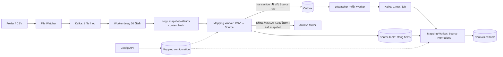

# Mapping Demo — แผนระหว่างออกแบบ

สถานะ: ร่างสำหรับการสัมภาษณ์ ยังไม่ใช่แผน implementation ที่ตกลงครบแล้ว

Sequence diagrams: [เปิดไฟล์ draw.io](diagrams/mapping-demo-sequence.drawio) — หน้า 01 Main Flow เรียง lifeline ซ้าย→ขวาตามลำดับงานใน flowchart ด้านล่าง ตามด้วยหน้า retry/reprocess และ configuration

## เป้าหมายและข้อกำหนดที่ผู้ใช้ระบุ

สร้างโปรเจกต์ขนาดเล็กเพื่อจำลองกระบวนการ mapping ประกอบด้วย:

1. API ด้วย C# / ASP.NET Core Web API
2. Service เฝ้าดูไฟล์
3. Docker สำหรับ Kafka work queue และ PostgreSQL
4. Service จัดการ mapping configuration และสร้างตาราง/คอลัมน์ผ่าน API
5. Service ประมวลผลไฟล์ตาม mapping configuration

## ข้อสรุปรอบที่ 1

- ใช้ 2 process ใน solution เดียว: API (มี File Watcher เป็น hosted service) และ Mapping Worker โดยต้องมี Kafka
- โปรเจกต์จริงรัน API หนึ่ง instance; เมื่อ API หยุด Watcher จะหยุดด้วย และการ scan ตอนเริ่มจะรับไฟล์ที่เข้ามาระหว่างหยุด
- ไฟล์ข้อมูลเป็น CSV มี header และ encoding UTF-8
- Pipeline: folder → watcher → Kafka → file-to-source mapping → Kafka → source-to-normalized mapping
- ขั้นแรกมี API endpoint สำหรับ config การจับคู่ field จาก CSV ลง source table
- ทุก field ข้อมูลจากไฟล์ใน source table เป็น string
- ขั้นที่สอง map source table ลง normalized table พร้อมแปลงชนิดข้อมูล, trim และ required validation
- API รองรับสร้างตารางและเพิ่มคอลัมน์
- ขอบเขต partner/ประเภทงานยังไม่ได้ตกลง

## ข้อสรุปรอบที่ 2

- ผูก folder กับ mapping config
- จัดการ config ผ่าน API ทั้งสองขั้น; หนึ่ง config มี Source หนึ่งตารางและ Normalized หนึ่งตาราง
- ต้องการแสดงแนวคิดการทำงานขนานและการเรียกทำงานแต่ละขั้นผ่าน Kafka; รายละเอียดตามข้อสรุปรอบที่ 3
- ย้ายไฟล์ไป Archive folder หลังนำเข้า Source ครบ ตามข้อสรุปรอบที่ 4
- เมื่อ normalize 100 แถวแล้วผิด 2 แถว ให้บันทึก 98 แถวที่ผ่าน ข้าม 2 แถวที่ผิด และบันทึก rownumber, field, สาเหตุ
- รัน Kafka/PostgreSQL บน Docker และรัน .NET ทั้ง 2 process บนเครื่องเพื่อ debug

## ข้อสรุปรอบที่ 3

- File Import Job: หนึ่งไฟล์ต่อหนึ่ง job สำหรับนำ CSV เข้า Source Table
- Row Normalization Job: เมื่อบันทึกแต่ละแถวลง Source สำเร็จ ให้ส่งงานแถวนั้นเข้า Kafka ทันที หนึ่งแถวต่อหนึ่ง job โดยไม่รอการนำเข้าทั้งไฟล์จบ
- การส่งต่อทันทีหมายถึงหลังข้อมูลแถวนั้น commit แล้ว โดยใช้ outbox ตามข้อสรุปรอบที่ 4
- ขั้นนำเข้าและ normalize ทำงานขนานกันได้ ทั้งระหว่างไฟล์และระหว่างแถวที่พร้อมแล้วของไฟล์เดียวกัน
- มี API สั่งรันแต่ละขั้นซ้ำผ่าน Kafka รวมถึง normalize จาก Source โดยไม่อ่าน CSV ซ้ำ; แยก retry/reprocess ตามข้อสรุปรอบที่ 4
- ตรึง config version ของทั้งสองขั้นตั้งแต่รับไฟล์
- rownumber คือลำดับ record ข้อมูล เริ่ม 1 ไม่นับ header และคงเลขเดิมตลอด pipeline
- จังหวะ Archive สรุปแล้วในรอบที่ 4: หลังนำเข้า Source ครบ
- ใช้เวลาหน่วงตายตัวก่อนนำเข้า ตามข้อสรุปเพิ่มเติมด้านล่าง

## ข้อสรุปรอบที่ 4

- Archive หลังนำเข้า Source ครบ ไม่รอ normalize ทุกแถวเสร็จ
- ไฟล์มาจาก partner; ไม่สามารถกำหนดให้ partner ใช้ชื่อ `.tmp` แล้ว rename ได้ ฝั่งระบบมีสิทธิ์ย้ายไฟล์ไป Archive
- เมื่อนำเข้าไฟล์ล้มกลางทาง ให้เก็บแถวที่สำเร็จแล้วไว้ บันทึกว่านำเข้าไม่ครบ และ retry โดยไม่สร้าง Source/Normalized ซ้ำ
- ใช้ outbox: บันทึก Source row และงานรอส่งใน transaction เดียว แล้วส่ง Kafka จาก background task ภายใน Worker
- รองรับการส่ง message ซ้ำโดยไม่สร้างผลลัพธ์ซ้ำ
- Retry ใช้ config version เดิม; Reprocess สามารถเลือก version ใหม่ได้
- ผลเมื่อ reprocess ล้มเหลวและการกันรันชนกันสรุปในรอบที่ 5; ขอบเขตการเลือกแถวยังต้องกำหนด

## ข้อสรุปรอบที่ 5

- ไฟล์เนื้อหาเหมือนกันภายใน Mapping Config เดียวกันถือเป็น duplicate แม้ชื่อไฟล์ต่างกัน โดยใช้ content hash ไม่ import เพิ่ม; ต้องการประมวลผลใหม่ให้ใช้ reprocess
- Reprocess ที่สำเร็จอัปเดตผลของ Source แถวเดิมและเก็บประวัติ; หากไม่ผ่าน ให้เก็บผลสำเร็จเดิมพร้อม version ที่สร้างผลนั้น และบันทึกข้อผิดพลาดของการรันล่าสุดแยกกัน
- ไม่อนุญาตให้ reprocess แถวเดียวกันซ้อนกัน
- Source เก็บ field จากไฟล์เป็น string; Normalized แปลงเป็น text/date/decimal/boolean พร้อม trim และ required ตามตาราง Normalized
- Enqueue ทันทีที่ Watcher พบไฟล์ แล้ว Worker หน่วง 30 วินาทีก่อนนำเข้า ตามข้อสรุปเพิ่มเติมด้านล่าง
- ชุดข้อมูลลูกค้าและจำนวน 2 configs จากข้อเสนอเดิมยังไม่ได้รับการยืนยัน; ไม่ถือเป็นข้อกำหนดของผู้ใช้

### ข้อสรุปเพิ่มเติม: เข้าคิวทันทีแล้วหน่วง 30 วินาที

ผู้ใช้กำหนด flow: `เข้าคิวทันที → Worker delay 30 วินาที → เริ่มนำเข้า Source`

- เริ่มนับ 30 วินาทีเมื่อ Worker รับงานไฟล์มาเริ่มจัดการ ไม่ใช่เมื่อ Watcher พบไฟล์
- ใช้ asynchronous delay ที่ยกเลิกได้เมื่อ service shutdown; งานไฟล์อยู่ในสถานะ `Delaying` ระหว่างรอ
- เป็นเวลาหน่วงตายตัว ไม่ตรวจความนิ่งทุก 5 วินาที และไม่เริ่มนับใหม่ตาม Changed event
- การรอเป็นของ File Import Job เท่านั้น; Row Normalization Job ไม่ต้องหน่วง 30 วินาที
- จำกัดจำนวนงานที่รับมารอ/ประมวลผลพร้อมกัน และให้ consumer ขั้น normalize ทำงานอิสระ
- หลังครบเวลา จึงเปิดอ่าน ตรวจ content hash และนำเข้าข้อมูล; หากเปิดอ่านหรือประมวลผลไม่ได้ ให้บันทึก failure และใช้ retry ตามกติกางานเดิม
- ห้ามบันทึกว่างานสำเร็จหรือยืนยัน Kafka offset จนกว่าจะมีผลหรือสถานะกู้คืนที่บันทึกถาวรแล้ว
- การหน่วงนี้ไม่รับประกันว่า partner เขียนไฟล์เสร็จ หากใช้เวลามากกว่า 30 วินาทีอาจอ่านข้อมูลไม่ครบ และไฟล์ที่ยังไม่ครบอาจเป็น CSV ที่ parse ได้โดยไม่มี error

### การรับไฟล์จาก partner

- ใช้ `FileSystemWatcher.Created` และ `Renamed` ที่พบ CSV เพื่อแจ้งให้ intake สร้าง File Import Job และ outbox โดยไม่อ่านเนื้อหาไฟล์ใน event handler
- แยกการตรวจ event ซ้ำของไฟล์ที่กำลังรับเข้า ออกจากการตรวจ duplicate ด้วย content hash ซึ่งทำหลังครบเวลาหน่วง
- ตรึง config version เมื่อรับ File Import Job; Worker ใช้สถานะ `Delaying` ระหว่างหน่วง 30 วินาที
- หลังเวลาหน่วงให้เปิดอ่านและตรวจ content hash ก่อน import; ห้าม resume ไฟล์ที่เนื้อหาเปลี่ยนโดยใช้ rownumber เดิม
- เสนอให้ scan เมื่อเริ่ม Watcher และ scan ชดเชยเป็นระยะ เพื่อรับไฟล์ที่ event ตกหล่น โดยผ่านการตรวจงานซ้ำชุดเดียวกัน
- เอกสาร Microsoft ระบุว่า `Created` เกิดทันทีเมื่อเริ่ม copy/transfer แล้วอาจมี `Changed` ตามมา จึงใช้ event เป็นสัญญาณพบไฟล์ ไม่ใช่สัญญาณเขียนเสร็จ ([FileSystemWatcher.Created](https://learn.microsoft.com/en-us/dotnet/api/system.io.filesystemwatcher.created?view=net-10.0))

การ enqueue ทันทีและหน่วง 30 วินาทีเป็นข้อสรุปแล้ว; ยังคง Archive หลังเข้า Source ครบตามข้อมูลที่อ่านได้

### ผลต่อวงจรงาน

1. Watcher สร้าง File Import Job พร้อมตรึง config version ทันทีที่พบไฟล์ แล้วส่งคำสั่งผ่าน outbox เข้า Kafka
2. Import Worker รับงานแล้วหน่วง 30 วินาที จากนั้น copy ไฟล์เป็น snapshot ตรวจ content hash แล้วอ่าน CSV จาก snapshot; ในแต่ละ transaction บันทึก Source row พร้อม Row Normalization Job และ outbox
3. Outbox dispatcher ส่งงานแถวเข้า Kafka หลัง commit โดยไม่รออ่านไฟล์ครบ
4. Normalize consumer ประมวลผลแถวที่พร้อมและบันทึกผลหรือ Row Error โดยอิสระจาก Import consumer
5. เมื่อนำเข้า Source ครบและบันทึกงานส่งต่อครบ และ hash ไฟล์จริงตรงกับ snapshot ให้ย้ายไฟล์ไป Archive ได้แม้บางแถวยังรอ normalize
6. สถานะนำเข้า, archive และ normalization แยกกัน; Archive ไม่ได้หมายความว่า normalize สำเร็จแล้ว
7. การสรุปผล normalization ของไฟล์ต้องรอทราบจำนวนแถวทั้งหมดและไม่มีงานแถวค้าง

การนำเข้าใหม่หลังล้มกลางทางต้องตรวจ content hash ว่าเป็นไฟล์เนื้อหาเดิม มิฉะนั้น rownumber เดิมอาจอ้างถึงข้อมูลคนละชุด; ป้องกันการเปลี่ยนแปลงระหว่างอ่านด้วย snapshot ตามข้อสรุปรอบที่ 6

M1 และ M2 เป็นสองส่วนภายใน Mapping Worker process เดียว; API ที่มี File Watcher เป็นอีก process
ทั้งสองขั้นใช้ config ที่จัดการผ่าน API
topic คือ `mapping.file-import` และ `mapping.row-normalize` ตามข้อสรุปรอบที่ 6; ส่งต่อหลัง commit ผ่าน outbox

### ข้อเสนอ contract เพื่อรองรับงานรายแถว — ยังไม่ถือเป็นข้อสรุป

- งานไฟล์อ้างอิง `fileJobId`, path ของไฟล์ที่รับไว้ และ `configVersionId`
- งานแถวอ้างอิง `rowJobId`, `fileJobId`, `sourceRowId`, `rownumber` และ version เดิม
- Source เก็บ field จาก CSV เป็นข้อความ; metadata สำหรับระบุตัวตน job/แถวแยกจาก field ข้อมูล
- รายงานผลไฟล์รวมจำนวนแถวที่นำเข้า, รอ normalize, สำเร็จ และผิดพลาด โดยปิดผลรวมเมื่อขั้นนำเข้าจบและไม่มี row job ค้าง
- Archive เป็นสถานะการจัดเก็บไฟล์ แยกจากผล normalization
- ใช้ outbox และป้องกันผลลัพธ์ซ้ำตามที่ตกลง; รายละเอียด identifiers/constraints เป็นข้อเสนอ implementation
- เสนอให้รับงานไฟล์และคำสั่ง retry/reprocess ผ่าน job record + outbox เช่นกัน เพื่อให้กู้คืนการส่งคำสั่งได้ โดยให้ dispatcher ใน Worker รับหน้าที่ส่งร่วมกัน

### API ที่เสนอสำหรับแผน implementation

| Endpoint | หน้าที่ |
|---|---|
| `POST /mapping-configs` | สร้าง config และผูก input folder |
| `POST /mapping-configs/{id}/versions` | สร้างรุ่นใหม่ที่ระบุ mapping ทั้งสองขั้น |
| `POST /mapping-configs/{id}/versions/{version}/activate` | ตรวจ config กับ schema ก่อนเลือกใช้กับไฟล์ใหม่ |
| `POST /tables` | สร้าง Source หรือ Normalized table ตาม definition |
| `POST /tables/{id}/columns` | เพิ่มคอลัมน์ |
| `GET /file-jobs/{id}` | ดูผลนำเข้า, archive และยอดงานรายแถว |
| `GET /file-jobs/{id}/errors` | ดูข้อผิดพลาดพร้อม rownumber, field, สาเหตุ |
| `POST /file-jobs/{id}/retry` | ขอ retry การนำเข้าด้วย version เดิม |
| `POST /row-jobs/{id}/retry` | ขอ retry normalization ด้วย version เดิม |
| `POST /file-jobs/{id}/reprocess` | ขอ normalize จาก Source ด้วย version ที่เลือก |

ชื่อ endpoint และ request/response ยังเป็นข้อเสนอ; reprocess ต้องตรวจว่า Source มี field ที่ version ใหม่ต้องใช้ โดยไม่เปลี่ยนความหมายของการนำเข้าที่จบแล้ว

### เกณฑ์ตรวจ demo ที่มาจากข้อกำหนดที่ตกลงแล้ว

- สร้าง schema/config ทั้งสองขั้นผ่าน API และนำ CSV เข้า Source โดย field ข้อมูลยังเป็นข้อความ
- Watcher ส่งงานเมื่อพบไฟล์; Worker ไม่เริ่มเปิดอ่าน/hash/import ก่อนครบ 30 วินาทีหลังรับงาน โดยขั้น normalize ทำงานได้ระหว่างนั้น
- เห็น row job เริ่ม normalize ก่อน File Import Job จบ
- ไฟล์ A และ B ประมวลผลคาบเกี่ยวกันได้
- CSV 100 records มี 2 records ผิด validation: Source มี 100, Normalized มี 98 และค้น error ด้วย rownumber/field/สาเหตุได้
- Archive หลังเข้า Source ครบ ขณะที่ normalization อาจยังทำงานอยู่
- หยุดหลัง Source/outbox commit แล้วเริ่มใหม่: งานแถวส่งต่อได้ และการส่งซ้ำไม่เพิ่มผลซ้ำ
- นำเข้าล้มกลางทางแล้ว retry ไฟล์เดิม: ไม่เพิ่ม Source/Normalized ซ้ำ
- แก้ config ระหว่างงาน: งานเดิมยังใช้ version ที่ตรึงไว้
- Retry ใช้ version เดิม; Reprocess ใช้ version ที่เลือกและมีประวัติแยก
- ส่งไฟล์เนื้อหาเดิมด้วยชื่อใหม่ภายใต้ config เดิม: เป็น duplicate และไม่เพิ่ม Source/Normalized
- Reprocess version ใหม่ไม่ผ่าน: ผลสำเร็จเดิมและ version เดิมยังอยู่ พร้อมข้อผิดพลาดจากการรันล่าสุด
- Log partition ของไฟล์ A และ B ยืนยันว่าอยู่คนละ partition และหน่วง 30 วินาทีพร้อมกัน
- แก้ไฟล์จริงหลัง copy snapshot แล้ว: ไฟล์ได้ `ChangedAfterRead` และไม่ถูกย้ายไป Archive
- แถวที่ระบบล้มจนเป็น `Failed`: ไฟล์ได้ `CompletedWithErrors`; retry แถวสำเร็จแล้วสถานะไฟล์คำนวณใหม่

ข้อเท็จจริงทางเทคนิค: Kafka consumer ใน Worker อ่าน message แล้วเรียก logic ของแต่ละขั้น; broker ไม่ได้เรียก HTTP endpoint กลับเอง ([Kafka consumer design](https://docs.confluent.io/kafka/design/consumer-design.html))

## ข้อสรุปรอบที่ 6 — ทบทวนวงจรงานทีละขั้น

ทบทวนวงจรงาน 7 ขั้นเมื่อ 2026-09-21 ข้อที่มี ★ ผู้ใช้ตัดสินเอง ข้ออื่นผู้ใช้รับค่าที่เสนอโดยไม่แก้

### Step 1 — Watcher รับไฟล์

- ★ ตรึง config version ตอน Watcher สร้าง File Import Job; ถ้า activate version ใหม่ระหว่างงานรอหน่วง งานเดิมยังใช้ version เดิม
- คีย์กัน event ซ้ำคือ `configId + path + size + lastWriteTime` เพื่อไม่ให้ไฟล์ชื่อเดิมที่ partner ส่งทับถูกมองว่าซ้ำ
- ไฟล์ที่ไม่ใช่ `.csv` ข้าม; folder ที่ไม่มี active config ให้ log warning และไม่สร้าง job
- Watcher บันทึก job และ outbox ลง PostgreSQL; ถ้า Worker ไม่ได้รัน งานรออยู่ใน outbox จนกว่า dispatcher จะเริ่มทำงาน

### Step 2 — หน่วงแล้วนำเข้า Source

- ★ topic `mapping.file-import` มีหลาย partition และใช้ `fileJobId` เป็น key; Worker มี consumer ใน group เท่าจำนวน partition เพื่อไม่ให้การหน่วงของไฟล์หนึ่งบล็อกไฟล์อื่น
  - ไฟล์ที่ hash ลง partition เดียวกันยังทำงานต่อกัน; script demo ต้อง log partition ของแต่ละไฟล์เพื่อยืนยันว่าคาบเกี่ยวกันจริง
- copy ไฟล์เป็น snapshot ใน staging แล้ว hash และ parse จาก snapshot เท่านั้น; retry นำเข้าต่อจาก snapshot เดิม จึงปิดปัญหาไฟล์เปลี่ยนระหว่างอ่าน
- 1 Source row ต่อ 1 transaction: Source row + Row Normalization Job + outbox
- ไฟล์ duplicate ได้สถานะ `Duplicate` แล้วย้ายไป Archive เพื่อไม่ให้ scan ชดเชยพบซ้ำ

### Step 3 — Outbox dispatcher

- มี 2 topic:
  - `mapping.file-import` สำหรับงานไฟล์ใหม่และ retry การนำเข้า
  - `mapping.row-normalize` สำหรับงานแถว, retry แถว และ reprocess; reprocess ทั้งไฟล์กระจายเป็นงานรายแถวผ่าน outbox
- key ของ row job คือ `sourceRowId` เพื่อให้แถวของไฟล์เดียวกันทำงานขนานได้ และงานของแถวเดียวกันเรียงลำดับใน partition เดียว; ยังต้องมี lock ฝั่ง DB กัน reprocess แถวเดียวกันซ้อน
- ส่งแบบ at-least-once: บันทึก `sent_at` หลัง broker ack; poll ทุก 500ms ครั้งละไม่เกิน 100 รายการ; ไม่ลบ outbox ที่ส่งแล้วเพื่อดูย้อนหลังตอน demo

### Step 4 — Normalize consumer

- กันผลซ้ำใน transaction เดียว: ถ้า Row Job เป็น `Done` หรือ `Invalid` แล้วให้ข้าม; ไม่เช่นนั้นบันทึก Normalized (unique `sourceRowId`) หรือ Row Error พร้อมเปลี่ยนสถานะ; commit offset หลัง DB commit
- แถวที่ผิดหลาย field เก็บ Row Error ทุก field
- ค่าเริ่มต้นการแปลง ซึ่ง config แต่ละคอลัมน์ override ได้:
  - date `yyyy-MM-dd`
  - decimal ใช้ `InvariantCulture` จุดเป็นทศนิยม ไม่มี comma คั่นหลัก
  - boolean `true/false/1/0` ไม่สนตัวพิมพ์
  - ค่าว่างหลัง trim: required เป็น error, ไม่ required เป็น `NULL`
- แยก error สองชนิด:
  - ข้อมูลผิด: Row Error + สถานะ `Invalid` ไม่ retry อัตโนมัติ แก้ด้วย reprocess
  - ระบบล้ม: ไม่ commit offset, retry ใน process 3 ครั้งแบบ backoff แล้วเป็น `Failed` และ commit offset; สั่งซ้ำผ่าน `POST /row-jobs/{id}/retry`

### Step 5 — Archive

- ★ ก่อนย้าย hash ไฟล์จริงแล้วเทียบกับ snapshot: ตรงกันย้ายไป Archive แล้วลบ snapshot; ไม่ตรงตั้ง `ChangedAfterRead` ไม่ย้ายไฟล์ และรอคนตัดสิน
  - ข้อนี้ทำให้เห็นกรณีที่ 30 วินาทีไม่พอ แต่ไม่ได้ป้องกัน เพราะแถวจาก snapshot เข้า Source และ normalize ไปแล้ว
- path ใน Archive คือ `archive/{configId}/{yyyyMMdd}/{fileJobId}_{ชื่อเดิม}`
- การย้ายทำซ้ำได้: ถ้าไฟล์อยู่ที่ archive path แล้วให้ตั้งสถานะเท่านั้น; Archive folder ต้องไม่อยู่ใต้ input folder ที่ Watcher เฝ้าดู
- ย้ายไม่ได้ retry 3 ครั้ง แล้วตั้ง `ArchiveFailed` โดยไม่กระทบ normalization; import ล้มกลางทางไม่ย้ายไฟล์

### Step 6–7 — สถานะและผลสรุปของไฟล์

| มิติ | สถานะ |
|---|---|
| File `import_status` | `Queued` → `Delaying` → `Importing` → `Imported` / `ImportFailed` / `Duplicate` |
| File `archive_status` | `NotArchived` → `Archived` / `ArchiveFailed` / `ChangedAfterRead` |
| File `normalization_status` | `InProgress` → `Completed` / `CompletedWithErrors` |
| Row Job `status` | `Pending` → `Done` / `Invalid` / `Failed` |

- บันทึก `total_rows` ครั้งเดียวเมื่อไฟล์เป็น `Imported`; ยอดแยกสถานะ query จาก Row Jobs ตอนเรียก `GET /file-jobs/{id}` ไม่ใช้ counter บน file job เพื่อไม่ให้ row jobs ที่ทำขนานแย่ง lock
- `normalization_status` ปิดได้เมื่อ `import_status = Imported` และไม่มี `Pending`; แถว `Failed` นับว่าปิดแล้วและแสดงยอดแยกจาก `Invalid` จึงได้ `CompletedWithErrors`; retry แถวแล้วสถานะไฟล์คำนวณใหม่เอง
- ไฟล์ `ImportFailed` ยังไม่มี `total_rows` จึงเป็น `InProgress` จนกว่า retry นำเข้าจะสำเร็จ; แถวที่เข้า Source แล้วยัง normalize ต่อได้

## บริบทเอกสารเดิม

- [ระบบเดิม](../current-program-workflow.md) อธิบาย flow ไฟล์ → staging → mapping/condition → ตารางปลายทาง และแยกไฟล์ข้อมูลออกจาก configuration
- [แผน modernization](../plan-mapping-api-modernization.md) เสนอ service รวมและ SQL job queue เป็น MVP
- คำขอ demo ปัจจุบันกำหนด Kafka และ PostgreSQL จึงใช้คำขอปัจจุบันเป็นหลัก ไม่ถือว่าข้อเสนอเก่าถูกเลือกสำหรับ demo

## ผังการตัดสินใจ

รอบถัดไป — ขอบเขตที่ต้องตกลง:

- รายละเอียด reprocess ที่เลือกบางแถว/ทุกแถว → API contract
- จำนวนชุด config และตัวอย่าง → schema และ acceptance criteria

เมื่อข้อกำหนดที่เกี่ยวข้องชัดเจน ต้องปิดรายละเอียด retry/replay, file deduplication, config/schema validation และเกณฑ์ผ่านของ demo
การตรวจไฟล์เปลี่ยนระหว่างอ่านและรูปแบบข้อมูลสำหรับ conversion ปิดแล้วในข้อสรุปรอบที่ 6

## ลำดับงานเบื้องต้น

1. ตกลงตัวอย่าง input, config และผลลัพธ์ที่คาดหวัง
2. เตรียม solution และ Docker infrastructure
3. ทำ API จัดการ config และโครงสร้างตารางตามขอบเขตที่ตกลง
4. ทำ file intake และส่งงานเข้า Kafka
5. ทำ mapping worker และบันทึกผลลง PostgreSQL
6. เพิ่มสถานะงานและพฤติกรรมเมื่อผิดพลาดตามขอบเขตที่ตกลง
7. เตรียม script สาธิตและตรวจผลครบเส้นทาง

แต่ละขั้นยังต้องเติม API contract, schema, acceptance criteria และวิธีทดสอบหลังได้ข้อสรุป
