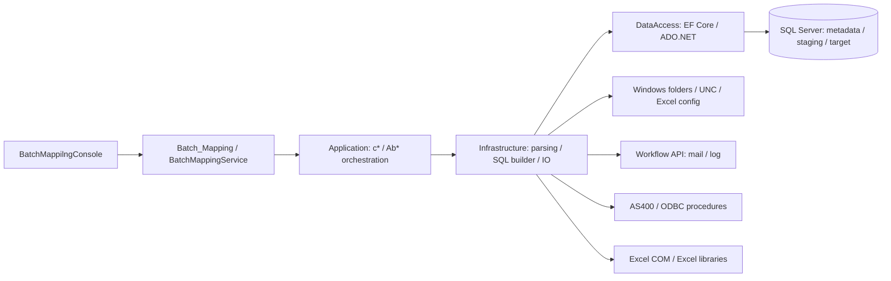
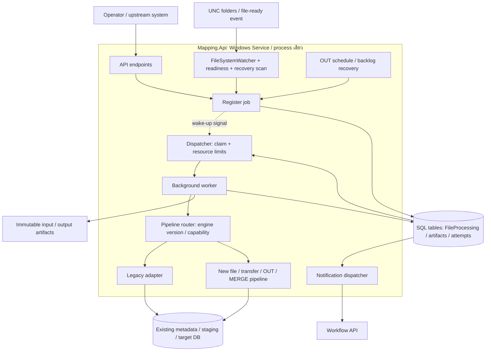
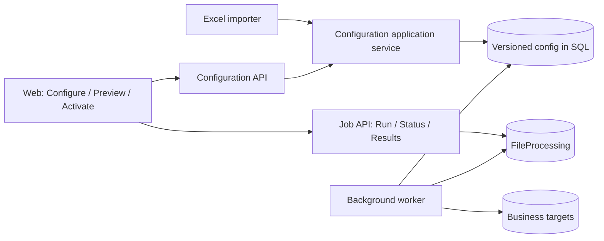
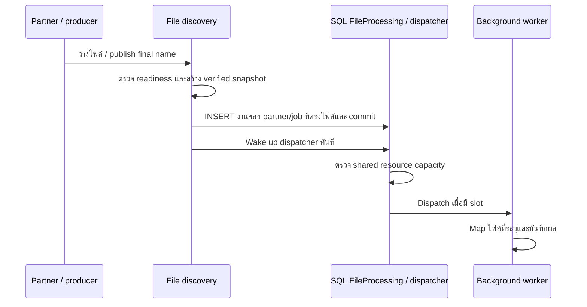
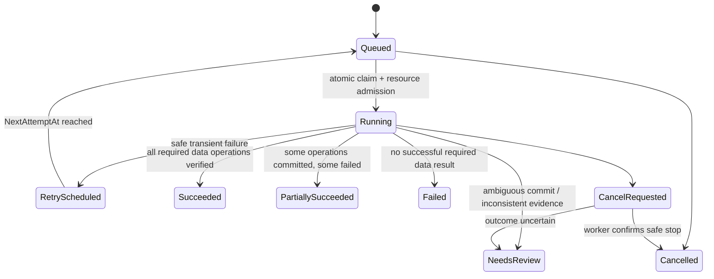

# แนวทางปรับ Batch Mapping เป็น Multi-partner API Service

วันที่: 15 กันยายน 2026  
ปรับปรุงบริบท partner และ Excel configuration: 16 กันยายน 2026  
เพิ่มแนวทาง Web Mapping Configuration และ database revisions: 16 กันยายน 2026  
สถานะ: Architecture proposal สำหรับวางแผน implementation ยังไม่ได้เปลี่ยน runtime หรือ deploy  
วิธีการ: ใช้ skill `legacy-modernizer` โดยประเมิน dependency และ risk ก่อนออกแบบ incremental migration

## 1. ข้อเสนอหลัก

สร้าง **service กลางตัวเดียวที่รวม API + FileSystemWatcher + background worker และใช้ SQL table เก็บไฟล์/งาน/สถานะร่วมกันทุก partner** ใช้ codebase และ release เดียว แยกความต่างของ partner เป็น versioned configuration และ strategy เฉพาะกรณี แล้วทยอยย้าย pipeline เดิมเข้า platform ด้วย Strangler Fig Pattern

API รับคำสั่ง trigger/rerun และให้ตรวจผล ส่วน worker รับเฉพาะรายการงานที่พร้อมจาก SQL table งาน mapping ไม่ผูกกับอายุ HTTP request และไม่เริ่ม processing ทุก partner ในแต่ละรอบอีก MVP ไม่ต้องมี in-memory queue หรือ message broker เพิ่ม คำว่า queue/JobStore ในเอกสารนี้หมายถึงรายการงานและสถานะที่ persist ใน SQL table ส่วน dispatcher คือ logic เลือกงานภายใน service ไม่ใช่ service แยก

**Requirement เพิ่มเติม:** partner ใดวางไฟล์เข้ามา ระบบต้องตรวจและเริ่ม mapping อัตโนมัติทันทีที่ไฟล์พร้อมและมี execution capacity โดยไม่ต้องเรียก API เอง ไม่รอ scheduled batch หรือรอ partner อื่นจบรอบ ใช้ event-driven intake เป็นเส้นทางหลัก คำว่า “ทันที” เริ่มนับหลัง producer เขียนไฟล์เสร็จ ไม่ใช่ตอนที่ไฟล์เพิ่งปรากฏแต่ยัง copy อยู่ หาก shared DB resource เต็มให้แสดง Queued พร้อมเหตุผลแทนการเพิ่ม writer จนเกิด contention

สิ่งที่เปลี่ยนเพื่อแก้แต่ละปัญหา:

| ปัญหา | แนวทาง |
|---|---|
| build/copy executable แยก folder ต่อ partner | build/deploy service กลางชุดเดียวที่รวม API และ background worker; partner registry เลือก config ตอนรับงาน |
| ทุก partner ตื่นขึ้นมาทำ pipeline พร้อมกัน | trigger สร้าง job เฉพาะ source ที่พร้อม; scheduler กระจายเวลาและ worker จำกัด concurrency |
| ไม่มีไฟล์แต่ยังทำ mapping/transfer | แยก file discovery ออกจาก processing; transfer backlog และ OUT มี trigger ของตนเอง |
| DB lock บ่อย | จำกัด writer ตาม shared DB resource, ลด scope SQL/transaction, เอา config import/DDL ออกจาก file processing และวัด blocking จริง |
| ต้อง rerun ด้วยการย้ายไฟล์/reset flag | rerun endpoint สร้าง execution ใหม่จาก immutable input และ checkpoint พร้อม deduplication |
| ไม่รู้ว่าสำเร็จจริงหรือแค่ process จบ | durable status, row/target result, error classification และ audit trail |

**ข้อจำกัดของข้อสรุป:** API ช่วยจัดการคำสั่งและงาน แต่การเปลี่ยน host เป็น API เพียงอย่างเดียวไม่ยืนยันว่า DB lock จะหาย ต้องแก้ขอบเขตการเขียนและวัด root cause ประกอบด้วย

## 2. Assessment จากระบบปัจจุบัน

### 2.1 หลักฐานและความต่างจากปัญหาที่รายงาน

เอกสารอ้างอิงหลักคือ [current-program-workflow.md](current-program-workflow.md) และตรวจ code บางส่วนประกอบ โดยยังไม่ได้เชื่อม development/production DB หรือรันไฟล์จริง

| สิ่งที่พบ | ผลต่อการออกแบบ |
|---|---|
| ผู้ใช้รายงานว่า deployment แยก folder ต่อ partner แต่ `BatchMappilngConsole` มี multi-partner อยู่แล้ว | แก้ deployment/configuration และ job coordination ได้โดยไม่ต้องเขียน business mapping ใหม่ทั้งหมด; ต้องสำรวจว่าเครื่องจริงใช้ host ใด |
| single host วน Original/Transfer; multi-partner host ใช้ `Watch` gate ก่อน `WhileExecute(false)` | ไม่ควรสรุปว่าทุก host เขียน business DB ทั้งที่ไม่มีไฟล์ในรูปแบบเดียวกัน |
| multi-partner host ใช้ `Parallel.ForEach` แล้วรอทุก partner จบก่อนรอบใหม่ | partner ช้าขวางรอบถัดไป และ concurrency limit ไม่ครอบคลุม process อื่น |
| ready-file list ไม่ถูกส่งเข้า Application และ extension filter มีค่าที่คำนวณแต่ไม่ได้ใช้ | ต้องเปลี่ยน entry point ให้รับ file/job ที่ระบุชัดเจน ไม่ enumerate ใหม่ทั้ง partner |
| normal one-shot เรียก MapConfig → CreateTable → Timers ก่อน data pipeline | แยก configuration lifecycle ออกจาก execution lifecycle |
| `InfraApp.BatchMode/BatchType` เปลี่ยนระหว่างวน job | ใช้ execution context ต่อ job; ห้ามแชร์ mutable instance ระหว่าง partner |
| save header อิง SystemID/filename/sheet; row status บางเส้นทาง update ด้วย RowNumber อย่างเดียว | ต้องแก้ identity และ SQL scope ก่อนเปิด concurrency/rerun |
| SQL helpers/phase บางส่วนกลืน exception; host Completed ไม่เท่ากับข้อมูลสำเร็จ | adapter ต้องคืน structured result และ reconcile ผล DB ห้ามตัดสินจาก return ปกติหรือ log End |
| target, conditions และ SQL templates อยู่ใน metadata DB | ยังยืนยัน coverage ของทุก partner จาก source code เพียงอย่างเดียวไม่ได้ |
| OUT ใช้ TABLE/ODBC และมี AY-OS query ตายตัว; MERGE รวมหลายไฟล์ | common platform ต้องรองรับหลาย pipeline type และ strategy เฉพาะ partner |

หลักฐาน: [workflow หัวข้อ 3–8, 12–16](current-program-workflow.md), [BatchMappingService.cs](../Batch_Mapping/BatchMappingService.cs), [Program.cs ของ multi-partner host](../BatchMappilngConsole/Program.cs), [AbOriginalMapping.cs](../Application/Common/AbStract/AbOriginalMapping.cs)

### 2.2 Dependency map ปัจจุบัน



### 2.3 External integration และ data contract inventory

ตารางนี้เป็น inventory ขั้นต้น ทุกช่องที่ยังไม่ทราบต้องมี owner ยืนยันก่อนย้าย partner นั้นเข้า production ไม่ถือว่าได้ตรวจครบทุก integration แล้ว

| Boundary | Contract ที่ต้องรักษา/เก็บเพิ่ม | Owner ที่เสนอ |
|---|---|---|
| File producer → input | partner/job, filename rules, encoding 874/UTF-8, delimiter/fixed width, sheet/column order, password, readiness signal, duplicate policy | Integration team + partner owner |
| Excel config/JSON → metadata | partner/job identity, TIMER, schema, mapping, SQL template, active flags และ revision | Application team |
| Metadata/staging → targets | table/schema, column types, keys, triggers, template side effects, primary/UNION targets, reconciliation | Application team + DBA |
| File archive/output → downstream | naming, archive paths, consumer pickup, overwrite policy, retention, output readiness | Operations + downstream owner |
| Mapping → Workflow API | request/response schema, timeout, acknowledgement, idempotency, mail grouping และ log fields | Workflow API owner |
| OUT → AS400 | ODBC driver/account, stored procedure input/output, timeout และ side effects | AS400 owner |
| Service → Windows/UNC/Excel | service account, ACL, locale/timezone, COM dependencies และ non-interactive execution | Operations |

ข้อมูลที่ยังต้องเก็บ: deployed host/process/schedule จริง, partner/job list, sanitized metadata export, representative files, target constraints/indexes/triggers, blocking/deadlock reports และ downstream SLA ใช้ secret reference ในเอกสาร/config model ไม่คัดลอก credentials

### 2.4 Risk register

ระดับต่อไปนี้เป็นการประเมินเชิงออกแบบ ยังไม่มี production frequency รองรับ

| Risk | ระดับ | Mitigation / release gate |
|---|---|---|
| old/new worker อ่าน source หรือเขียน target เดียวกัน | Critical | single execution owner ต่อ partner/job; pause/drain และตรวจ process เก่าก่อน cutover |
| rerun หลัง partial commit ทำข้อมูลซ้ำ | Critical | target execution ledger + unique operation key; ผลไม่แน่ชัดต้อง reconcile ก่อน retry |
| update/query scope กว้างข้าม TransID | Critical | ตรวจ SQL templates และบังคับ scope ทุก statement; integration test สองไฟล์ที่ RowNumber ซ้ำ |
| archive แล้วข้อมูลยังไม่ครบ/สูญเสียต้นฉบับ | High | immutable snapshot ก่อน processing; finalization แยกจาก data commit |
| หลาย partner ใช้ resource เดียวกันแล้ว lock | High | shared resource concurrency limit และ measured SQL tuning |
| COM/global state ใช้กับ service หรือ concurrency ไม่ได้ | High | capability routing ไป isolated Windows worker จาก artifact เดียว; ทดสอบ service account จริงใน dev |
| status แสดงสำเร็จผิด | High | structured outcome + persisted reconciliation; แยก data result กับ notification result |
| เปลี่ยน config ระหว่างงานทำให้ผลไม่ซ้ำเดิม | High | pin config/template/engine version ต่อ execution |
| queue DB/UNC/AS400 ล่ม | High | durable recovery, bounded retry/backoff, pause resource และ alert |

### 2.5 บริบทก่อน mapping: เพิ่ม partner และกำหนดประเภทงาน

ข้อมูลส่วนนี้มาจากคำอธิบายผู้ดูแลระบบและ [workflow หัวข้อ 1.1–1.3](current-program-workflow.md) เป็นบริบทธุรกิจสำหรับปรับแผน ไม่ใช่หลักฐานว่าระบบใหม่ implement แล้ว เมื่อมี partner ใหม่ ต้องกำหนด field จากไฟล์ให้ตรงกับตารางต้นทางในฐานข้อมูลเพื่อ insert ข้อมูล แล้วกำหนด field ที่จะ map ไปตารางปลายทาง เช่น `mti_original` พร้อมเงื่อนไขแปลงค่าหรือตรวจสอบกับตารางอื่นตามที่แต่ละ field ต้องใช้

ตารางต้นทาง (staging) ตั้งชื่อตามแนวทาง `trn` + ชื่อ partner + ประเภทงาน เช่น partner KK:

| ประเภทไฟล์ | ความหมายทางธุรกิจ | ตัวอย่างตารางต้นทาง |
|---|---|---|
| แจ้งงานเข้า | ขอสร้างกรมธรรม์จากข้อมูลที่ partner แจ้งเข้ามา | `trnkkjob` |
| ยืนยัน | บาง partner ส่งข้อมูลเข้าก่อนโดยยังไม่ออกกรมธรรม์ แล้วส่งไฟล์ยืนยันข้อมูลก่อนออกกรมธรรม์ | `trnkkos` |
| ยกเลิก | ขอให้ยกเลิกงานที่เคยแจ้งเข้าเพื่อออกกรมธรรม์ | `trnkkcancel` |

ไม่ใช่ทุก partner ต้องมีขั้นยืนยัน และไม่ใช่ทุกงานต้องผ่านทั้ง 3 ประเภทตามลำดับ การ map สำเร็จไม่เท่ากับออกกรมธรรม์สำเร็จ ต้องยืนยัน contract กับระบบปลายทาง รวม business key ที่ใช้เชื่อมงานเดิมกับไฟล์ยืนยัน/ยกเลิก และพฤติกรรมเมื่อไฟล์มาผิดลำดับก่อนย้าย partner นั้น

ผู้ดูแลกำหนดข้อมูลผ่าน Excel 6 แท็บ โดยไฟล์ตัวอย่าง [NewMapping-NTL-Pro.xlsx](NewMapping-NTL-Pro.xlsx) มีโครงสร้างดังนี้:

| แท็บ | หน้าที่เดิม | ข้อมูลที่แผนใหม่ต้องรองรับ |
|---|---|---|
| `Configuration` | บอก path ที่อ่านไฟล์ต้นทาง | input routing และรายละเอียดรับไฟล์ต่อ partner/job |
| `Timer` | บอกเวลารันงานตาม configuration | เก็บ schedule เดิมไว้สำหรับงานที่ต้องใช้ โดยกำหนด trigger policy ให้ชัดเจน |
| `TableName` | ระบุตารางต้นทางและปลายทาง | source/target references ต่อ job definition |
| `Table-<partner>-01` | ระบุ field ทั้งหมดของตารางต้นทาง | field layout, data type, length และ nullability สำหรับ staging |
| `Mapping-<partner>-01` | ระบุ field ต้นทางที่ map ไป field ปลายทาง | field mappings และค่า default/ค่าคงที่ |
| `Condition-<partner>-01` | ระบุเงื่อนไขเพิ่มเติมหรือแปลงข้อมูล รวมการตรวจสอบจากตารางอื่น | transformation/lookup rules และ dependency ที่ต้องใช้ |

ไฟล์ตัวอย่างใช้ชื่อ `Table-NTL-01`, `Mapping-NTL-01`, `Condition-NTL-01`; `TableName!A2:D2` ระบุ `NTL / 01 / trnNtlJob / MTI_ORIGINAL` จึงเป็นตัวอย่าง NTL/job 01 ไม่ได้ยืนยันรหัสงานยืนยัน/ยกเลิกหรือปลายทางของทุก partner ชื่อตารางจริงต้องอ่านจาก configuration ไม่สร้างจากชื่อ partner โดยอัตโนมัติ

Flow ที่ต้องรักษาคือ **ไฟล์งาน → insert ตารางต้นทาง → mapping พร้อมเงื่อนไข → ตารางปลายทาง** โดย Excel เป็น configuration ของ flow ไม่ใช่ไฟล์งาน ข้อจำกัด importer เดิม เช่น ไม่ overwrite mapping เดิมทุกกรณี และไม่ใช้ทุกค่า default ใน workbook ต้องนำมาทำ compatibility tests ตาม [workflow หัวข้อ 5](current-program-workflow.md) ก่อนกำหนดพฤติกรรม importer ใหม่

ผู้ดูแลระบุเพิ่มเติมว่าข้อมูลแจ้งงานถูกกระจายไป insert ตามกลุ่มข้อมูลดังนี้:

| กลุ่มข้อมูล | ตารางปลายทาง |
|---|---|
| ข้อมูลทั่วไป | `mti_original` |
| ข้อมูลลูกค้า/บุคคล/นิติบุคคล | `mti_original_client` |
| ข้อมูลรายละเอียดรถ | `mti_original_cardetail` |

แผนจึงต้องรองรับหลาย target operations ต่อหนึ่งงานแจ้งเข้า และรายงานผลของแต่ละตาราง ไม่ตัดสินว่างานสำเร็จเพียงเพราะ insert `mti_original` สำเร็จ ก่อนย้ายต้องเก็บ contract ของ field/key ที่เชื่อมตาราง จำนวนแถว ลำดับ/dependency และ transaction ที่ใช้งานจริง รวมเงื่อนไขว่ารายการใดต้องมีข้อมูลลูกค้าหรือรถ โดยไม่สมมติว่าแต่ละงานสร้างหนึ่งแถวในทุกตารางเสมอ กลไก multi-target checkpoint/rerun ในหัวข้อ 8 ต้องครอบคลุมตารางเหล่านี้ด้วย

## 3. Architecture เป้าหมายและ deployment

### 3.1 รูปแบบที่เลือก

เริ่มด้วย **modular monolith ที่มี host/process เดียว** รวม API, FileSystemWatcher และ background worker ภายใน `Mapping.Api` ทุก partner ใช้ service instance กลางเดียวใน MVP โดย deploy เป็น Windows Service ที่เปิด HTTP endpoint และเริ่มอัตโนมัติ ไม่อาศัย HTTP request เพื่อปลุก service การแยก API host กับ Worker host เป็นทางเลือกภายหลังเมื่อมีเหตุผลด้าน capacity หรือ isolation

API ทำ authentication/authorization, validation, job submission และ result query ส่วน Worker ทำ discovery, dispatch, mapping และ finalization ตาม capability ใช้ `BackgroundService` เป็น lifecycle ของงานเบื้องหลังได้ โดยสร้าง DI scope ต่อ execution สำหรับ scoped dependencies ตาม [Microsoft hosted services guidance](https://learn.microsoft.com/en-us/aspnet/core/fundamentals/host/hosted-services)



### 3.2 SQL table เป็นแหล่งงานและสถานะ

| ทางเลือก | Trade-off | ข้อเสนอ |
|---|---|---|
| SQL table `FileProcessing` + background worker | เก็บงานที่รอทำและประวัติไว้ที่เดียว; restart แล้ว recover ได้ แต่ต้องมี atomic claim/index/retry policy | เลือกเป็น baseline ของ MVP |
| in-memory queue | เพิ่มรายการงานอีกชุดที่ต้องประสานกับ DB; ไม่จำเป็นสำหรับ flow นี้ | ไม่ใช้ใน MVP |
| external broker + JobStore | แยก queue load จาก DB แต่เพิ่ม infrastructure และ publish/duplicate handling | พิจารณาภายหลังเมื่อผลวัดชี้ว่าจำเป็น |

Flow หลักคือ `file ready → INSERT FileProcessing → commit → ส่ง wake-up signal → worker claim → process` โดย signal เป็นเพียงการแจ้งว่า table อาจมีงาน ไม่เก็บ payload/list ของไฟล์ใน memory queue หาก signal หายหรือ service restart ให้ค้นรายการที่พร้อมจาก table; เมื่อ worker ทำงานจบให้ตรวจงานถัดไปทันที ไม่รอ scan รอบใหม่

FileSystemWatcher callback ต้องทำงานสั้นและไม่เรียก mapping โดยตรง ใช้ bounded discovery/background work ตรวจ candidate จาก input roots; เมื่อระบบไม่ว่างให้เก็บงานพร้อมใน table แทนการสร้าง task ไม่จำกัดต่อ event

MVP แยก control tables/schema จาก business tables ใน SQL Server ที่มีอยู่ได้ ไม่บังคับเพิ่ม database/instance ใหม่ ให้ DBA ประเมิน workload ก่อนเลือกที่วาง คำว่า Control DB ในเอกสารหมายถึง logical job/config storage; แยก database/instance ภายหลังได้หากผลวัดรองรับ การใช้ table ไม่ได้ทำให้ idle DB activity เป็นศูนย์: ยังมี indexed recovery checks/heartbeat แต่ไม่มีการเรียก mapping pipeline เพื่อถามว่ามีงานหรือไม่

ไม่เพิ่ม microservice ต่อ partner หาก COM ใช้ใน service กลางไม่ได้ ให้เก็บ partner นั้นที่ legacy ระหว่าง pilot หรือแยก isolated worker สำหรับ capability นั้นหลังผ่าน tests โดยยังใช้ release กลางเดียวกัน

### 3.3 ขอบเขต project/module ที่เสนอ

| ส่วน | ความรับผิดชอบ |
|---|---|
| `Mapping.Api` ใหม่ | host เดียวสำหรับ HTTP contracts, access control, submit/query/cancel intent และ hosted background services |
| Background modules ภายใน `Mapping.Api` | FileSystemWatcher/discovery, scheduler, worker, claim/heartbeat, graceful shutdown; ยังไม่สร้าง `Mapping.Worker` project แยกใน MVP |
| `Application` | use cases และ pipeline orchestration, legacy adapter, typed execution result |
| `Infrastructure` | interfaces/DTOs, parser, file storage, resource gate, notification adapters |
| `DataAccess` | JobStore, execution ledger, metadata/target access |

รักษาทิศทาง dependency เดิม host → Application → Infrastructure → DataAccess และ default-interface-method architecture ที่ไม่จำเป็นต้องเปลี่ยน ใช้ prefix `I*`, `Ab*`, `c*`, `m*` ตาม repo เมื่อลงมือเขียนจริง ห้าม hand-edit scaffolded entity/DbContext; schema ใหม่ต้องมี migration/deployment script และ regenerate ด้วย workflow ของ repo ตามความเหมาะสม

แผนนี้คง target framework `net6.0`/`net6.0-windows` ตาม repository guideline; runtime upgrade เป็นงานแยกหากมีการร้องขอ เอกสาร Microsoft ที่อ้างใช้ประกอบ pattern ไม่ใช่คำสั่งนำ API/package ของ version ล่าสุดมาใช้โดยไม่ตรวจ compatibility

## 4. Multi-partner configuration

เป้าหมายคือสร้าง/แก้ไข mapping ผ่านหน้าเว็บ และเก็บ configuration ในฐานข้อมูลเป็นแหล่งข้อมูลหลัก โดยคง Excel เป็นช่องทาง import ทั้งสองช่องทางใช้ config model, validation และ lifecycle เดียวกัน หน้าเว็บสั่งรันและติดตามผลผ่าน API ส่วน mapping จริงทำใน background worker ตาม job/config version ที่ระบุ

แยก `PartnerId`, `JobDefinitionId`, `PipelineType` และ `ConfigVersion` ออกจาก `ApplicationMode` เดิม แล้วให้ adapter แปลงเป็น BatchMode/BatchType เฉพาะตอนเรียก legacy

Job definition ควรมี:

- `PartnerId`, `JobDefinitionId`, `Enabled`, `PipelineType`: `InboundMapping`, `TransferBacklog`, `OutboundExport`, `Merge`
- ประเภทงานธุรกิจ แจ้งเข้า/ยืนยัน/ยกเลิก และรหัส legacy job ที่ระบุจริงใน workbook; source/target table references, field mappings, transformation/lookup rules และ business correlation/dependency policy
- `InputRootId`, extension allowlist, encoding, parser/layout strategy, readiness policy, archive/output policy
- `MetadataConnectionRef`, `TargetConnectionRef`, ODBC/secret references
- `ConfigVersion`, `TemplateVersion`, `EngineVersion`, `ExecutionOwner`
- `ResourceKeys`, ordering/dependency rules, priority, timeout, retry limit, schedule/timezone
- duplicate policy และ capability เช่น `WindowsExcelCom`

เก็บ secret แยกจาก config ที่ API คืน ใช้ allowlisted strategy ที่ผ่าน review; การเพิ่ม partner ที่ใช้ parser/strategy เดิมให้ register config และ activate ได้โดยไม่ build ใหม่ ส่วน business behavior ใหม่จริงยังต้องพัฒนา strategy และออก release กลาง

Lifecycle: `Draft → Validated → Prepared → Active → Retired` โดย import Excel config/ตรวจ schema/เตรียม staging ทำก่อน Active ภายใต้ config deployment lock จัดการ DDL ในช่วงที่ไม่มี execution ใช้ schema ที่กระทบ รองรับ additive schema ระหว่าง migration และตรวจความเข้ากันได้ก่อนสลับ version

แต่ละ job pin immutable config รวม SQL templates/layout ที่จำเป็นตั้งแต่สร้าง job การเก็บเลข version อย่างเดียวแต่ยังอ่าน mutable metadata สดไม่เพียงพอ กรณี legacy adapter ยังอ่าน metadata สด ต้อง freeze การเปลี่ยน config จนงานในรุ่นนั้น drain และบันทึก checksum ไว้ก่อน

### 4.1 Onboarding ผ่าน Excel/Web และการ activate configuration

1. ผู้ดูแลระบุ partner/ประเภทงานแล้ว import Excel 6 แท็บตามหัวข้อ 2.5 หรือสร้าง/clone Draft ผ่านเว็บตามหัวข้อ 4.2 ใช้ Excel เดิมเป็นช่องทางนำเข้าในช่วง migration เพื่อรักษาวิธีเตรียม mapping ที่ใช้อยู่
2. Import เป็น `Draft` revision พร้อมเก็บ workbook/checksum และรายงานข้อผิดพลาดถึง sheet/row/field ตรวจความสัมพันธ์ partner/job ระหว่างแท็บ, source/target columns, type/default และเงื่อนไข/ตาราง lookup ที่อ้างถึงก่อนเป็น `Validated`; ไม่ข้าม rule ที่ยังไม่รองรับแบบเงียบ
3. เตรียม staging และตรวจ schema/dependencies ในขั้น `Prepared` ภายใต้ lifecycle/lock ด้านบน การเปลี่ยนชื่อ/ชนิด field หรือ semantics ของ condition ต้องมี compatibility review และผลเปรียบเทียบกับ legacy ก่อน activate
4. Activate เป็น immutable `ConfigVersion` ของ job definition ที่ผ่านการตรวจ งานใหม่ใช้ revision ที่ active ส่วนงานเดิมใช้ revision ที่ pin ไว้; import ล้มเหลวต้องไม่ทำให้ active configuration กลายเป็นข้อมูลบางส่วน
5. ลงทะเบียน input routing ของ revision ที่ active แล้วรับไฟล์ตาม trigger policy โดยไม่ import workbook หรือทำ DDL ซ้ำทุกครั้งที่มีไฟล์งาน

ประเภทงานธุรกิจแยกจาก `PipelineType`: ไฟล์แจ้งเข้า ยืนยัน และยกเลิกสามารถใช้ `InboundMapping` โดยมี job definition และ mapping ของตนเอง ไม่ตีความ `os` เป็น `OutboundExport` จากชื่อเพียงอย่างเดียว และ **ไฟล์ยกเลิกของ partner เป็น business input คนละเรื่องกับ API cancel ที่หยุด execution** การหยุด worker ไม่ถือเป็นการยกเลิกงานออกกรมธรรม์

สำหรับ partner ที่ต้องยืนยันก่อนออกกรมธรรม์ ให้ระบุ business key, dependency และผู้รับผิดชอบตรวจลำดับใน contract; platform ต้องรักษาข้อตกลงนั้นระหว่าง concurrency/rerun และส่งต่อข้อมูลตาม mapping โดยไม่ถือว่าการจบ job แจ้งเข้าอนุญาตให้ออกกรมธรรม์ทันที ยังไม่กำหนดว่ากฎนี้อยู่ใน mapping service หรือ downstream จนตรวจ contract จริง

`Timer` ใน Excel เป็นข้อมูลกำหนดเวลาของระบบเดิม ไม่ควรนำมาทำให้ inbound ที่ตกลงรับแบบ event-driven ต้องรอ scheduled batch อีก การย้ายต้องระบุว่า job ใดรับทันทีและ job ใดยังต้องใช้ schedule พร้อมรักษาข้อกำหนดธุรกิจ; โค้ดเดิมไม่ได้ enforce ค่า Timer ทุก mode ตาม workflow จึงห้ามถือว่าการมีค่า Timer เป็นหลักฐานว่ามี scheduling ทำงานจริง

### 4.2 Web Mapping Configuration

ระบบเดิมเก็บ metadata ในฐานข้อมูลอยู่แล้ว: [ISaveMapConfig.cs](../Infrastructure/Common/Interface/Config/Commands/ISaveMapConfig.cs) บันทึก `MapConfigDetail` และ [IGetMapConfigDetail.cs](../Infrastructure/Common/Interface/Mapping/Queries/IGetMapConfigDetail.cs) อ่านตาม `MapId`/สถานะ Active สิ่งที่เพิ่มคือช่องทางจัดการผ่านเว็บและ revision lifecycle ตัวบันทึกเดิมไม่ overwrite mapping ทุกกรณี และตัวอ่านยังไม่เลือก immutable revision ต่อ job จึงไม่ใช้คำสั่งเดิมเป็น CRUD API โดยตรง



API ในภาพเป็นความรับผิดชอบภายใน service กลางเดิม ไม่บังคับแยก deployment เพิ่ม เว็บไม่เชื่อม DB โดยตรง ทั้งเว็บและ Excel importer ใช้ application service เดียวกัน เลือก frontend technology ใน implementation โดยคง target framework ตามข้อจำกัด repository

| หน้าจอ | ข้อมูล/การทำงาน |
|---|---|
| Partner / Job | partner, ประเภทงานแจ้งเข้า/ยืนยัน/ยกเลิก และ pipeline |
| Source / Schedule | format, sheet/header, delimiter, encoding, input root reference และ trigger policy |
| Table / Schema | โครงสร้างต้นทาง/ปลายทางและ dependencies; เปลี่ยน schema ต้องผ่าน Prepared |
| Field Mapping | จับคู่ source → target, type, default และ transformation ที่ engine รองรับ |
| Condition / Lookup | เลือกเงื่อนไข/lookup จาก catalog ที่ตรวจสอบแล้ว |
| Preview / Validation | ใช้ไฟล์ตัวอย่างแสดงค่าก่อน/หลัง mapping และ error ระดับ row/field |
| Versions / Audit | diff, ผู้แก้ไข, เหตุผล, validation evidence และ activate revision |
| Jobs / Results | สั่งงานผ่าน file registration/job API เดิมและดูสถานะ/ผลของ worker |

ตัวอย่างสมมติ: `Policy No → PolicyNo` พร้อม trim, `Start Date → EffectiveDate` พร้อมรูปแบบวันที่ และ `Premium → PremiumAmount` พร้อม decimal conversion ต้องเป็น operation ที่ engine รองรับและระบุลำดับชัดเจน UI ไม่เปิดรับ raw SQL/script เพื่อ execute; legacy SQL templates ใช้ catalog/version ที่ผ่าน review ส่วน rule ที่ยังแก้ผ่านเว็บไม่ได้ต้องแสดงข้อจำกัดและห้ามข้ามเงียบ

เว็บบันทึกเป็น Draft และใช้ validation เดียวกับ Excel โดยรายงาน field/rule ที่ผิดแทน sheet/row การแก้ revision ที่ตรวจแล้วต้องกลับ Draft และยกเลิกผล validate/preview เดิม ส่วน Active/Retired เก็บ immutable และ clone เป็น Draft ใหม่

Preview ใช้ parser/mapping rules และ engine version เดียวกับ execution แต่ปิด business writes, mail, archive และ external side effects ใช้ isolated test storage และ lookup fixture/read-only source ที่อนุญาต พร้อมบันทึก lookup snapshot/time จำกัดขนาดไฟล์/จำนวนแถวและแสดงขอบเขต sample; preview ที่ผ่านไม่รับประกันผลทั้งไฟล์หรือ downstream commit หาก legacy adapter ยังแยก side effects ไม่ได้ ต้องใช้ isolated test environment ก่อนเปิดความสามารถนี้

### 4.3 Database configuration model และ consistency

ตารางต่อไปนี้เป็น logical model ที่เสนอ ยังไม่ใช่ schema migration ที่นำไปใช้แล้ว รายละเอียด config อาจเป็น relational tables หรือ immutable serialized snapshot แต่ต้องอ่านคืนครบและ validate ได้จาก revision เดียว

| Entity | หน้าที่ |
|---|---|
| `Partner` | identity และ scope สิทธิ์ของ partner |
| `JobDefinition` | identity ของงานและ pointer ไป active revision |
| `ConfigRevision` | version, lifecycle, schema/engine compatibility, checksum, actor/time และที่มา Web/Excel/Clone |
| Source / Schema / Mapping / Condition / Schedule definitions | รายละเอียดที่อ้าง `ConfigRevisionId` เดียวกัน รวม template/layout versions และ connection/secret references |
| Validation / Preview evidence | ผลตรวจที่ผูกกับ revision checksum, sample และ engine/lookup context |
| Configuration audit | ประวัติแก้ไข/activate และ old/new revision พร้อมเหตุผล |
| `MappingJob` (`FileProcessing` ใน MVP) | pin revision/snapshot ตั้งแต่สร้างงาน |

- ใช้ optimistic concurrency token สำหรับแก้ Draft และสลับ active pointer; stale token คืน conflict แทนการทับเงียบ
- Activate แบบ atomic หลัง Prepared สำเร็จ โดยตรวจ revision/checksum และ expected active revision; การสร้าง job ต้อง pin revision ที่สอดคล้องกับ routing ที่ใช้รับงาน ไม่ผสม routing เก่ากับ mappings ใหม่
- Snapshot ครอบคลุม mapping, conditions, SQL templates, layout และ execution policy ที่ใช้จริง ไม่อ่าน mutable legacy metadata ระหว่างงาน; หากยังทำไม่ได้ ให้ freeze config และ drain queued/running jobs ก่อนเปลี่ยน metadata ตามหัวข้อ 4
- Rollback เลือก revision เดิมที่ยัง compatible แล้วสลับ active pointer ภายใต้ gate เดียวกัน งานที่ pin version อื่นยังใช้ของเดิม; ไม่ undo schema หรือ business data อัตโนมัติ
- เก็บ secrets เป็น reference และ resolve ฝั่ง server ตรวจสิทธิ์ต่อ partner ทั้ง config, sample, preview และ job results ตามหัวข้อ 9

### 4.4 Configuration API ที่เสนอ

Resource root ตัวอย่าง: `/api/v1/partners/{partnerId}/job-definitions/{jobDefinitionId}` ทุก endpoint ตรวจ partner scope ฝั่ง server โดยแยก Reader/Operator/ConfigAdmin ตามหัวข้อ 9

| Endpoint suffix | Contract |
|---|---|
| `GET /config-revisions` / `GET /config-revisions/{revisionId}` | อ่านประวัติ/รายละเอียดที่ redact secrets ตามสิทธิ์ |
| `POST /config-revisions` | สร้าง Draft ใหม่หรือ clone revision |
| `POST /config-imports` | รับ Excel เป็น Draft ผ่าน model/validator เดียวกับเว็บ |
| `PUT /config-revisions/{revisionId}` | บันทึก Draft พร้อม concurrency token |
| `POST /config-revisions/{revisionId}/validate` | ตรวจ references/types/rules และบันทึกผลตาม checksum |
| `POST /config-revisions/{revisionId}/preview` | ทดลอง sample artifact ที่มีสิทธิ์เข้าถึง; ไม่รับ arbitrary server path |
| `POST /config-revisions/{revisionId}/prepare` | เตรียม schema/dependencies ภายใต้ deployment lock |
| `POST /config-revisions/{revisionId}/activate` | เปิดใช้ revision ที่ผ่าน gate พร้อม expected active revision และเหตุผล |

งาน preview/prepare ที่ใช้เวลานานคืน operation ID และ status URL ให้เว็บติดตาม ไม่ผูกกับอายุ HTTP request คำสั่งที่ retry ได้ต้อง deduplicate ตาม request identity การสั่ง mapping จริงใช้ job API ในหัวข้อ 9 และ pin Active revision ไม่ execute Draft ผ่าน production pipeline

## 5. Trigger ที่ทำงานเมื่อมีเหตุ

### 5.1 แยก trigger ตามชนิดงาน

| Pipeline | Trigger | หน่วยงาน |
|---|---|---|
| InboundMapping | upstream file-ready API/event; UNC discovery เป็น fallback | หนึ่ง immutable file ต่อ job; หลาย sheet เป็น child results |
| TransferBacklog | explicit operator request หรือ bounded recovery scan | หนึ่ง legacy TransID หรือชุดที่ระบุชัดและแบ่งเป็น child jobs |
| OutboundExport | schedule, upstream data-ready event หรือ API | export partition/business date/record selection snapshot |
| Merge | manifest/expected file set ครบ หรือ cutoff schedule/API | immutable input manifest หนึ่งชุด |

OUT ไม่ควรต้องมีไฟล์ใน WatchFolders จึงเริ่มได้ และ MERGE ไม่ควรสร้างงานทุกครั้งที่พบไฟล์แรกโดยยังไม่รู้ว่าชุดครบหรือไม่ สำหรับ schedule ต้องกำหนด timezone เช่น `Asia/Bangkok`, unique schedule occurrence และ misfire policy ว่าจะ catch up หรือข้าม ห้าม scheduler หลาย instance สร้าง occurrence ซ้ำ

### 5.2 UNC discovery และ readiness

1. หากควบคุม producer ได้ ให้เขียน temporary name แล้ว publish final name/manifest หลังปิดไฟล์ พร้อมส่ง file-ready event
2. สำหรับ partner ที่วางไฟล์ใน folder ให้เปิด `FileSystemWatcher` บน input roots ของทุก active job definition รับ Created/Changed/Renamed แล้วแจ้ง candidate ทันที พร้อม periodic reconciliation scan ตอน startup, หลัง reconnect/overflow และตาม interval; callback ทำเพียงส่งสัญญาณเข้า bounded intake ไม่ parse หรือเขียน business DB ใน callback
3. normalize extension แบบ case-insensitive, ข้าม temporary files, ตรวจ size/mtime คงที่หลายรอบและการเปิดอ่าน; นี่เป็น heuristic ไม่รับประกันว่า producer เขียนเสร็จแล้ว
4. copy ไป immutable snapshot ที่ตั้งชื่อด้วย FileId แบบ temporary แล้ว finalize หลังตรวจ size/hash; recheck source ระหว่าง copy ถ้าเปลี่ยนให้รอใหม่ งานจะเข้า Queued เมื่อ snapshot พร้อมเท่านั้น
5. deduplicate การลงทะเบียนด้วย durable identity/unique constraint; event ซ้ำและ scan ซ้ำต้องคืน FileId เดิม
6. เมื่อ snapshot พร้อม ให้สร้าง durable job และส่ง wake-up signal ให้ dispatcher ทันที ไม่รอรอบ queue polling; signal สูญหายยัง recover จาก durable queue ได้ ส่ง snapshot/file manifest เดิมเข้า parser โดยตรง ห้ามใช้ Watch เป็นเพียง gate แล้ว enumerate ทั้ง partner ใหม่

FileSystemWatcher มีโอกาสสูญเสีย event จาก buffer overflow จึงไม่ควรใช้เป็นแหล่งความจริงเดียวสำหรับงานที่ห้ามตกหล่น ตาม [Microsoft FileSystemWatcher documentation](https://learn.microsoft.com/en-us/dotnet/api/system.io.filesystemwatcher)

ตัวเลขเริ่มต้นสำหรับทดสอบ: reconciliation scan ทุก 60–300 วินาทีเป็น recovery path สำหรับ event ที่ตกหล่น **ไม่ใช่เวลารอปกติก่อนเริ่ม mapping**; สำหรับ producer ที่ยังไม่มี completion signal ให้ตรวจ readiness เฉพาะ candidate ทุกประมาณ 1 วินาทีจน stable 2–3 observations พร้อม timeout/backoff ต้อง benchmark UNC/ขนาดไฟล์จริง หาก SLA กรณี event ตกหล่นสั้นกว่า scan interval ต้องลด interval หรือเพิ่ม reliable producer event/manifest ถ้าไม่มี candidate จะไม่อ่าน staging/transfer หรือทำ config import/DDL; discovery ยังเฝ้ารออยู่ตามหน้าที่

### 5.3 พฤติกรรมเมื่อ partner วางไฟล์



- Partner A วางไฟล์: เริ่มรับงาน A ทันที; B/C ที่ไม่มีไฟล์ไม่ถูกเรียก mapping
- Partner B วางไฟล์ขณะ A ทำงาน: รับงาน B ทันทีและเริ่มได้หาก resource budget อนุญาต ไม่รอ A เพราะรอบ `Parallel.ForEach` เดิม
- A/B ใช้ shared target ที่อนุญาต writer เดียว: B รอใน queue จน resource ว่าง โดย API แสดง `WaitingForResource` เป็น queue reason พร้อมเวลาที่รอ
- Created/Changed หลาย event ของไฟล์เดียวต้อง coalesce และ deduplicate; readiness/snapshot ของไฟล์ใหญ่ไม่ควรขวาง intake ทั้งระบบ ใช้ bounded intake workers และ fair scheduling
- เป้าหมายเบื้องต้นสำหรับทดสอบเมื่อระบบปกติและไม่มี queue/resource contention: `ReadyJobQueued → WorkerStarted` p95 ≤ 2 วินาที ส่วน `ProducerFileReady → WorkerStarted` ต้องรวม detection/readiness/snapshot latency และกำหนด budget ตามขนาดไฟล์/UNC จริง ตัวเลขนี้เป็น proposed acceptance target ยังไม่ใช่ผลที่วัดได้

### 5.4 Backpressure และความเป็นธรรม


- จำกัด pending jobs และ snapshot bytes ทั้งระบบ/ราย partner; queue เต็มให้ API คืน `429` พร้อม `Retry-After` และ discovery ชะลอ intake โดยไม่ลบ source
- fair scheduling ระหว่าง partner พร้อม priority aging ป้องกัน partner ปริมาณมากยึด worker ทั้งหมด
- เมื่อ source หาย/permission denied แยกสถานะ source unavailable จาก no files และใช้ backoff พร้อม alert
- งานที่ต้องเรียงลำดับใช้ dependency/sequence key ชัดเจน ไม่พึ่งลำดับจาก file enumeration

## 6. FileProcessing table และ execution lifecycle

### 6.0 Physical table ขั้นต้นสำหรับ MVP

ใช้ `FileProcessing` เป็นตารางหลักเก็บหนึ่ง execution ต่อรายการ มี `JobId` เป็น primary key และ `FileId` อ้างต้นฉบับที่เก็บถาวร ชื่อ table ใช้กับ inbound pilot ก่อน ส่วน OUT/MERGE ใช้ pipeline/manifest reference ตามชนิดงาน ไม่บังคับให้มีชื่อไฟล์ input ทุก job

| Column / กลุ่มข้อมูล | ใช้ทำอะไร |
|---|---|
| `JobId`, `FileId`, `PartnerId`, `JobDefinitionId`, `PipelineType` | ระบุ execution, delivery และเจ้าของงาน |
| `FileName`, `StoredPath`, `ContentHash`, `FileSize`, `DeliveryKey` | ตรวจ delivery ซ้ำ/เก็บต้นฉบับ; จะ normalize ไป FileArtifact ได้ |
| `Status`, `CurrentPhase`, `WaitingReason` | แยกงานรอ งานกำลังทำ ผลสำเร็จบางส่วน และเหตุผลที่ยังเริ่มไม่ได้ |
| `ConfigVersion`, `EngineVersion` | pin พฤติกรรมที่ใช้ประมวลผล |
| `CreatedAt`, `StartedAt`, `CompletedAt`, `HeartbeatAt` | ติดตามเวลาและตรวจงานค้าง |
| `WorkerId`, `ClaimToken`, `RowVersion` | รับสิทธิ์ทำงานและกันการ update จากผู้ถือสิทธิ์เก่า |
| `AttemptCount`, `NextAttemptAt`, `ErrorCategory`, `ErrorSummary` | bounded retry และ diagnostics |
| `ParentJobId`, `IdempotencyKey`, `RequestHash` | rerun lineage และ deduplicate API requests ตาม caller/partner scope |

ใช้ชื่อสถานะ `Queued` สำหรับความหมาย Pending และ `Running` สำหรับ Processing ให้ตรงกับ API/state diagram เดิม ไม่เก็บ boolean `IsProcessed` เพียงตัวเดียว หากไฟล์มีหลาย sheet/TransID ให้เก็บ child result mapping ระหว่าง JobId กับ TransID ไม่บังคับหนึ่ง TransID ต่อไฟล์

ตารางประกอบเพิ่มตามหน้าที่ที่จำเป็น: `JobAttempt` สำหรับประวัติ attempt, result/checkpoint สำหรับหลายแถว/target และ config/artifact references ไม่จำเป็นต้องแยกทุก conceptual entity ในหัวข้อ 6.1 เป็น physical table ตั้งแต่ MVP แต่หลักฐาน target commit ต้องเก็บใน transaction boundary ที่ถูกต้องก่อนเปิด safe rerun

สร้าง unique constraint สำหรับ delivery identity ใน artifact/registration boundary เพื่อให้ไฟล์เดียวมี FileId เดียว; อนุญาต child rerun jobs อ้าง FileId เดิมได้ โดยมี guard กัน overlapping execution แยกต่างหาก จัด index สำหรับ status/due time/partner ตาม query ที่ใช้จริง ไม่ scan ประวัติทั้ง table ทุกครั้งที่รับงาน

### 6.1 Entity ขั้นต่ำ

| Entity | ข้อมูลหลัก |
|---|---|
| Partner / JobDefinition / ConfigRevision | identity, capability, policy, immutable config และ routing owner |
| FileArtifact | FileId, partner/job, original name, producer delivery ID, SHA-256, size, snapshot URI, retention |
| MappingJob (`FileProcessing` ใน MVP) | JobId, pipeline, FileId/manifest, pinned versions, parent job, state, current phase, timestamps |
| JobAttempt | AttemptId, worker, lease token, heartbeat, deadline, started/ended time, failure category |
| StepResult / RowTargetResult | FileId, sheet/source row, legacy TransID, TargetId, operation type, result/count/error |
| ResourceLease | canonical ResourceKey, holder, epoch/fencing token, expiry |
| TargetExecutionLedger | unique operation key และผล commit ที่ตรวจได้ใกล้ target transaction |
| NotificationOutbox / AuditEvent | notification intent, delivery state; actor/reason/request correlation |

Control DB unique request key ใช้ scope `CallerId + PartnerId + Operation + IdempotencyKey` พร้อม request hash; key เดิม payload เดิมคืน resource เดิม แต่ payload ต่างคืน `409` กำหนด retention ของ key ไม่น้อยกว่าช่วง client retry ที่รับรอง

File identity ใช้ producer delivery ID เมื่อมี หรือ partner/job + content hash + business partition ตาม duplicate policy; filename อย่างเดียวไม่พอ และ hash เหมือนกันข้ามวันอาจเป็น delivery ที่ถูกต้อง ต้องตกลง per partner ห้ามนำ ConfigVersion มาเปลี่ยน file identity เพื่อหลบ dedup โดยอัตโนมัติ

### 6.2 State และผลลัพธ์



เก็บ `CurrentPhase` แยก เช่น `Parsing`, `Staging`, `Transferring`, `Finalizing`; `WaitingForFile` เป็น discovery state ก่อนสร้าง runnable MappingJob ไม่ต้องให้ worker ยึด slot รอไฟล์คัดลอก

- `Succeeded` ต้องยืนยัน required target operations ครบ ไม่ใช้จำนวน SQL ที่ไม่ throw แทน affected rows
- `PartiallySucceeded` เก็บแถวดีไว้ตาม [plan-row-level-save.md](plan-row-level-save.md); ไม่ rollback/DELETE ทั้งไฟล์เพื่อ rerun
- `NeedsReview` หมายถึงหยุด automation รอ reconcile มี side effect ไม่แน่ชัด ห้าม auto-requeue
- `Cancelled` ไม่ได้แปลว่า undo ข้อมูลที่ commit แล้ว ต้องแสดง committed counts และเวลาที่หยุดจริง
- `ArchiveStatus` และ `NotificationStatus` แยกจาก data state; API เปิดเผย overall completion/pending actions ชัดเจน งาน map สำเร็จแต่ notification ค้างไม่ต้อง map ซ้ำ

### 6.3 Claim, lease และ crash recovery

Dispatcher เลือก job ที่ due แล้วเปลี่ยน Queued → Running พร้อมสร้าง attempt/lease แบบ atomic transaction สั้น ต้องมี optimistic concurrency/row version ป้องกัน claim พร้อมกัน; งานที่ยังไม่ได้ resource slot ให้อยู่ queue ไม่ค้าง DB transaction ขณะรอ

ห้ามใช้ `SELECT ว่ายังไม่ process → เริ่ม mapping` โดยไม่มี conditional claim เพราะ watcher, API และ recovery อาจรับไฟล์เดียวกันพร้อมกันได้ Worker ต้องเริ่ม mapping เฉพาะเมื่อ transaction เปลี่ยนสถานะ/รับ ownership สำเร็จและ commit แล้ว การใช้ SQL table รับงานรองรับได้ แต่รายละเอียด locking hints ต้องทดสอบกับ isolation/index ของ environment ตาม [Microsoft SQL Server table hints](https://learn.microsoft.com/en-us/sql/t-sql/queries/hints-transact-sql-table)

MVP ใช้ service instance เดียวและจำกัด writer concurrency ต่ำ จึงยังไม่ต้องสร้าง distributed worker platform หากเพิ่ม service replica ต้องเปิดใช้ resource coordination/fencing ข้าม process และผ่าน recovery tests ในหัวข้อนี้ก่อน สำหรับ MVP ที่ยัง enforce fencing ฝั่ง target ไม่ได้ งาน Running ที่ค้างหลัง crash ให้เข้า NeedsReview และยืนยัน writer เดิมหยุด/ตรวจ target ก่อนรับใหม่ ไม่ reset กลับ Queued อัตโนมัติ

Worker heartbeat และ renew lease ตามกำหนด เมื่อ shutdown หยุดรับงานใหม่แล้ว drain ตาม timeout งานที่หมด lease ให้ recovery ตรวจ checkpoint และ target ledger ก่อนตัดสินใจ retry

**lease expiry อย่างเดียวไม่หยุด worker เก่า:** ทุก side-effect transaction ต้องตรวจ current ownership/fencing token ใน boundary ที่รับรอง atomicity ได้ หรือใช้ resource lock ที่ผูกกับ session ของ writer และยืนยันว่า writer เดิมหยุดแล้วก่อน takeover หาก target/legacy ทำเช่นนั้นไม่ได้ ให้เข้า NeedsReview และหยุด resource นั้น ห้ามปล่อย worker ใหม่เขียนซ้อนเพียงเพราะ heartbeat ขาด

ถ้า JobStore กับ target คนละ DB/transaction ให้ ledger ฝั่ง target เป็นหลักฐาน commit แล้วค่อย reconcile JobStore การ update status ใน Control DB หลังเขียน target ไม่ใช่ atomic commit ข้ามระบบ

## 7. DB lock: ลดงานซ้ำและควบคุม writer

### 7.1 ต้องวัดก่อนระบุ root cause

เก็บ blocking chain, deadlock graph, wait types, SQL duration, actual execution plans, transaction age, active connection count และ table/index/trigger ที่เกี่ยวข้อง โดยติด `JobId/PartnerId/TransID` เข้ากับ diagnostics อย่างเหมาะสม เปรียบเทียบช่วง idle กับช่วงมีไฟล์และจำนวน process จริง

จาก static inspection ระบุได้ว่าเกิด redundant work และ scope กว้างได้ แต่ยังสรุปไม่ได้ว่า incident เกิดจาก lock escalation, writer contention, missing index หรือ external transaction ตัวใด

### 7.2 Controls ที่ต้องมี

| Control | รายละเอียด |
|---|---|
| Global execution budget | เริ่ม pilot ด้วย writer concurrency 1 สำหรับ business DB ที่ยังไม่รู้ resource sharing แล้วค่อยเพิ่มจากผล load test |
| Partner/job ordering | เริ่ม max 1 execution ต่อ partner/job ที่ใช้ shared staging หรือมีลำดับพึ่งพา |
| Shared resource gate | ใช้ canonical DB instance/database/schema/table หรือ resource group รวม triggers/metadata side effects ไม่ใช้ชื่อ partner เป็น lock key เพียงอย่างเดียว |
| หลาย resource ต่อ job | acquire ในลำดับเดียวกันหรือ atomic admission; หากยังระบุไม่ได้ใช้ DB-wide key แบบ conservative |
| Statement scope | staging/flag/query ต้องจำกัดด้วย TransID + row identity + target/operation ตามความจำเป็น; ห้าม update ด้วย RowNumber อย่างเดียว |
| Short transactions | parse/copy/hash/HTTP/mail อยู่นอก DB transaction; commit หน่วย operation ที่มีความหมายและรักษา row-level partial success |
| Config preparation | import/DDL แยกจาก data execution และไม่ชนงานที่ใช้ schema เดียวกัน |
| Index/SQL tuning | ออกแบบ index จาก actual predicates เช่น TransID/state/row identity และวัด execution plan ก่อนเพิ่ม |
| Read API | อ่าน JobStore/result projection ที่มี index/pagination; ไม่ count/scan target ทั้งตารางทุกครั้งที่ poll status |

Resource limit ต้องใช้ร่วมกันทุก Worker instance และ config revision ต้องรวม target ที่ query/trigger แตะจริง งานจาก application ภายนอก platform ยังสร้าง contention ได้ จึงต้องวัดร่วมกับ DBA

SQL Server ใช้ locks/transactions เพื่อรักษา consistency; row versioning อาจช่วย read/write blocking แต่ไม่ใช่คำตอบสำหรับ writer ชนกันทั้งหมด และ `ROWLOCK` ไม่รับประกันว่าจะไม่เกิด lock escalation ตาม [Microsoft Transaction Locking and Row Versioning Guide](https://learn.microsoft.com/en-us/sql/relational-databases/sql-server-transaction-locking-and-row-versioning-guide) การเปลี่ยน isolation/RCSI ต้องประเมิน semantics และ capacity กับ DBA ไม่ตั้ง `NOLOCK` เป็นวิธีแก้ผลลัพธ์ mapping

## 8. Rerun ที่ไม่สร้างข้อมูลซ้ำ

### 8.1 แยกความหมายของคำสั่ง

| Operation | พฤติกรรมที่เสนอ |
|---|---|
| Trigger new delivery | สร้าง job จาก FileId/manifest ที่ registered แล้ว และ pin active config |
| Automatic retry | attempt ใหม่ของ logical job เดิม เฉพาะ transient failure ที่ replay ได้ปลอดภัย |
| Manual rerun: ResumeFailed | สร้าง child JobId ใหม่ ใช้ immutable input/config เดิม และทำเฉพาะ operation ที่ยืนยันว่าไม่สำเร็จ |
| Manual rerun: Reprocess | ใช้ input เดิมกับ config ใหม่ เป็น business revision ใหม่ ต้องมี policy ว่าจะ supersede/update/สร้าง target revision อย่างไร |
| Retry finalization/notification | ทำ archive/output publish/mail ที่ค้างโดยไม่ staging/transfer ซ้ำ |

MVP เปิด ResumeFailed เฉพาะ pipeline ที่มี checkpoint + target dedup พร้อม; legacy job ที่มีเพียง A/E flags ต้องคืน `409 RerunNotSafe` พร้อมเหตุผลและขั้น reconcile ไม่ reset header E → I โดยตรง Full Reprocess ยังไม่เปิดจนมี business conflict policy ที่ทดสอบแล้ว

### 8.2 Operation identity และ atomicity

ตัวอย่าง logical operation key: `(FileId, SheetId, SourceRowId, TargetId, OperationType, BusinessRevision)` โดย primary/UNION เป็นคนละ operation, rerun/attempt ไม่เปลี่ยน key และ JobId ไม่ใช่ dedup key ฝั่ง target เพราะ rerun มี JobId ใหม่

เมื่อทำได้ ให้ target write และ ledger insert อยู่ transaction เดียวกันและมี unique constraint เป็น guard; check-then-insert อย่างเดียวแข่งกันได้ หากใช้ business unique key ที่มีอยู่ต้องพิสูจน์ว่าแยก record ที่ถูกต้องครบ ไม่รวมคนละ delivery ผิดพลาด

หลาย target ที่ไม่อยู่ transaction เดียวกันให้ checkpoint ต่อ target; query เดียวที่สร้างหลาย target rows ต้องตรวจ affected rows และ record identity จริง ไม่สมมติว่า 1 query = 1 row หาก SQL template มี side effect เพิ่ม ต้องลงทะเบียนใน operation contract ด้วย

| Crash point | Recovery |
|---|---|
| ก่อน target commit | retry หลังยืนยัน transaction rollback/ไม่มี ledger |
| target commit แล้ว แต่ JobStore ยังไม่ update | อ่าน target ledger แล้วบันทึกผลกลับ ห้าม insert ใหม่ |
| target timeout และยืนยัน commit ไม่ได้ | NeedsReview; reconcile unique operation/target records ก่อน |
| data commit แล้ว แต่ archive/mail fail | retry finalization/mail เท่านั้น |
| rerun ถูกเรียกสองครั้งพร้อมกัน | unique active recovery guard ต่อ logical operation/parent ป้องกัน overlapping rerun แม้ Idempotency-Key ต่างกัน |

Retry policy เริ่มจาก bounded exponential backoff + jitter เฉพาะ safe transient errors เช่น deadlock victim ที่ rollback ยืนยันได้; malformed data, mapping/template error, unknown commit และ permanent auth/config errors ไม่ retry อัตโนมัติ ตั้ง max attempts/deadline เพื่อไม่ให้เป็น infinite loop

## 9. API contract ที่เสนอ

API ใช้ asynchronous request-reply: persist job สำเร็จก่อนคืน `202 Accepted`, ส่ง `Location` สำหรับ status และ `Retry-After` สำหรับ poll ตาม [Microsoft Asynchronous Request-Reply Pattern](https://learn.microsoft.com/en-us/azure/architecture/patterns/asynchronous-request-reply) หาก persist ไม่สำเร็จให้คืน error ไม่ยืนยันว่ารับงานแล้ว

### 9.1 Endpoints

| Method / endpoint | หน้าที่ |
|---|---|
| `GET /api/v1/partners` | รายชื่อ partner ที่ caller เข้าถึงได้ |
| `GET /api/v1/partners/{partnerId}/job-definitions` | pipeline/trigger/capability ที่เปิดใช้งาน |
| `POST /api/v1/partners/{partnerId}/file-registrations` | ลงทะเบียน source ผ่าน InputRootId + relative name/producer delivery ID; คืน registration ให้ตรวจ readiness |
| `GET /api/v1/file-registrations/{registrationId}` | ตรวจการสร้าง snapshot และ FileId เมื่อพร้อม |
| `POST /api/v1/partners/{partnerId}/jobs` | trigger งานตาม JobDefinitionId กับ FileId/manifest/selection ที่อนุญาต |
| `GET /api/v1/jobs/{jobId}` | durable state, phase, versions, attempts, counts, archive/mail status |
| `GET /api/v1/jobs?partnerId=...&status=...&cursor=...` | ค้นประวัติแบบ bounded pagination |
| `GET /api/v1/jobs/{jobId}/results?cursor=...` | ผลแยก sheet/row/target และ error category ตามสิทธิ์ |
| `POST /api/v1/jobs/{jobId}/reruns` | สร้าง child job พร้อม mode/reason และตรวจ replay safety |
| `POST /api/v1/jobs/{jobId}/cancellation` | รับ cancel intent; worker หยุดที่ safe boundary |
| `POST /api/v1/jobs/{jobId}/notification-retries` | ส่ง notification เดิมใหม่ตาม policy โดยไม่ map ซ้ำ |
| `GET /health/live`, `GET /health/ready` | process health และ readiness; health check ไม่เรียก mapping |

File registration เป็น operation แยกจาก MappingJob: จะยังไม่เปิด worker mapping slot ระหว่าง copy/readiness; client ที่ส่ง trigger ก่อน FileId พร้อมได้รับ `409 FileNotReady` และ registration URL

### 9.2 ตัวอย่าง trigger และตรวจผล

ค่าต่อไปนี้เป็นตัวอย่างสมมติ ไม่ใช่ partner/config จริง

```http
POST /api/v1/partners/PARTNER_A/jobs
Idempotency-Key: delivery-20260915-001
Content-Type: application/json

{
  "jobDefinitionId": "inbound-01",
  "fileId": "f-001",
  "reason": "Upstream confirmed file ready"
}
```

```http
HTTP/1.1 202 Accepted
Location: /api/v1/jobs/j-001
Retry-After: 5

{
  "jobId": "j-001",
  "status": "Queued",
  "configVersion": "cfg-12"
}
```

```json
{
  "jobId": "j-001",
  "partnerId": "PARTNER_A",
  "status": "PartiallySucceeded",
  "inputRows": 100,
  "completedRows": 98,
  "failedRows": 2,
  "targetOperations": { "expected": 200, "succeeded": 198, "failed": 2 },
  "actualTargetRowsInserted": 198,
  "resultVerification": "Verified",
  "archiveStatus": "Completed",
  "notificationStatus": "Pending",
  "canResumeFailed": true,
  "resultsUrl": "/api/v1/jobs/j-001/results"
}
```

ตัวอย่างนี้สมมติ 2 target operations ต่อ source row และ 1 inserted row ต่อ operation ที่สำเร็จ; ของจริงต้องแยก row counts กับ operation counts, affected rows และ unknown counts เมื่อไม่ทราบให้คืน null/verification state ไม่เดาเป็น 0 หรือสำเร็จ

ตัวอย่าง rerun body: `{ "mode": "ResumeFailed", "reason": "External dependency recovered" }` พร้อม Idempotency-Key ใหม่ API คืน child JobId และ ParentJobId ส่วน operation keys สำหรับกัน target write ซ้ำยังคงเดิม

Error contract ใช้ structured error code: `400 InvalidRequest`, `401/403` ตาม identity/permission, `404` resource ไม่พบใน scope, `409` config/file/job state หรือ replay safety conflict, `429` admission limit, `503` JobStore unavailable ตัว status endpoint คืน `200` พร้อม job state ได้แม้ job Failed เพราะอ่าน resource สำเร็จ

### 9.3 Access control และ audit

ใช้ identity provider ขององค์กร แยก Reader/Operator/ConfigAdmin และ scope ต่อ partner ทุก endpoint รวม result/file access ฝั่ง server resolve path จาก registry; ห้ามรับ raw SQL, connection string หรือ arbitrary UNC path ไป execute และต้องกัน path traversal/reparse point ที่ออกนอก allowlisted root

เก็บ actor, reason, request ID, old/new config version และ rerun lineage ใช้ mask/redact สำหรับข้อมูลส่วนบุคคลและ secrets ทั้ง API/log/error details; raw SQL ที่มีค่าข้อมูลไม่ควรอยู่ใน public result

## 10. Pipeline boundary และการใช้ legacy code

### 10.1 Seams ที่ต้องสร้างก่อนเปิดจริง

| Boundary ที่เสนอ | Contract | ข้อจำกัดเดิมที่ต้องแก้ |
|---|---|---|
| Input selection | รับ FileArtifact/manifest ที่ immutable | OriginalMapping ยัง enumerate config paths ใหม่ |
| Execution context | immutable partner/job/config/attempt context | InfraApp เปลี่ยน BatchMode/BatchType ระหว่างงาน |
| Pipeline result | typed phase/row/target outcome + affected rows | void/bool และ swallowed exceptions ทำผลคลุมเครือ |
| Transfer selection | รับ TransID/operation selection เฉพาะ job | HeaderInitial เดิมเลือกทุก pending header ตาม mode |
| SQL writer | scoped operation + commit evidence | row flag scope และ template predicates ยังไม่ยืนยัน |
| Config preparation | prepare/validate/activate แยก command | MapConfig/CreateTable ปนกับ one-shot processing |

`WhileExecute(false)` ยังทำหลาย phase และไม่จำกัดไฟล์/TransID จึงยังไม่ใช่ API-ready adapter การเรียกเมธอดนี้จาก controller หรือ `Task.Run` แล้วคืน 202 จะไม่ให้ durability, isolation หรือผลที่ตรวจสอบได้ตามแผน

ช่วงแรกเก็บ parser/conversion ที่มีอยู่และห่อผ่าน adapter แต่ต้องผ่าน characterization tests ก่อนแก้ entry points จากนั้นค่อยย้ายทีละ seam ใช้ engine version/feature flag route ต่อ partner/job ไม่แก้ business rules ทุก partner พร้อมกัน

### 10.2 ความต่างที่ต้องรักษา

- Excel/CSV/Text/fixed-width, encoding, sheet/row trimming และ partner conversion ต้องมี golden samples
- encrypted Excel/COM ใช้ isolated capability worker หากยังจำเป็น; ต้องพิสูจน์ non-interactive execution ก่อนรับงาน production
- primary/UNION และหลาย targets ต้องแสดงผลแยก ห้ามปิด success หลัง target แรก
- OUT: ย้าย hard-coded AY-OS/ODBC behavior เข้า explicit strategy/config ที่ตรวจสอบแล้ว แยก export publish กับ DB exported flag ให้ recover ได้
- MERGE: pin input manifest, สร้าง output temporary แล้ว publish หลังตรวจสำเร็จ; หลัง restart ต้องใช้ชุดเดิม ห้ามรวมไฟล์ใหม่เข้า retry เงียบ ๆ

การแก้ known bugs เช่น partial parser result, flag scope หรือ success reporting ต้องมี test ระบุ expected behavior ใหม่และ change record แยกจาก golden master ที่บันทึกพฤติกรรมเดิม เพื่อไม่ใช้ bug เดิมเป็น acceptance โดยไม่ตั้งใจ

## 11. File, archive และ notification consistency

ลำดับที่เสนอสำหรับ inbound คือ `register → verified immutable snapshot → parse/validate → stage → transfer → persist data result → finalize archive → dispatch notification`

- snapshot ถูกเก็บก่อน side effects และ retry อ่าน snapshot เดิม; hash/checksum ช่วยยืนยัน artifact ไม่ถูกแก้
- staging สำเร็จบางส่วนต้องรู้ source row identity และ checkpoint ไม่ reinsert ทั้งไฟล์
- archive ใช้ FileId หรือ collision-safe destination; ข้าม volume ให้ copy/verify ก่อนลบ source ไม่สมมติว่า file move atomic ข้าม UNC/storage
- ก่อนลบ source ให้ยืนยันว่าเป็น delivery เดิมที่ snapshot ไว้ หาก producer เขียนไฟล์ชื่อเดิมใหม่ต้องไม่ลบไฟล์รุ่นใหม่
- ไฟล์ว่าง/malformed จัดสถานะ quarantine พร้อมเหตุผล เก็บต้นฉบับและเปิดทางส่ง corrected delivery ตาม policy
- notification intent บันทึก durable พร้อมผล job; dispatcher ส่งแยก มี notification identity และ bounded retries
- ถ้า Workflow API ไม่มี idempotency/receipt contract อาจส่ง mail ซ้ำเมื่อ acknowledgement หาย ต้องแสดง DeliveryUnknown และ reconcile ตาม policy ไม่อ้าง exactly-once notification
- เก็บหนึ่ง summary ต่อไฟล์/transaction ตาม rule เดิม; partner-data errors ส่งให้ partner ส่วน system errors ส่งช่องทาง Operations ตามสิทธิ์และ policy

กำหนด retention สำหรับ source snapshots, outputs, detailed row results, audit และ dedup ledger ร่วมกัน: ลบ snapshot เร็วกว่าช่วง rerun ที่รับรองไม่ได้ และลบ dedup ledger เร็วจน replay ทำ target ซ้ำไม่ได้; ตัว API ต้องบอกเมื่อ artifact หมด retention แล้ว rerun ใช้ไม่ได้

## 12. Incremental migration roadmap

ใช้ feature flag `ExecutionOwner = Legacy | Platform` และ `EngineVersion` ต่อ partner/job; route คงที่ต่อ logical job และ rerun ห้ามสุ่มสลับ engine ระหว่าง attempt กำหนด role owner ต่อ phase ด้านล่าง และ assign ชื่อผู้รับผิดชอบก่อน production change

| Phase | Deliverable / exit gate | Rollback trigger และวิธี | Owner ที่เสนอ |
|---|---|---|---|
| 0 — Inventory/baseline | contract inventory ครบสำหรับ pilot, source/target dependency map, deployed process list, baseline lock/results และ sample corpus | contract/target side effects ยังไม่ชัด: คง routing เดิมและเก็บหลักฐานเพิ่ม | Tech lead + DBA + partner owner |
| 1 — Safety net | characterization tests ผ่านบน legacy ที่ยังไม่แก้, golden target/output comparison, crash scenarios; เป้าหมายครอบคลุม ≥80% behavior inventory ของ scope ที่ย้าย และ critical scenarios ทุกกรณี | test ต่างจาก baseline ที่อธิบายไม่ได้: หยุด refactor และแก้ test/contract | Application team + QA |
| 2 — Control plane | host เดียวรวม API/registry/FileSystemWatcher/background worker และ FileProcessing table แบบ dry-run; แสดง would-register โดยไม่เขียน business DB/ส่ง mail/ย้าย source | duplicate registration, missed candidate หรือ control load เกิน budget: ปิด discovery flag คง legacy | Application team + Operations |
| 3 — Safe execution seam | explicit-file/TransID adapter, typed result, resource gate, target ledger; dev crash/concurrency tests ผ่าน | result mismatch, unsafe retry หรือ flag scope ไม่ครบ: ปิด adapter execution flag | Application team + DBA |
| 4 — Pilot cutover | เลือกหนึ่ง partner/job ความเสี่ยงต่ำ; pause/drain legacy, ตรวจไม่มี in-flight writer แล้วสลับ owner; concurrency เริ่ม 1 | duplicate/data loss/ข้าม partner ทันที หรือ SLO เกิน threshold: pause intake, drain/reconcile แล้วคืน ownership ตาม runbook | Operations + DBA + partner owner |
| 5 — Expand cohorts | ย้ายประมาณ 5% → 25% → 50% → 100% ของ partner/job cohorts ตามความเหมาะสม; เพิ่ม format และ OUT/MERGE หลังผ่าน contract tests ของตน | error/latency/lock เกิน baseline budget: หยุด cohort ใหม่ ลด concurrency หรือคืน owner เฉพาะ scope ที่ reconcile แล้ว | Tech lead + QA + Operations |
| 6 — Replace legacy internals | ย้าย parser/SQL/result seams ทีละส่วนหลัง platform stable; rollout ด้วย engine flags และ versioned contracts | golden/output mismatch: route งานใหม่กลับ engine ก่อนหน้า เมื่อ compatible และงานเดิม drain | Application team |
| 7 — Retire old hosts | platform รับ scope ทั้งหมดที่ตกลง 100% และ stable อย่างน้อยหนึ่ง release cycle ครบงานรายวัน/ตามรอบ; backlog/retention/runbook พร้อม | มี partner ยังไม่ผ่านหรือ incident ที่อธิบายไม่ได้: เลื่อน retirement เก็บ rollback artifacts | Tech lead + Operations |

Phase 2 เริ่มทำขนานเชิงงานกับการเตรียม safety net ได้ เพราะเป็น control plane/dry-run แต่ Phase 3–4 ห้ามข้าม legacy test gate ไม่กำหนดระยะเวลาเป็นสัปดาห์จนทราบจำนวน partner, metadata variants และข้อจำกัด environment

สำหรับบริบท Excel/ประเภทงานที่เพิ่มในหัวข้อ 2.5: Phase 0 ต้องเก็บ workbook ทั้ง 6 แท็บ, metadata ที่ใช้งานจริง และตัวอย่างไฟล์แต่ละประเภทของ pilot พร้อม contract การเชื่อมงานเดิม; Phase 1 เปรียบเทียบผล staging/target และเงื่อนไข lookup กับ legacy; Phase 2 ต้องทดลอง import/validate revision ตามหัวข้อ 4.1 ก่อนเปิดรับงานจริง การขยาย cohort ต้องนับความครอบคลุมตาม partner และประเภทงาน ไม่ถือว่าทดสอบไฟล์แจ้งเข้าอย่างเดียวครอบคลุมยืนยัน/ยกเลิกแล้ว

การส่งมอบ Web Configuration ผูกกับ roadmap ด้านบน โดยเปิด feature flag ต่อ partner/job:

| ช่วง | Deliverable / exit gate | Rollback / owner |
|---|---|---|
| Phase 0–1 | เก็บ workbook/metadata จริง เทียบ importer/runtime semantics และกำหนด config model กลาง | semantics ยังไม่ชัด: คง config เดิม; Application team + QA + partner owner |
| Phase 2 | Import Excel → Draft ใน DB, เว็บอ่าน/แก้/clone, validate และ audit; ยังไม่เปลี่ยน runtime config | lost update/validation mismatch: ปิด web editing flag คง active revision; Application team |
| Phase 3–4 | Preview แบบ isolated, prepare/activate และ worker อ่าน pinned revision; ผ่าน golden/concurrency tests ก่อน pilot | preview มี side effect หรือ version ผสม: ปิด activate flag, pause/drain/reconcile แล้วคืน compatible revision; Application team + DBA + Operations |
| Phase 5 | เปิดสร้าง config ใหม่ผ่านเว็บให้ partner ที่ผ่าน coverage แล้ว คง Excel import เป็นอีกช่องทาง | rule ยังไม่รองรับหรือผลต่าง: หยุดขยาย cohort และคง revision ที่ยืนยันแล้ว; QA + partner owner |

### 12.1 Cutover/rollback runbook ต่อ partner/job

1. ระบุ owner/version และบันทึก file inventory, pending TransID, latest committed checkpoints ก่อนสลับ
2. pause intake ของ scope นั้น ให้ file producer ส่งเข้า landing ได้ตามปกติพร้อม retention/capacity ที่เพียงพอ
3. หยุด scheduler/process เก่าและ drain in-flight SQL; หากยังมี uncertain commit ให้ reconcile ก่อน
4. import backlog เป็น registered jobs จาก TransID ที่ระบุ พร้อม baseline flags/target evidence; ห้ามให้ recovery scan สร้างงานซ้ำกับ live pipeline
5. สลับ ExecutionOwner แล้วเปิด intake เฉพาะ scope ใหม่ ตรวจผล/lock/queue age ตาม observation window
6. หาก rollback ให้ pause งานใหม่ก่อน แล้วจำแนกงาน `not started`, `committed`, `partial`, `unknown`; คืน legacy ได้เฉพาะรายการที่ยืนยัน replay safe หรือจัดเตรียม legacy-compatible state แล้ว
7. ห้าม copy archive กลับ input หรือ reset A/E → I ทั้งชุด และห้ามย้อน schema แบบทำลายข้อมูลเพื่อให้ binary เก่ารันได้ ใช้ additive compatibility/forward repair

การกลับไปใช้ binary เดิมไม่ undo target data ที่ platform commit แล้ว ต้อง reconcile ก่อนส่ง ownership กลับทุกครั้ง และห้าม dual-write old/new เข้าฐาน production เดียวเพื่อเปรียบเทียบผล Shadow comparison ใช้ isolated DB/output และปิด external side effects

## 13. Verification และ acceptance criteria

### 13.1 Test matrix ที่ต้องสร้างก่อน implementation rollout

| Scenario | Expected evidence |
|---|---|
| ทุก partner ไม่มี input/backlog/due schedule | mapping invocation และ business DML/DDL จาก idle file processing เป็น 0; control queue/discovery activity แยกวัด |
| partner เดียวมีไฟล์ แต่ partner อื่นว่าง | enqueue/execute เฉพาะ job ที่ตรง file และ policy |
| partner วางไฟล์โดยไม่เรียก API และยังไม่ถึง reconciliation scan | watcher รับ event → readiness/snapshot → enqueue/wake-up → mapping อัตโนมัติ; วัด event/ready/queued/started timestamps |
| partner B วางไฟล์ขณะ A ยังทำงาน | B เริ่มโดยไม่รอ batch round หาก resource ว่าง; หาก resource เต็มแสดง queue reason และเริ่มหลัง release |
| file event ซ้ำ, API timeout แล้วส่งซ้ำ, สอง scanners พบไฟล์เดียวกัน | หนึ่ง logical delivery/job ตาม dedup policy |
| ไฟล์ยัง copy, rename, UNC disconnect/overflow | ไม่ parse partial snapshot และ reconciliation พบงานเมื่อ source กลับมา |
| สอง partner share target/staging และ RowNumber ซ้ำ | resource gate ทำงานร่วมหลาย process; ไม่ update ข้าม TransID |
| worker crash ก่อน/หลัง target commit และ lease expiry ขณะ writer เก่ายังรัน | ไม่มี target duplicate; fence/stop หรือ NeedsReview ตาม recovery contract; MVP ที่ไม่มี target fencing ต้องไม่ auto-requeue งานค้าง |
| service restart หรือ wake-up signal หาย | งานที่ commit ใน FileProcessing ยังอยู่; recovery พบ Queued โดยไม่พึ่ง memory queue และตรวจ Running แยกก่อนทำต่อ |
| partial row failure, primary/UNION, หลาย target | แถวดีคงอยู่, counts ถูก, final state สะท้อนทุก required operation |
| งานแจ้งเข้ากระจายข้อมูลทั่วไป/ลูกค้า/รถ และหนึ่ง target ล้มเหลว | ข้อมูลลง `mti_original` / `mti_original_client` / `mti_original_cardetail` ตรงกลุ่มและ key ตาม contract; ไม่รายงานสำเร็จทั้งหมดเมื่อ required target ยังล้มเหลว และ rerun ไม่ insert ซ้ำใน target ที่ commit แล้ว |
| ResumeFailed เรียกซ้ำ/พร้อมกัน | retry เฉพาะ operation ที่ eligible; completed rows ไม่ถูกเขียนซ้ำ |
| same filename different content; same hash different valid business date | identity ตรง duplicate policy ของ partner |
| config เปลี่ยนระหว่าง queue/rerun | job ใช้ pinned version และไม่ผสม template/layout |
| data สำเร็จแต่ archive/notification fail | retry finalization อย่างเดียว; result แยก pending side effects |
| OUT ไม่มี input file และ MERGE ต้องรอชุดครบ | trigger ถูกชนิด, output manifest ถูก, exported flag ไม่สูญเสีย recovery |
| cancel / deploy restart / rollback หลัง partial result | status และ committed evidence ตรงจริง; ไม่มี replay แบบ blind |
| unauthorized partner access / queue เต็ม | scoped authorization และ admission control ทำงาน |

ใช้ development DB และ accessible test UNC shares ที่ยืนยัน environment แล้ว; external API/AS400 ใช้ test environment หรือ controlled test doubles พร้อม contract verification บันทึก partner/config/input/observed result ทุก manual test

เพิ่มกรณีทดสอบสำหรับ onboarding และประเภทงานจากหัวข้อ 2.5/4.1:

| กรณี | ผลที่ต้องยืนยัน |
|---|---|
| Import workbook 6 แท็บของ NTL/job 01 | ได้ source `trnNtlJob`, target `MTI_ORIGINAL`, field/default/condition ตรงข้อมูลตัวอย่าง; ใช้ไฟล์งานตัวอย่างแยกเพื่อเทียบผล runtime |
| sheet/field/lookup reference ไม่ถูกต้อง หรือ condition ยังไม่รองรับ | validation ระบุตำแหน่งผิดและไม่ activate ข้อมูลบางส่วน; active revision เดิมยังใช้ได้ |
| ไฟล์แจ้งเข้า/ยืนยัน/ยกเลิกของ partner เดียวกัน | route ไป job definition และ source/target ตาม config ถูกต้อง ไม่อนุมาน job code หรือ target จากชื่อไฟล์เพียงอย่างเดียว |
| partner ที่ต้องยืนยัน ส่งไฟล์ยืนยัน/ยกเลิกก่อนงานเดิมหรือส่งซ้ำ | ใช้ business key และผลตาม contract ที่ตกลง; concurrency/rerun ไม่ทำให้ข้ามเงื่อนไขก่อนออกกรมธรรม์ |
| รับไฟล์ยกเลิกเทียบกับเรียก API cancel | ไฟล์ยกเลิกผ่าน business mapping ของตน ส่วน API cancel หยุด execution ตาม contract โดยไม่อ้างว่าได้ยกเลิกงานธุรกิจ |
| เปิด config revision ใหม่ขณะมี queued/running jobs | งานเดิมยังใช้ pinned mappings/conditions; งานใหม่ใช้ active revision โดยไม่มี config import/DDL ใน file processing |

กรณีเพิ่มสำหรับ Web/Database configuration ตามหัวข้อ 4.2–4.4:

| กรณี | ผลที่ต้องยืนยัน |
|---|---|
| Config เดียวกันจาก Excel และเว็บ | definitions และผล golden mapping เท่ากัน; default/condition ต่างจาก legacy ต้องระบุและตกลง semantics ก่อนใช้ |
| ผู้ใช้สองคนแก้ Draft เดียวกัน | stale token ได้ conflict; ไม่สูญเสียการแก้ไขเงียบ |
| แก้ Draft หลัง validate/preview | evidence เก่าใช้ activate ไม่ได้จนตรวจใหม่ตาม checksum |
| Preview ไฟล์ผิดรูปแบบ/บางแถวผิด | ระบุ row/field และขอบเขต sample; ไม่มี business writes/mail/archive หรือ external side effects |
| Activate พร้อมรับไฟล์/สร้าง job หรือ activate ล้มเหลว | active pointer เปลี่ยนทั้งหมดหรือไม่เปลี่ยน; routing และ pinned config ตรง revision เดียว งานเดิมยังอ่าน revision เดิมได้ |
| Rollback config หลังมี committed jobs | งานใหม่ใช้ compatible revision ที่เลือก งานเก่าและข้อมูลที่ commit ไม่ถูก replay/undo อัตโนมัติ |
| ConfigAdmin เข้าถึง partner อื่น หรือส่ง SQL/script/path นอก catalog | ปฏิเสธฝั่ง API; audit ระบุ actor/action และไม่มี secret รั่วใน response/log |

### 13.2 Release gates ที่วัดได้

- partner ที่ใช้ capability เดิมเพิ่มผ่าน registry/config ได้ โดยไม่มี partner-specific build/folder deployment
- critical test matrix ผ่านทุกข้อ; characterization/golden comparison ไม่มี unexplained differences
- restart แล้ว accepted jobs ไม่หาย; duplicate target writes จาก duplicate delivery/recovery tests = 0
- critical data loss, cross-partner writes, false success = 0 ใน validation cohort
- idle mapping/business DML/DDL = 0 เมื่อไม่มี runnable work ตามเงื่อนไขที่กำหนด
- API admission latency, queue age, file-to-result p95, lock wait และ throughput มี budget ที่ตกลงหลัง baseline; ต้องไม่เพิ่ม concurrency หาก SLO แย่ลง
- ตัวอย่าง rollback threshold สำหรับตกลงใน Phase 0: p95 latency สูงกว่า baseline 20% ต่อเนื่องสอง observation windows หรือ blocking/deadlock rate เกิน budget; data correctness incident ใช้ stop ทันทีโดยไม่รอ window
- OUT/MERGE/COM ต้องมี acceptance ของตนเองก่อนนับว่า “ครบทุก partner”

ทุก code phase ต้องผ่าน `dotnet build Batch_Mapping.sln` และ build host ใหม่ที่เพิ่ม; ถ้าแก้ library ที่ WinForms ใช้ให้ build `BatchMappilngApp/BatchMappilngApp.csproj` ด้วย เอกสารนี้เป็น planning-only จึงไม่ได้รัน build/test หรืออ้างว่าระบบใหม่ใช้งานได้แล้ว

## 14. Monitoring และ operations

Dashboard ควรแสดง per partner/job/resource: ready/queued/running/retry/review counts, oldest queue age, processing p50/p95, input/completed/failed rows, target affected rows, duplicate suppressed, active resource leases, SQL waits/deadlocks, UNC availability, archive/mail backlog และ engine/config version

ใช้ structured logs ที่มี `JobId`, `AttemptId`, `PartnerId`, `FileId`, `TransID`, `TargetId`, `ConfigVersion`, `CorrelationId`; metrics ไม่ติด FileId/RowId เป็น label จำนวนมาก ให้รายละเอียดนั้นอยู่ log/result storage

Alerts ขั้นต่ำ: worker heartbeat หาย, NeedsReview ใหม่, oldest queue age เกิน SLA, deadlock/blocking เกิน budget, snapshot storage ใกล้เต็ม, poison file ซ้ำ, notification retry หมด และผลสำเร็จที่ reconciliation ไม่ตรง ตั้ง alert routing ให้ system errors ไป Operations และ partner data errors ไปผู้รับตาม business policy

Operations ต้องมี pause/resume ต่อ partner/resource, inspect attempt, reconcile uncertain commit, rerun eligible operations, retry finalization และ export audit โดยไม่ต้องแก้ DB flags เอง

## 15. ขอบเขต MVP และงานถัดไป

### MVP ที่แนะนำ

1. Partner registry + versioned config ใน SQL สำหรับ inbound pilot พร้อมเว็บ import Excel/แก้ Draft/validate/preview/activate ตามหัวข้อ 4.2–4.4; เปิด activate เมื่อ worker รองรับ pinned revision และผ่าน test gates แล้ว
2. `Mapping.Api` host/process เดียวแบบ Windows Service รวม API trigger/status/results, FileSystemWatcher และ background worker; ใช้ SQL `FileProcessing` เก็บงานและสถานะ ไม่มี in-memory queue/message broker เพิ่ม
3. file registration/snapshot, watcher wake-up + reconciliation scan และ worker แบบ explicit-file/TransID; one writer ต่อ shared DB ใน pilot, atomic claim, typed results, crash recovery และ safe ResumeFailed เฉพาะ operation ที่มี ledger
4. แยก config import/DDL, archive และ notification ออกจาก mapping loop
5. Characterization/integration tests, metrics และ cutover/rollback runbook ก่อน production pilot

งานระยะถัดไป: เพิ่ม partner cohorts/format, OUT/MERGE/COM capability, full Reprocess policy และ performance tuning/bulk write ที่รักษา error isolation การแยก Worker host, เพิ่มหลาย service instances/distributed resource coordination หรือ broker ให้ทำเมื่อ capacity/isolation และผลทดสอบชี้ว่าจำเป็น

ก่อนเริ่ม implementation ต้อง resolve decision ที่กระทบ correctness: actual partner/job inventory, shared target groups, business duplicate identity, producer readiness contract, target ledger/schema permissions, config snapshot feasibility, rerun/retention policy และ owner ของ external integrations ประเด็นเหล่านี้เป็น planning dependencies ไม่จำเป็นต้องหยุดการออกแบบ control plane เพื่อรอทุกคำตอบ

**ลำดับลงทุนที่สำคัญที่สุด:** ทำงานให้ระบุ file/TransID และรายงานผลจริงได้ → เพิ่ม FileProcessing table/atomic claim และควบคุม shared writer → เชื่อม watcher กับ background worker/API ใน service กลาง → ย้ายเป็น cohort แล้วค่อยปรับ engine ภายในต่อ

## 16. เอกสารที่เกี่ยวข้องและขอบเขตการตรวจ

- [current-program-workflow.md](current-program-workflow.md): หลักฐาน As-Is; ใช้แยก observed/inferred/unknown
- [NewMapping-NTL-Pro.xlsx](NewMapping-NTL-Pro.xlsx): ตัวอย่าง Excel 6 แท็บสำหรับ NTL/job 01; บริบทประเภทงานและวิธี onboarding จากผู้ดูแลระบบบันทึกใน workflow หัวข้อ 1.1–1.3 และแผนนี้หัวข้อ 2.5
- [plan-batch-mapping-console-file-processing.md](plan-batch-mapping-console-file-processing.md): แนวทางแก้ readiness/file selection; นำมารวมเป็น discovery/explicit-file boundary ใน platform
- [plan-row-level-save.md](plan-row-level-save.md): รักษาแถวดีและแยก partner/system errors; safe rerun ในฉบับนี้เป็น capability เพิ่ม ไม่ใช่การนำ E กลับเข้า polling เดิม
- [AbTransferMapping.cs](../Application/Common/AbStract/AbTransferMapping.cs), [ITransferQuery.cs](../Infrastructure/Common/Interface/Querys/Queries/ITransferQuery.cs), [IUpdateTransDetailFlag.cs](../Infrastructure/Common/Interface/Querys/Commands/IUpdateTransDetailFlag.cs): seams สำหรับ targeted transfer/result correctness

ข้อเสนอทั้งหมดเป็น To-Be design จากเอกสาร workflow, static code inspection และ primary documentation ที่ลิงก์ใกล้ข้อความที่เกี่ยวข้อง ยังไม่มีผล load test, production root-cause diagnosis หรือการยืนยัน contract ภายนอก ไม่ได้เปลี่ยน source/config/schema หรือเรียก production pipeline ในงานจัดทำเอกสารนี้
